
# MODEL PREDIKSI KETERLAMBATAN PEMBAYARAN PAJAK DENGAN METODE REGRESI LINEAR PADA SAMSAT DEPOK 1

Tugas akhir

diajukan untuk melengkapi

persyaratan mencapai

gelar sarjana

NAMA : ANGGIETA AVILIANI FADHILA

NPM : 202243500213

PROGRAM STUDI TEKNIK INFORMATIKA

FAKULTAS TEKNIK DAN ILMU KOMPUTER

UNIVERSITAS INDRAPRASTA PGRI

2026

## LEMBAR PERSETUJUAN TUGAS AKHIR

| Nama | : | Anggieta Aviliani Fadhila |
| --- | --- | --- |
| NPM | : | 202243500213 |
| Fakultas | : | Teknik dan Ilmu Komputer |
| Program Studi | : | Teknik Informatika |
| Judul Tugas Akhir | : | Model Prediksi Keterlambatan Pajak Dengan Metode Regresi Linear Pada Samsat Depok 1 |

Telah diperiksa dan disetujui untuk diujikan

| Pembimbing Materi |  | Pembimbing Teknik |
| --- | --- | --- |
|  |  |  |
| (Dr. Dwi Marlina. M,Kom.) NIDN : 0305107705 |  | (Ni Ketut Pertiwi Anggraeni. M,Pd.) NIDN : 0327089202 |

## LEMBAR PENGESAHAN

| Nama | : | Anggieta Aviliani Fadhila |
| --- | --- | --- |
| NPM | : | 202243500213 |
| Fakultas | : | Teknik dan Ilmu Komputer |
| Program Studi | : | Teknik Informatika |
| Judul Tugas Akhir | : | Model Prediksi Keterlambatan Pajak Dengan Metode Regresi Linear Pada Samsat Depok 1 |

Panitia Ujian

Ketua : Prof. Dr. Sumaryoto

Sekretaris : Ir. Soepardi Harris, M.T

Anggota :

| No. | Nama | Tanda Tangan |
| --- | --- | --- |
| 1 | Dr. Dwi Marlina, M.Kom. |  |
| 2 | Ni Ketut Pertiwi Anggraeni, M.Pd. |  |
|  |  |  |

## LEMBAR PERNYATAAN

Yang bertanda tangan di bawah ini :

Nama : Anggieta Aviliani Fadhila

NPM : 202243500213

Program Studi : Teknik Informatika

Dengan ini menyatakan bahwa skripsi/tugas akhir dengan judul Model Prediksi Keterlambatan Pembayaran Pajak Dengan Metode Regresi Linear Pada Samsat Depok 1 beserta seluruh isinya adalah benar-benar karya saya sendiri. Saya tidak melakukan penjiplakan atau pengutipan dengan cara-cara yang tidak sesuai dengan etika ilmu yang berlaku dalam masyarakat keilmuan. Atas pernyataan ini, saya siap menanggung resiko/sanksi apabila di kemudian hari ditemukan adanya pelanggaran etika keilmuan atau ada klaim dari pihak lain terhadap keaslian karya saya ini sesuai Undang-undang Republik Indonesia Nomor 20 Tahun 2003 tentang Sistem Pendidikan Nasional Bab VI Pasal 25 ayat 2 dan Bab XX Pasal 70.

Demikian pernyataan ini saya buat untuk dimanfaatkan sesuai dengan keperluan.

Jakarta, 01 Mei 2026

Yang menyatakan,

Angggieta Aviliani Fadhila

## ABSTRAK

1. Anggieta Aviliani Fadhila, NPM : 202243500213
1. Model Prediksi Keterlambatan Pembayaran Pajak Dengan Metode Regresi Linear Pada Samsat Depok 1. Tugas Akhir, Jakarta; Fakultas Teknik dan Ilmu Komputer; Program Studi Teknik Informatika; Universitas Indraprasta Persatuan Guru Republik Indonesia, Mei, 2026.
1. Jumlah halaman romawi + 5 BAB + Jumlah halaman isi
1. Kata Kunci : Keterlambatan Pembayaran Pajak Samsat Depok 1, pajak kendaraan bermotor & bermobil, Data Mining, Regresi Linear, Laravel, MySQL.
1. Penelitian ini bertujuan untuk merancang dan mengimplementasikan sistem prediksi keterlambatan pembayaran pajak kendaraan bermotor dan bermobil pada Samsat Depok 1 menggunakan algoritma Regresi Linear. Penelitian ini dilatarbelakangi oleh proses identifikasi wajib pajak yang terlambat membayar pajak yang masih dilakukan secara manual sehingga kurang efektif dan efisien. Metode penelitian meliputi pengumpulan dan pengolahan data, perancangan sistem, pembangunan model prediksi, implementasi, serta pengujian. Hasil penelitian menunjukkan bahwa sistem dapat membantu karyawan Samsat Depok 1 dalam mengidentifikasi wajib pajak yang terlambat atau berpotensi mengalami keterlambatan pembayaran pajak. Berdasarkan hasil pengujian, model memperoleh hasil sebesar 81,50%. Dengan demikian, sistem dapat mendukung proses pengolahan data dan penentuan prioritas pemantauan wajib pajak secara lebih efektif dan efisien.
1. Daftar Pustaka : jurnal (tahun 20xx – 20xx)

: laporan penelitian akademik

: 2 buku

1. Pembimbing :1. Dr. Dwi Marlina. M,Kom. (Pembimbing Materi)

2. Ketut Pertiwi Anggraeni. M,Pd. (Pembimbing Teknik)

## MOTO

“Apapun yang terjadi, pulanglah sebagai sarjana.’’

“Tiada lembar yang paling indah

Dalam laporan skripsi ini kecuali lembar persembahan,

Skripsi ini saya persembahkan untuk Kedua Orang tua Saya tercinta dan Uti Saya tercinta yang tanpa lelah dengan penuh kasih sayang memanjatkan doa yang luar biasa untuk anaknya serta memberikan dukungan baik moral maupun materil.

Terimakasih atas pengorbanan dan kerja keras dalam mendidik saya”.

Tugas Akhir Ini

Kupersembahkan untuk

Keluarga besar/kedua orang tua saya, uti saya, kekasihku

Teman-teman kelas XB

Atas motivasi, doa, dan dukungannnya

## PRAKATA

Dengan memanjatkan syukur kepada Allah SWT yang telah melimpahkan rahmat dan karunia-Nya kepada penulis, sehingga akhirnya penulis dapat menyelesaikan skripsi ini tepat pada waktunya. Skripsi/tugas akhir ini berjudul “model prediksi keterlambatan pembayaran pajak dengan metode regresi linear pada samsat depok 1 ” ini ditulis untuk memenuhi salah satu syarat guna memperoleh gelar sarjana pada Universitas Indraprasta PGRI. Pada kesempatan ini, izinkanlah penulis menyampaikan rasa hormat dan ucapan terima kasih kepada semua pihak yang dengan tulus ikhlas telah memberikan bantuan dan dorongan kepada penulis dalam menyelesaikan skripsi ini, terutama kepada:

1. Ibu Dr. Dwi Marlina, M.Kom. selaku Dosen Pembimbing Materi.
1. Ibu Ni Ketut Pertiwi Anggraeni, M.Pd. selaku Dosen Pembimbing Teknik.
1. Bapak Prof. Dr. Sumaryoto selaku Rektor Universitas Indraprasta PGRI.
1. Bapak Ir. Soapardi Harris, M.T selaku Dekan Fakultas Teknik Ilmu Koputer Universitas Indraprasta PGRI.
1. Ibu Mei Lestari, M.Kom. selaku Ketua Program Studi Teknik Informatika, Fakultas Teknik dan Ilmu Komputer, Universitas Indraprasta PGRI.
1. Ibu Ni Wayan Parwati Septiani, S.T., M.M., M.Kom. selaku Sekretaris Program Studi Teknik Informatika, Fakultas Teknik dan Ilmu Komputer, Universitas Indraprasta PGRI.
1. Bapak Heru Sulistiono M.Kom. selaku Dosen Pembimbing Akademik kelas XB.
1. Segenap Dosen Teknik Informatika, Universitas Indraprasta PGRI.
1. Kantor Samsat Depok 1, yang telah bersedia memberikan izin untuk diadakannya penelitian ini.
1. Keluarga besar penulisan Anggieta Aviliani Fadhila khususnya Uti Sulimah, Ibu Sumaryati, dan Ayah Setio Pambudi. Terimakasih atas doa, semangat, dan kasih sayangnya yang tiada henti.
1. Teruntuk kekasihku kepada Adhitia Adam S. Yang telah menjadi bagian penting dalam perjalanan perkuliahan penulis. Terimakasih telah menjadi rumah untuk melepas keluh kesah, segala usaha yang diberikan mulai dari waktu, mendukung, memberikan semangat untuk pantang menyerah, doa, dan support dalam proses penyusunan skripsi ini sampai selesai.
1. Teman-teman seperjuangan Angkatan 2022, khususnya Mahasiswa Teknik Informatika kelas XB terutama kepada Salwa Rafiliana, Nelia Vuspitasari, Fitria Maulida, Audy Maulidia.
1. Terakhir, terima kasih kepada penulis yaitu diriku sendiri Anggieta Aviliani Fadhila. Terima kasih telah berusaha keras untuk meyakinkan dan menguatkan diri sendiri bahwa kamu dapat menyelesaikan studi ini sampai selesai. Rayakan kehadiranmu sebagai berkah dimana pun kamu menjejakkan kaki. Semoga langkah kebaikan selalu menyertaimu, dan semoga Allah SWT selalu meridhai setiap langkahmu serta menjagamu dalam lindungan-Nya. Aamiin

Dalam penulisan Skripsi ini penulis menyadari masih adanya kekurangan baik bentuk, isi, maupun teknik penyajiannya. Oleh karena itu, penulis mohon maaf atas kekurangan yang terdapat dalam penulisan Skripsi ini. Kritik dan saran yang bersifat membangun bagi berbagai pihak sangat penulis harapkan untuk perbaikan di masa yang akan datang. Semoga Skripsi ini dapat bermanfaat khususnya bagi Mahasiswa dan Mahasiswi Universitas Indraprasta PGRI.

.

Jakarta, 01 Mei 2026

Anggieta Aviliani Fadhila

## DAFTAR ISI

- [LEMBAR PERSETUJUAN TUGAS AKHIR](#lembar-persetujuan-tugas-akhir)
- [LEMBAR PENGESAHAN](#lembar-pengesahan)
- [LEMBAR PERNYATAAN](#lembar-pernyataan)
- [ABSTRAK](#abstrak)
- [PRAKATA](#prakata)
- [DAFTAR SIMBOL](#daftar-simbol)
- [DAFTAR TABEL](#daftar-tabel)
- [DAFTAR GAMBAR](#daftar-gambar)
- [DAFTAR LAMPIRAN](#daftar-lampiran)
- [BAB I PENDAHULUAN](#bab-i-pendahuluan)
  - [A. Latar Belakang](#a-latar-belakang)
  - [B. Identifikasi Masalah](#b-identifikasi-masalah)
  - [C. Batasan Masalah](#c-batasan-masalah)
  - [D. Rumusan Masalah](#d-rumusan-masalah)
  - [E. Tujuan Penelitian](#e-tujuan-penelitian)
  - [F. Manfaat Penelitian](#f-manfaat-penelitian)
    - [1. Manfaat Teoritis](#1-manfaat-teoritis)
    - [2. Manfaat Praktis](#2-manfaat-praktis)
- [BAB II TINJAUAN PUSTAKA](#bab-ii-tinjauan-pustaka)
  - [A. Landasan Teori](#a-landasan-teori)
    - [1. Machine Learning](#1-machine-learning)
    - [2. Penambangan Data / Data Mining](#2-penambangan-data-data-mining)
    - [3. Regresi Linear](#3-regresi-linear)
    - [4. UML (Unified Modeling Language)](#4-uml-unified-modeling-language)
      - [a. Usecase Diagram](#a-usecase-diagram)
      - [b. Sequence Diagram](#b-sequence-diagram)
      - [c. Activity Diagram](#c-activity-diagram)
      - [d. Class Diagram](#d-class-diagram)
    - [5. Sistem Basis Data](#5-sistem-basis-data)
      - [a. Entity Relationship Diagram (ERD)](#a-entity-relationship-diagram-erd)
      - [b. Structured Query Language (SQL)](#b-structured-query-language-sql)
    - [6. Pajak](#6-pajak)
    - [7. Pajak Kendaraan Bermotor & Bermobil](#7-pajak-kendaraan-bermotor-and-bermobil)
    - [8. Keterlambatan Pembayaran Pajak](#8-keterlambatan-pembayaran-pajak)
    - [9. Laravel](#9-laravel)
    - [10. PhpMyAdmin](#10-phpmyadmin)
    - [11. XAMPP](#11-xampp)
    - [12. Visual Studio Code](#12-visual-studio-code)
    - [13. Evaluasi Model Regresi Linear](#13-evaluasi-model-regresi-linear)
  - [B. Penelitian Relevan](#b-penelitian-relevan)
- [BAB III METODOLOGI PENELITIAN](#bab-iii-metodologi-penelitian)
  - [A. Waktu dan Tempat Penelitian](#a-waktu-dan-tempat-penelitian)
    - [1. Waktu Penelitian](#1-waktu-penelitian)
    - [2. Tempat Penelitian](#2-tempat-penelitian)
  - [B. Tahapan Penelitian](#b-tahapan-penelitian)
    - [1. Pengumpulan Dataset](#1-pengumpulan-dataset)
    - [2. Import Dataset ke Database](#2-import-dataset-ke-database)
    - [3. Preprocessing Data](#3-preprocessing-data)
    - [4. Pembagian Data (Training dan Testing)](#4-pembagian-data-training-dan-testing)
    - [5. Menentukan Variabel X (Independen) dan Y (Dependen)](#5-menentukan-variabel-x-independen-dan-y-dependen)
    - [6. Data Siap Digunakan](#6-data-siap-digunakan)
    - [7. Model Regresi Linear](#7-model-regresi-linear)
    - [8. Prediksi Data Testing](#8-prediksi-data-testing)
    - [9. Implementasi Model ke dalam Sistem Laravel](#9-implementasi-model-ke-dalam-sistem-laravel)
    - [10. Perancangan Database dan Antarmuka](#10-perancangan-database-dan-antarmuka)
    - [11. Pengujian Sistem (Black Box Testing)](#11-pengujian-sistem-black-box-testing)
    - [12. Data Baru melalui Sistem](#12-data-baru-melalui-sistem)
    - [13. Proses Prediksi](#13-proses-prediksi)
    - [14. Hasil Prediksi](#14-hasil-prediksi)
  - [C. Algoritma](#c-algoritma)
    - [1. Langkah – Langkah dari Algoritma Metode Regresi Linear](#1-langkah-langkah-dari-algoritma-metode-regresi-linear)
      - [a. Pengumpulan Dataset](#a-pengumpulan-dataset)
      - [b. Menentukan Variabel Penelitian](#b-menentukan-variabel-penelitian)
      - [c. Pemodelan Dengan Regresi Linear](#c-pemodelan-dengan-regresi-linear)
      - [d. Evaluasi Model](#d-evaluasi-model)
      - [e. Model Memenuhi Kriteria?](#e-model-memenuhi-kriteria)
      - [f. Implementasi Model Ke Dalam Sistem Laravel](#f-implementasi-model-ke-dalam-sistem-laravel)
      - [g. Data Baru](#g-data-baru)
      - [h. Melakukan Proses Prediksi](#h-melakukan-proses-prediksi)
      - [i. Hasil Prediksi](#i-hasil-prediksi)
      - [j. Selesai](#j-selesai)
- [BAB IV HASIL DAN PEMBAHASAN](#bab-iv-hasil-dan-pembahasan)
  - [A. Definisi Masalah](#a-definisi-masalah)
  - [B. Pembahasan Algoritma](#b-pembahasan-algoritma)
    - [1. Algoritma Regresi Linear](#1-algoritma-regresi-linear)
    - [2. Algoritma Prediksi Keterlambatan Pembayaran Pajak dengan Regresi Linear](#2-algoritma-prediksi-keterlambatan-pembayaran-pajak-dengan-regresi-linear)
      - [a. Pengumpulan dan Preprocessing Data](#a-pengumpulan-dan-preprocessing-data)
      - [b. Penentuan Variabel X dan Y](#b-penentuan-variabel-x-dan-y)
      - [c. Pembagian Dataset](#c-pembagian-dataset)
      - [d. Pembentukan Persamaan Regresi Linear](#d-pembentukan-persamaan-regresi-linear)
      - [e. Evaluasi Model](#e-evaluasi-model)
      - [f. Implementasi ke dalam Sistem Laravel](#f-implementasi-ke-dalam-sistem-laravel)
    - [3. Contoh Perhitungan Manual](#3-contoh-perhitungan-manual)
  - [C. Pemodelan Perangkat Lunak](#c-pemodelan-perangkat-lunak)
    - [1. Unified Modeling Language (UML)](#1-unified-modeling-language-uml)
      - [a. Use Case Diagram](#a-use-case-diagram)
      - [1. Skenario Use Case Admin / Petugas](#1-skenario-use-case-admin-petugas)
      - [2. Skenario Use Case User](#2-skenario-use-case-user)
      - [b. Activity Diagram](#b-activity-diagram)
      - [1) Activity Diagram Login Admin / Petugas](#1-activity-diagram-login-admin-petugas)
      - [2) Activity Diagram Dashboard Admin / Petugas](#2-activity-diagram-dashboard-admin-petugas)
      - [3) Activity Diagram Data Pajak Admin / Petugas](#3-activity-diagram-data-pajak-admin-petugas)
      - [4) Activity Diagram Model & Prediksi Admin / Petugas](#4-activity-diagram-model-and-prediksi-admin-petugas)
      - [5) Activity Diagram Import Pajak](#5-activity-diagram-import-pajak)
      - [6) Activity Diagram Cetak Laporan](#6-activity-diagram-cetak-laporan)
      - [7) Activity Diagram Laporan](#7-activity-diagram-laporan)
      - [8) Activity Diagram Pengguna](#8-activity-diagram-pengguna)
      - [9) Activity Diagram Pengaturan Admin / Petugas](#9-activity-diagram-pengaturan)
      - [10) Activity Diagram Login User](#10-activity-diagram-login-user)
      - [11) Activity Diagram Dashboard User](#11-activity-diagram-dashboard-user)
      - [12) Activity Diagram Data Pajak User](#12-activity-diagram-data-pajak-user)
      - [13) Activity Diagram Model & Prediksi User](#13-activity-diagram-model-and-prediksi-user)
      - [14) Activity Diagram Pengaturan User](#14-activity-diagram-pengaturan)
      - [c. Sequence Diagram](#c-sequence-diagram)
      - [1) Sequence Diagram Login Admin / Petugas](#1-sequence-diagram-login-admin-petugas)
      - [2) Sequence Diagram Dashboard Admin / Petugas](#2-sequence-diagram-dashboard-admin-petugas)
      - [3) Sequence Diagram Data Pajak Admin / Petugas](#3-sequence-diagram-data-pajak-admin-petugas)
      - [4) Sequence Diagram Model & Prediksi Admin / Petugas](#4-sequence-diagram-model-and-prediksi-admin-petugas)
      - [5) Sequence Diagram Cetak Laporan](#5-sequence-diagram-cetak-laporan)
      - [6) Sequence Diagram Laporan](#6-sequence-diagram-laporan)
      - [7) Sequence Diagram Import Data](#7-sequence-diagram-import-data)
      - [8) Sequence Diagram Pengguna](#8-sequence-diagram-pengguna)
      - [9) Sequence Diagram Pengaturan](#9-sequence-diagram-pengaturan)
      - [9) Sequence Diagram Login User](#9-sequence-diagram-login-user)
      - [10) Sequence Diagram Dashboard User](#10-sequence-diagram-dashboard-user)
      - [11) Sequence Diagram Data Pajak User](#11-sequence-diagram-data-pajak-user)
      - [12) Sequence Diagram Model & Prediksi User](#12-sequence-diagram-model-and-prediksi-user)
      - [13) Sequence Diagram Pengaturan](#13-sequence-diagram-pengaturan)
      - [d. Class Diagram](#d-class-diagram-2)
    - [2. Rancangan Layar](#2-rancangan-layar)
      - [a. Rancangan Layar Login Admin / Petugas](#a-rancangan-layar-login-admin-petugas)
      - [b. Rancangan Layar Dashboard Admin / Petugas](#b-rancangan-layar-dashboard-admin-petugas)
      - [c. Rancangan Layar Data Pajak Admin / Petugas](#c-rancangan-layar-data-pajak-admin-petugas)
      - [d. Rancangan Layar Model & Prediksi Admin / Petugas](#d-rancangan-layar-model-and-prediksi-admin-petugas)
      - [e. Rancangan Layar Cetak Laporan](#e-rancangan-layar-cetak-laporan)
      - [f. Rancangan Layar Laporan](#f-rancangan-layar-laporan)
      - [g. Rancangan Layar Import Data](#g-rancangan-layar-import-data)
      - [h. Rancangan Layar Pengguna](#h-rancangan-layar-pengguna)
      - [i. Rancangan Layar Pengaturan](#i-rancangan-layar-pengaturan)
      - [j. Rancangan Layar Login User](#j-rancangan-layar-login-user)
      - [k. Rancangan Layar Dashboard User](#k-rancangan-layar-dashboard-user)
      - [l. Rancangan Layar Data Pajak User](#l-rancangan-layar-data-pajak-user)
      - [m. Rancangan Layar Model & Prediksi User](#m-rancangan-layar-model-and-prediksi-user)
      - [n. Rancangan Layar Pengaturan](#n-rancangan-layar-pengaturan)
    - [3. Tampilan Layar](#3-tampilan-layar)
      - [a. Tampilan Layar Login Admin / Petugas](#a-tampilan-layar-login-admin-petugas)
      - [b. Tampilan Layar Dashboard Admin / Petugas](#b-tampilan-layar-dashboard-admin-petugas)
      - [c. Tampilan Layar Data Pajak Admin / Petugas](#c-tampilan-layar-data-pajak-admin-petugas)
      - [d. Tampilan Layar Model & Prediksi Admin / Petugas](#d-tampilan-layar-model-and-prediksi-admin-petugas)
      - [e. Tampilan Layar Cetak Laporan](#e-tampilan-layar-cetak-laporan)
      - [f. Tampilan Layar Laporan](#f-tampilan-layar-laporan)
      - [g. Tampilan Layar Import Data](#g-tampilan-layar-import-data)
      - [h. Tampilan Layar Pengguna](#h-tampilan-layar-pengguna)
      - [i. Tampilan Layar Pengaturan](#i-tampilan-layar-pengaturan)
      - [j. Tampilan Layar Login User](#j-tampilan-layar-login-user)
      - [k. Tampilan Layar Dashboard User](#k-tampilan-layar-dashboard-user)
      - [l. Tampilan Layar Data Pajak User](#l-tampilan-layar-data-pajak-user)
      - [m. Tampilan Layar Model & Prediksi User](#m-tampilan-layar-model-and-prediksi-user)
      - [n. Tampilan Layar Pengaturan](#n-tampilan-layar-pengaturan)
  - [D. Kelebihan dan Kekurangan Sistem](#d-kelebihan-dan-kekurangan-sistem)
  - [a. Kelebihan Sistem](#a-kelebihan-sistem)
  - [b. Kekurangan Sistem](#b-kekurangan-sistem)
- [BAB V PENUTUP](#bab-v-penutup)
  - [A. Simpulan](#a-simpulan)
  - [B. Saran](#b-saran)
- [DAFTAR PUSTAKA](#daftar-pustaka)
- [DAFTAR RIWAYAT HIDUP PENULIS](#daftar-riwayat-hidup-penulis)
- [LAMPIRAN](#lampiran)
  - [1. Kartu Asistensi Bimbingan Tugas Akhir (Materi)](#1-kartu-asistensi-bimbingan-tugas-akhir-materi)
  - [2. Kartu Asistensi Bimbingan Tugas Akhir (Teknik)](#2-kartu-asistensi-bimbingan-tugas-akhir-teknik)
  - [3. Surat Permohonan Penelitian](#3-surat-permohonan-penelitian)
  - [4. Surat Keterangan Telah Melaksanakan Penelitian di Kantor Samsat Depok 1](#4-surat-keterangan-telah-melaksanakan-penelitian-di-kantor-samsat-depok-1)
  - [5. Listing Program](#5-listing-program)

## DAFTAR SIMBOL

1. Use Case Diagram

| Simbol | Nama | Keterangan |
| --- | --- | --- |
|  | Actor | Mewakili peran orang, sistem yang lain, atau alat ketika berkomunikasi dengan use case. |
| 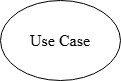 | Use Case | Deskripsi dari urutan aksi-aksi yang ditampilkan sistem yang menghasilkan suatu hasil terstruktur bagi suatu aktor. |
|  | Association | Komunikasi antara aktor dan use case yang berpartisipasi pada use case atau use case memiliki interaksi dengan aktor. |
| 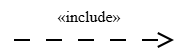 | Include | Menunjukkan bahwa suatu use case seluruhnya merupakan fungsionalitas dari use case lainnya. |
| 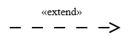 | Extend | Menunjukkan bahwa suatu use case merupakan tambahan fungsionalitas dari case lainnya jika suatu kondisi terpenuhi. |

1. Class Diagram

| Simbol | Nama | Keterangan |
| --- | --- | --- |
|  | Generalization | Hubungan dimana objek anak (descendent) berbagi perilaku dan struktur data dari objek yang ada diatasnya objek induk (ancestor). |
|  | Nary Association | Upaya untuk menghindari asosiasi dengan lebih dari 2 objek. |
| 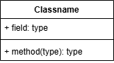 | Class | Himpunan dari objek-objek yang berbagi atribut serta operasi yang sama. |
|  | Collaboration | Deskripsi dari urutan aksi-aksi yang ditampilkan sistem yang menghasilkan suatu hasil yang terukur bagi suatu aktor. |
| 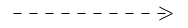 | Realization | Operasi yang benar-benar dilakukan oleh suatu objek. |
| 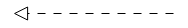 | Depedency | Hubungan dimana perubahan yang terjadi pada suatu elemen mandiri akan mempengaruhi elemen yang bergantung pada elemen yang tidak mandiri. |
|  | Association | Apa yang menghubungkan antara objek satu dengan objek lainnya. |
| 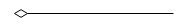 | Aggregation | Relasi antar kelas dengan makna semua – bagian. |

1. Activity Diagram

| Simbol | Nama | Keterangan |
| --- | --- | --- |
|  | Start Point | Bagaimana objek dibentuk atau diawali. |
|  | Activity | Bagaimana objek dibentuk atau diawali dengan kata kerja. |
|  | Decision Points | Percabangan dimana ada pilihan yang lebih dari satu. |
| 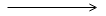 | Line Connector | Menunjukkan bahwa suatu use case seluruhnya merupakan fungsionalitas dari use case lainnya. |
|  | End Point | Status akhir yang dilakukan sistem. |
| 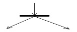 | Fork | Digunakan untuk menunjukkan kegiatan yang dilakukan secara paralel. |
| 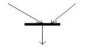 | Join | Digunakan untuk menunjukkan kegiatan yang digabungkan. |
| 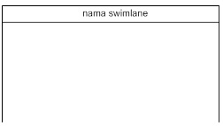 | Swimlane | Memisahkan organisasi bisnis yang bertanggung jawab terhadap aktivitas yang terjadi. |

1. Sequence Diagram

| Simbol | Nama | Keterangan |
| --- | --- | --- |
|  | Actor | Menggambarkan seseorang atau sesuatu seperti perangkat yang berinteraksi dengan sistem. |
| 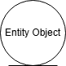 | Entity Class | Menggambarkan hubungan yang akan dilakukan. |
| 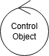 | Control Class | Menggambarkan penghubung antara boundary dengan tabel. |
| 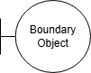 | Boundary Class | Menggambarkan sebuah gambaran dari form. |
| 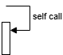 | Message To Self | Menggambarkan pesan/hubungan objek untuk dirinya sendiri. |
| 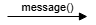 | Message | Menggambarkan objek yang mengirim satu pesan ke objek lain. |
| 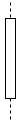 | Activation | Mewakili sebuah eksekusi operasi dari objek panjang kotak ini berbanding lurus dengan durasi aktivitas sebuah operasi. |

## DAFTAR TABEL

- [Tabel 2.1 Penelitian Relevan](#tabel-2-1-penelitian-relevan)
- [Tabel 3.1 Waktu Penelitian](#tabel-3-1-waktu-penelitian)
- [Tabel 4.1 Data Perhitungan Manual Regresi Linear](#tabel-4-1-data-perhitungan-manual-regresi-linear)
- [Tabel 4.2 Skenario Use Case Login Admin/Petugas](#tabel-4-2-skenario-use-case-login-admin-petugas)
- [Tabel 4.3 Skenario Use Case Dashboard Admin/Petugas](#tabel-4-3-skenario-use-case-dashboard-admin-petugas)
- [Tabel 4.4 Skenario Use Case Data Pajak Admin/Petugas](#tabel-4-4-skenario-use-case-data-pajak-admin-petugas)
- [Tabel 4.5 Skenario Use Case Model dan Prediksi Admin/Petugas](#tabel-4-5-skenario-use-case-model-dan-prediksi-admin-petugas)
- [Tabel 4.6 Skenario Use Case Cetak Laporan](#tabel-4-6-skenario-use-case-cetak-laporan)
- [Tabel 4.7 Skenario Use Case Laporan](#tabel-4-7-skenario-use-case-laporan)
- [Tabel 4.8 Skenario Use Case Import Data](#tabel-4-8-skenario-use-case-import-data)
- [Tabel 4.9 Skenario Use Case Pengguna](#tabel-4-9-skenario-use-case-pengguna)
- [Tabel 4.10 Skenario Use Case Pengaturan](#tabel-4-10-skenario-use-case-pengaturan)
- [Tabel 4.11 Skenario Use Case Login User](#tabel-4-11-skenario-use-case-login-user)
- [Tabel 4.12 Skenario Use Case Dashboard User](#tabel-4-12-skenario-use-case-dashboard-user)
- [Tabel 4.13 Skenario Use Case Data Pajak User](#tabel-4-13-skenario-use-case-data-pajak-user)
- [Tabel 4.14 Skenario Use Case Model & Prediksi User](#tabel-4-14-skenario-use-case-model-and-prediksi-user)
- [Tabel 4.15 Skenario Use Case Pengaturan](#tabel-4-15-skenario-use-case-pengaturan)

## DAFTAR GAMBAR

- [Gambar 3.1 Lokasi Samsat Depok 1](#gambar-3-1-lokasi-samsat-depok-1)
- [Gambar 3.2 Lokasi Samsat Depok 1](#gambar-3-2-lokasi-samsat-depok-1)
- [Gambar 3.3 Tahapan Penelitian](#gambar-3-3-tahapan-penelitian)
- [Gambar 3.4](#gambar-3-4)
- [Gambar 4.1 Use Case Diagram](#gambar-4-1-use-case-diagram)
- [Gambar 4.2 Activity Diagram Login Admin / Petugas](#gambar-4-2-activity-diagram-login-admin-petugas)
- [Gambar 4.3 Activity Diagram Dashboard Admin / Petugas](#gambar-4-3-activity-diagram-dashboard-admin-petugas)
- [Gambar 4.4 Activity Diagram Kelola Data Pajak Admin / Petugas](#gambar-4-4-activity-diagram-kelola-data-pajak-admin-petugas)
- [Gambar 4.5 Activity Diagram Model & Prediksi Admin / Petugas](#gambar-4-5-activity-diagram-model-and-prediksi-admin-petugas)
- [Gambar 4.6 Activity Diagram Import Data](#gambar-4-6-activity-diagram-import-data)
- [Gambar 4.7 Activity Diagram Cetak Laporan](#gambar-4-7-activity-diagram-cetak-laporan)
- [Gambar 4.8 Activity Diagram Laporan](#gambar-4-8-activity-diagram-laporan)
- [Gambar 4.9 Activity Diagram Pengguna](#gambar-4-9-activity-diagram-pengguna)
- [Gambar 4.10 Activity Diagram Pengaturan Admin / Petugas](#gambar-4-10-activity-diagram-pengaturan)
- [Gambar 4.11 Activity Diagram Login User](#gambar-4-11-activity-diagram-login-user)
- [Gambar 4.12 Activity Diagram Dashboard User](#gambar-4-12-activity-diagram-dashboard-user)
- [Gambar 4.13 Activity Diagram Data Pajak User](#gambar-4-13-activity-diagram-data-pajak-user)
- [Gambar 4.14 Activity Diagram Model & Prediksi User](#gambar-4-14-activity-diagram-model-and-prediksi-user)
- [Gambar 4.15 Activity Diagram Pengaturan User](#gambar-4-15-activity-diagram-pengaturan)
- [Gambar 4.16 Sequence Diagram Login Admin / Petugas](#gambar-4-16-sequence-diagram-login-admin-petugas)
- [Gambar 4.17 Sequence Diagram Dashboard Admin / Petugas](#gambar-4-17-sequence-diagram-dashboard-admin-petugas)
- [Gambar 4.18 Sequence Diagram Data Pajak Admin / Petugas](#gambar-4-18-sequence-diagram-data-pajak-admin-petugas)
- [Gambar 4.19 Sequence Diagram Prediksi Model & Prediksi Admin / Petugas](#gambar-4-19-sequence-diagram-prediksi-model-and-prediksi-admin-petugas)
- [Gambar 4.20 Sequence Diagram Cetak Laporan](#gambar-4-20-sequence-diagram-cetak-laporan)
- [Gambar 4.21 Sequence Diagram Laporan](#gambar-4-21-sequence-diagram-laporan)
- [Gambar 4.22 Sequence Diagram Import Data](#gambar-4-22-sequence-diagram-import-data)
- [Gambar 4.23 Sequence Diagram Pengguna](#gambar-4-23-sequence-diagram-pengguna)
- [Gambar 4.24 Sequence Diagram Pengaturan](#gambar-4-24-sequence-diagram-pengaturan)
- [Gambar 4.25 Sequence Diagram Login User](#gambar-4-25-sequence-diagram-login-user)
- [Gambar 4.26 Sequence Diagram Dashboard User](#gambar-4-26-sequence-diagram-dashboard-user)
- [Gambar 4.27 Sequence Diagram Pajak User](#gambar-4-27-sequence-diagram-pajak-user)
- [Gambar 4.28 Sequence Diagram Model & Prediksi User](#gambar-4-28-sequence-diagram-model-and-prediksi-user)
- [Gambar 4.29 Sequence Diagram Pengaturan](#gambar-4-29-sequence-diagram-pengaturan)
- [Gambar 4.30 Class Diagram](#gambar-4-30-class-diagram)
- [Gambar 4.31 Rancangan Layar Login Admin / Petugas](#gambar-4-31-rancangan-layar-login-admin-petugas)
- [Gambar 4.32 Rancangan Layar Dashboard Admin / Petugas](#gambar-4-32-rancangan-layar-dashboard-admin-petugas)
- [Gambar 4.33 Rancangan Layar Data Pajak Admin / Petugas](#gambar-4-33-rancangan-layar-data-pajak-admin-petugas)
- [Gambar 4.34 Rancangan Layar Model & Prediksi Admin / Petugas](#gambar-4-34-rancangan-layar-model-and-prediksi-admin-petugas)
- [Gambar 4.35 Rancangan Layar Cetak Laporan](#gambar-4-35-rancangan-layar-cetak-laporan)
- [Gambar 4.36 Rancangan Layar Laporan](#gambar-4-36-rancangan-layar-laporan)
- [Gambar 4.37 Rancangan Layar Import Data](#gambar-4-37-rancangan-layar-import-data)
- [Gambar 4.38 Rancangan Layar Pengguna](#gambar-4-38-rancangan-layar-pengguna)
- [Gambar 4.39 Rancangan Pengaturan](#gambar-4-39-rancangan-pengaturan)
- [Gambar 4.40 Rancangan Login User](#gambar-4-40-rancangan-login-user)
- [Gambar 4.41 Rancangan Dashboard User](#gambar-4-41-rancangan-dashboard-user)
- [Gambar 4.42 Rancangan Data Pajak User](#gambar-4-42-rancangan-data-pajak-user)
- [Gambar 4.43 Rancangan Model & Prediksi User](#gambar-4-43-rancangan-model-and-prediksi-user)
- [Gambar 4.44 Rancangan Pengaturan](#gambar-4-44-rancangan-pengaturan)
- [Gambar 4.45 Tampilan Layar Login Admin / Petugas](#gambar-4-45-tampilan-layar-login-admin-petugas)
- [Gambar 4.46 Tampilan Layar Dashboard Admin / Petugas](#gambar-4-46-tampilan-layar-dashboard-admin-petugas)
- [Gambar 4.47 Tampilan Layar Data Pajak Admin / Petugas](#gambar-4-47-tampilan-layar-data-pajak-admin-petugas)
- [Gambar 4.48 Tampilan Layar Model & Prediksi Admin / Petugas](#gambar-4-48-tampilan-layar-model-and-prediksi-admin-petugas)
- [Gambar 4.49 Tampilan Layar Cetak Laporan](#gambar-4-49-tampilan-layar-cetak-laporan)
- [Gambar 4.50 Tampilan Layar Laporan](#gambar-4-50-tampilan-layar-laporan)
- [Gambar 4.51 Tampilan Import Data](#gambar-4-51-tampilan-import-data)
- [Gambar 4.52 Tampilan Layar Pengguna](#gambar-4-52-tampilan-layar-pengguna)
- [Gambar 4.53 Tampilan Layar Pengaturan](#gambar-4-53-tampilan-layar-pengaturan)
- [Gambar 4.54 Tampilan Layar Login User](#gambar-4-54-tampilan-layar-login-user)
- [Gambar 4.55 Tampilan Layar Dashboard User](#gambar-4-55-tampilan-layar-dashboard-user)
- [Gambar 4.56 Tampilan Layar Data Pajak User](#gambar-4-56-tampilan-layar-data-pajak-user)
- [Gambar 4.57 Tampilan Layar Model & Prediksi User](#gambar-4-57-tampilan-layar-model-and-prediksi-user)
- [Gambar 4.58 Tampilan Layar Pengaturan](#gambar-4-58-tampilan-layar-pengaturan)

## DAFTAR LAMPIRAN

- [Kartu Asistensi Bimbingan Tugas Akhir (Materi)](#1-kartu-asistensi-bimbingan-tugas-akhir-materi)
- [Kartu Asistensi Bimbingan Tugas Akhir (Teknik)](#2-kartu-asistensi-bimbingan-tugas-akhir-teknik)
- [Surat Permohonan Penelitian](#3-surat-permohonan-penelitian)
- [Surat Keterangan Telah Melaksanakan Penelitian di Kantor Samsat Depok 1](#4-surat-keterangan-telah-melaksanakan-penelitian-di-kantor-samsat-depok-1)
- [Listing Program](#5-listing-program)

## BAB I PENDAHULUAN

### A. Latar Belakang

Perkembangan teknologi informasi telah mendorong pemanfaatan algoritma machine learning dalam berbagai bidang, seperti ekonomi, pendidikan, bisnis, kesehatan, dan pemerintahan. Penerapan machine learning dalam bidang prediksi terus mengalami peningkatan seiring dengan bertambahnya ketersediaan data, perkembangan teknologi komputasi, serta kebutuhan organisasi dalam menghasilkan keputusan yang cepat, akurat, dan berbasis data-driven decision making (Roihan et al., 2020). Selain didukung oleh ketersediaan data dalam jumlah besar (big data), perkembangan perangkat lunak analisis data dan bahasa pemrograman seperti Python dan R (Programming Language) turut mempercepat implementasi berbagai algoritma machine learning untuk menyelesaikan permasalahan prediksi pada berbagai sektor (Gulo, 2020). Seiring dengan perkembangan tersebut, berbagai algoritma machine learning telah dikembangkan dan dimanfaatkan untuk membangun model prediksi, di antaranya Decision Tree, Naive Bayes, K-Nearest Neighbor (KNN), Support Vector Machine (SVM), Random Forest, Artificial Neural Network (ANN), dan Regresi Linear (Gulo et al., 2022).

Samsat Depok I salah satu Unit Pelaksana Teknis Daerah (UPTD) yang melayani administrasi pajak kendaraan bermotor & bermobil di wilayah Kota Depok 1 dengan jumlah WP (wajib pajak) yang terus meningkat setiap tahunnya. Seiring dengan meningkatnya jumlah kendaraan bermotor & bermobil, kebutuhan akan pengelolaan administrasi perpajakan yang efektif juga semakin besar. Meskipun pemerintah telah menyediakan berbagai inovasi layanan, seperti e-Samsat, aplikasi SIGNAL, dan Samsat Keliling, masih terdapat WP (wajib pajak) yang melakukan pembayaran setelah jatuh tempo. Kondisi tersebut menunjukkan perlunya pemanfaatan model prediksi untuk mengidentifikasi potensi keterlambatan pembayaran pajak sehingga instansi dapat menyusun strategi pelayanan dan edukasi kepada WP (wajib pajak) secara lebih tepat sasaran. Kepatuhan WP (wajib pajak) dipengaruhi oleh berbagai faktor, antara lain tingkat kesadaran perpajakan, kemudahan akses layanan, kualitas pelayanan, serta modernisasi sistem administrasi perpajakan (Putri, 2025).

Salah satu indikator rendahnya kepatuhan WP (wajib pajak) adalah tingginya tingkat keterlambatan pembayaran pajak kendaraan bermotor & bermobil. Keterlambatan tersebut dipengaruhi oleh faktor internal, seperti kesadaran dan pemahaman WP (wajib pajak), serta faktor eksternal, seperti kemudahan akses layanan, kondisi ekonomi, dan kualitas pelayanan publik (Andi Sahrul Jahrir, 2025). Fenomena keterlambatan pembayaran pajak juga terjadi pada Samsat Depok I yang melayani jumlah kendaraan bermotor & bermobil yang besar. Tingginya jumlah WP (wajib pajak) yang terlambat membayar pajak menunjukkan masih adanya tantangan dalam meningkatkan kepatuhan WP (wajib pajak) meskipun berbagai inovasi layanan telah diterapkan (Putri, 2025).

Perkembangan teknologi analisis data memberikan peluang bagi instansi pemerintah untuk memanfaatkan data historis sebagai dasar dalam pengambilan keputusan yang lebih efektif, salah satu permasalahan yang dihadapi dalam pengelolaan pajak kendaraan bermotor dan bermobil adalah keterlambatan pembayaran yang dapat berdampak pada kepatuhan WP (wajib pajak) dan optimalisasi penerimaan pajak daerah untuk mengatasi permasalahan tersebut, salah satu pendekatan yang dapat diterapkan adalah membangun model prediksi menggunakan metode machine learning (Alwi Prayoga et al., 2025). Model prediksi dapat digunakan untuk mengidentifikasi pola dari data historis dan memperkirakan potensi keterlambatan pembayaran sehingga pihak Samsat Depok 1 dapat melakukan tindakan preventif, yang mendorong peningkatan kepatuhan WP (wajib pajak). Dengan demikian, pengelolaan pajak dapat dilakukan secara lebih proaktif melalui pemanfaatan data. Berdasarkan permasalahan dan kebutuhan tersebut, penelitian ini menggunakan algoritma regresi linear karena mampu menganalisis hubungan antara variabel independen dan variabel dependen, menghasilkan model yang sederhana dan mudah diinterpretasikan, serta memiliki proses komputasi yang relatif sederhana sehingga sesuai untuk diterapkan pada data administrasi pemerintahan (Permana & Herdiana, 2025). Regresi linear mampu mengolah data historis dan mengidentifikasi pola yang memengaruhi hasil prediksi (Widiyatmoko et al., 2025). Regresi linear mampu menghasilkan prediksi hasil ujian dengan tingkat akurasi yang memadai (Teknologi & Dan, 2023). Regresi linear untuk memprediksi pengaruh inflasi terhadap perekonomian Indonesia dengan nilai Root Mean Squared Error (RMSE) yang rendah (Azkiya & Santoso, 2023). Regresi linear efektif digunakan untuk memprediksi harga emas berdasarkan data historis (Erwansyah, 2024). Regresi linear berganda mampu menghasilkan prediksi dengan tingkat kesalahan yang rendah serta menjelaskan pengaruh variabel dalam model dengan baik (Halif et al., 2025). Hasil penelitian tersebut menunjukkan bahwa regresi linear layak digunakan dalam permasalahan prediksi berbasis data historis karena relatif sederhana, mudah diinterpretasikan, dan mampu menghasilkan prediksi dengan tingkat kesalahan yang baik.

Penelitian ini mengangkat judul “Model Prediksi Keterlambatan Pembayaran Pajak Dengan Metode Regresi Linear Pada Samsat Depok 1”. Penelitian ini berfokus pada pengembangan model prediksi keterlambatan pembayaran pajak menggunakan metode regresi linear berdasarkan data historis yang tersedia di Samsat Depok 1. Model yang dihasilkan diharapkan mampu membantu proses identifikasi potensi keterlambatan pembayaran pajak secara lebih dini sehingga dapat mendukung pengambilan keputusan dalam pengelolaan pajak daerah. Selain itu, hasil penelitian ini diharapkan dapat memberikan kontribusi secara teoritis dalam pengembangan penerapan metode regresi linear pada bidang perpajakan serta secara praktis sebagai bahan pertimbangan bagi instansi terkait dalam meningkatkan efektivitas pengelolaan pajak daerah.

### B. Identifikasi Masalah

Berdasarkan latar belakang yang telah diuraikan, dapat diidentifikasikan beberapa masalah yang dialami sebagai berikut :

1. Tingginya tingkat keterlambatan pembayaran pajak kendaraan bermotor & bermobil yang dipengaruhi oleh berbagai faktor yang berkaitan dengan karakteristik dan perilaku WP (wajib pajak).
1. Belum optimalnya pemanfaatan data historis WP (wajib pajak) untuk membangun model prediksi keterlambatan pembayaran pajak kendaraan bermotor & bermobil pada Samsat Depok 1.
1. Perlunya pengujian terhadap metode Regresi Linear untuk mengetahui kemampuannya dalam memprediksi keterlambatan pembayaran pajak kendaraan bermotor & bermobil secara akurat.

### C. Batasan Masalah

Agar penelitian lebih terarah, fokus, dan tidak melebar ke aspek yang terlalu luas, maka ditetapkan batasan masalah sebagai berikut:

1. Penelitian ini hanya dilakukan pada WP (wajib pajak) kendaraan bermotor & bermobil yang terdaftar di Samsat Depok 1.
1. Data yang dilakukan dalam penelitian merupakan data historis pembayaran pajak kendaraan bermotor & bermobil dalam periode tertentu (misalnya 7 hari - 3 tahun terakhir maupun pajak hidup, menyesuaikan ketersediaan data).
1. Variabel yang digunakan dalam penelitian terbatas pada variabel yang tersedia dalam data, seperti nomor, tanggal bayar, nama, nomor polisi, jenis kendaraan, nomor mesin, tanggal jatuh tempo, status keterlambatan/pajak hidup.
1. Variabel lain yang berpotensi mempengaruhi keterlambatan pajak, tidak dianalisis karena keterbatasan data.
1. Metode analisis yang digunakan penelitian ini hanya menggunakan Regresi Linear dan tidak membandingkan dengan metode lain seperti Naive Bayes, Decision Tree, atau metode machine learning lainnya.
1. Penelitian ini berfokus pada prediksi keterlambatan pembayaran pajak, bukan analisis kebijakan perpajakan, sanksi, atau aspek hukum yang berlaku.
1. Hasil penelitian ini hanya berlaku pada konteks dan karakteristik data di Samsat Depok 1, sehingga tidak dapat digeneralisasi secara langsung ke daerah lain tanpa penyesuaian.

### D. Rumusan Masalah

Berdasarkan latar belakang yang telah diuraikan, maka rumusan masalah dalam penelitian ini adalah :

1. Bagaimana mengidentifikasi fitur-fitur yang tepat untuk memprediksi keterlambatan pembayaran pajak?.
1. Bagaimana membuat model prediksi keterlambatan pembayaran pajak dengan algoritma regresi linear?.
1. Bagaimana merancang dan menerapkan aplikasi untuk model prediksi keterlambatan pembayaran pajak dengan algoritma regresi linear yang efektif dan efisien?.

### E. Tujuan Penelitian

Adapun tujuan dalam penelitian yang penulis lakukan dalam tugas akhir ini adalah :

1. Mengidentifikasi fitur-fitur yang berpengaruh dan relevan dalam memprediksi keterlambatan pembayaran pajak kendaraan bermotor & bermobil pada Samsat Depok 1.
1. Membangun model prediksi keterlambatan pembayaran pajak kendaraan bermotor & bermobil menggunakan algoritma regresi linear berdasarkan data historis yang tersedia.
1. Merancang dan mengimplementasikan aplikasi prediksi keterlambatan pembayaran pajak kendaraan bermotor & bermobil berbasis algoritma regresi linear yang efektif dan efisien untuk mendukung pengambilan keputusan pada Samsat Depok 1.

### F. Manfaat Penelitian

#### 1. Manfaat Teoritis

1. Penelitian ini dapat memberikan kontribusi dalam pengembangan ilmu pengetahuan, khususnya dalam bidang analisis data, statistika, dan penerapannya dalam sektor publik.
1. Memberikan penelitian dan referensi rujukan yang relevan bagi akademisi maupun peneliti selanjutnya yang akan mengembangkan sistem serupa.

#### 2. Manfaat Praktis

1. Menghasilkan perangkat lunak di kantor Samsat Depok 1 yang terkomputerisasi sebagai bahan pertimbangan dalam meningkatkan kepatuhan WP (wajib pajak).
1. Mempermudah pemerintah daerah membantu dalam optimalisasi penerimaan pajak daerah.
1. Mempermudah peneliti selanjutnya sebagai referensi dalam penelitian sejenis.

## BAB II TINJAUAN PUSTAKA

### A. Landasan Teori

#### 1. Machine Learning

Machine Learning (pembelajaran mesin) adalah salah satu cabang dari kecerdasan buatan (Artificial Intelligence) yang memungkinkan komputer untuk mempelajari pola dari data, memperoleh pengetahuan secara otomatis, serta meningkatkan kinerjanya tanpa harus diprogram secara eksplisit untuk setiap permasalahan yang dihadapi (Mustakim et al., 2019). Melalui proses pembelajaran dari data historis, sistem dapat mengenali pola tertentu dan menggunakan pola tersebut untuk melakukan prediksi, klasifikasi, maupun pengambilan keputusan.

Machine Learning adalah bagian dari data mining yang memanfaatkan teknik statistik, matematika, dan kecerdasan buatan untuk mengekstraksi pengetahuan dari data sehingga dapat digunakan dalam proses pengambilan keputusan (Mustakim et al., 2019). Pembelajaran mesin berfokus pada pengembangan algoritma yang mampu belajar dari data dan menghasilkan model yang dapat digunakan untuk menyelesaikan berbagai permasalahan prediktif (Roihan et al., 2020).

Perkembangan machine learning di Indonesia semakin meningkat seiring dengan bertambahnya kebutuhan pengolahan data dalam berbagai sektor, seperti kesehatan, pendidikan, ekonomi, pemerintahan, transportasi, dan perpajakan (Gulo et al., 2022). Berbagai penelitian menunjukkan bahwa machine learning mampu membantu proses analisis data dalam jumlah besar dengan tingkat kecepatan dan akurasi yang lebih baik dibandingkan metode konvensional.

Machine Learning telah banyak digunakan untuk menyelesaikan berbagai permasalahan prediksi dan pengambilan keputusan melalui tiga pendekatan utama, yaitu supervised learning, unsupervised learning, dan reinforcement learning (Roihan et al., 2020). Pemanfaatan teknologi ini terus berkembang karena kemampuannya dalam menemukan pola tersembunyi dari data dan menghasilkan informasi yang bermanfaat bagi organisasi maupun instansi pemerintah. Oleh karena itu, diperlukan upaya untuk meningkatkan kepatuhan WP (wajib pajak) melalui berbagai strategi, salah satunya dengan memanfaatkan teknologi dan analisis data.

Dalam penelitian ini, machine learning digunakan untuk membangun model prediksi keterlambatan pembayaran pajak kendaraan bermotor & bermobil pada Samsat Depok 1. Dengan memanfaatkan data historis WP (wajib pajak) dan algoritma regresi linear, model yang dihasilkan diharapkan mampu membantu pihak Samsat Depok 1 dalam mengidentifikasi potensi keterlambatan pembayaran pajak secara lebih dini sehingga dapat mendukung peningkatan kepatuhan WP (wajib pajak) dan optimalisasi penerimaan pajak daerah.

#### 2. Penambangan Data / Data Mining

Data Mining atau penambangan data adalah proses penggalian dan penemuan pola, hubungan, tren, maupun informasi yang bermanfaat dari sekumpulan data berukuran besar (Fana Wiza & Kuning, 2016). Data mining memanfaatkan berbagai teknik yang berasal dari statistika, kecerdasan buatan (Artificial Intelligence), machine learning, dan sistem basis data untuk menghasilkan pengetahuan yang dapat digunakan dalam proses pengambilan keputusan (Srirahayu & Pribadie, 2023). Data mining menjadi salah satu tahapan penting dalam proses Knowledge Discovery in Databases (KDD), yaitu proses menemukan pengetahuan yang sebelumnya tidak diketahui dari kumpulan data yang tersedia.

Data mining adalah serangkaian proses untuk mengekstraksi informasi atau pengetahuan yang berguna dari suatu basis data yang besar melalui teknik statistik, matematika, kecerdasan buatan, dan machine learning (Mustakim et al., 2019). Tujuan utama data mining adalah menemukan pola atau hubungan yang tersembunyi sehingga dapat dimanfaatkan untuk mendukung pengambilan keputusan yang lebih efektif.

Data mining merupakan proses penggalian informasi dari sejumlah data besar untuk memperoleh pola data yang dapat menghasilkan informasi berguna dalam mendukung pengambilan keputusan (Kahfi Rama Putra Lubis1, 2023).

Perkembangan teknologi informasi telah menyebabkan peningkatan volume data yang sangat besar pada berbagai sektor, termasuk pemerintahan, pendidikan, kesehatan, perbankan, perdagangan, dan perpajakan. Kondisi tersebut menjadikan data mining sebagai salah satu teknologi yang penting dalam mengubah data mentah menjadi informasi yang bernilai. Di Indonesia, penerapan data mining terus berkembang seiring meningkatnya kebutuhan organisasi terhadap pengambilan keputusan berbasis data (data-driven decision making) (Christefa et al., 2022).

Dalam penelitian ini, data mining digunakan sebagai pendekatan untuk mengolah data historis pembayaran pajak kendaraan bermotor & bermobil guna menemukan pola yang memengaruhi keterlambatan pembayaran pajak. Hasil proses data mining kemudian dimanfaatkan untuk membangun model prediksi menggunakan metode regresi linear pada Samsat Depok 1.

#### 3. Regresi Linear

Regresi Linear adalah regresi statistik yang digunakan untuk menganalisis hubungan antara satu variabel dependen dengan satu atau lebih variabel independen, metode ini bertujuan untuk mengetahui seberapa besar pengaruh variabel bebas terhadap variabel terikat serta digunakan untuk melakukan prediksi berdasarkan pola data yang tersedia. Dalam analisis data, regresi linear menjadi salah satu metode yang banyak digunakan karena memiliki proses perhitungan yang sederhana, mudah dipahami, dan mampu memberikan hasil prediksi yang cukup baik pada data yang memiliki hubungan linear (Nurhaswinda et al., 2025). Adapun jenis regresi linear sederhana (1 variabel independen), dan regresi linear berganda (lebih dari 1 variabel independen). Model Regresi Linear Berganda “$Y=a+b_{1}X_{1}+b_{2}X_{2}+b_{3}X_{3}+b_{4}X_{4}+e$’’ yang artinya (Y) variabel dependen keterlambatan pajak, (X) variabel independen, a yaitu konstanta, dan b yaitu koefisien regresi.

Regresi linear digunakan untuk memprediksi bagaimana perubahan nilai variabel dependen apabila nilai variabel independen dinaikkan atau diturunkan (Arif, 2024).

Regresi linear digunakan untuk mengukur kekuatan hubungan antar variabel, menguji hipotesis, dan melakukan prediksi (Nurhaswinda et al., 2025). Regresi linear merupakan metode statistik yang digunakan untuk mempelajari hubungan antara variabel dependen (terikat) dengan satu atau lebih variabel independen (bebas). Analisis regresi digunakan untuk mengetahui bagaimana perubahan pada variabel independen dapat memengaruhi variabel dependen, serta digunakan untuk melakukan estimasi atau prediksi terhadap suatu nilai berdasarkan data yang tersedia (Nurhaswinda et al., 2025).

#### 4. UML (Unified Modeling Language)

UML (Unified Modeling Language) adalah bahasa pemodelan visual yang digunakan untuk merancang, menggambarkan, dan mendokumentasikan sistem perangkat lunak berbasis objek (Nurshadrina & Voutama, 2023). UML digunakan sebagai alat bantu dalam proses analisis dan perancangan sistem agar struktur dan alur sistem dapat dipahami dengan lebih mudah oleh pengembang maupun pengguna.

Dalam penelitian ini, UML digunakan untuk menggambarkan rancangan sistem Keterlambatan Pembayaran Pajak Kendaraan bermotor & bermobil Pada Samsat Depok 1. Diagram yang dapat digunakan meliputi Use Case Diagram, Activity Diagram, Sequence Diagram, dan Class Diagram. Pemodelan UML membantu menjelaskan hubungan antara pengguna, proses input data, pengolahan data, proses implementasi menggunakan algoritma Regresi Linear, dan Pengujian hasil pengolahan data serta evaluasi sistem.

Beberapa pemodelan yang termasuk kedalam UML, seperti :

##### a. Usecase Diagram

Diagram yang menunjukkan interaksi antara aktor (pengguna atau sistem lain) dengan sistem yang sedang dikembangkan pada memvisualisasikan fungsionalitas (fungsi atau layanan) yang disediakan sistem dari sudut pandang pengguna, serta jenis interaksi yang terjadi antara aktor dan sistem (Haviluddin, 2011).

##### b. Sequence Diagram

Diagram yang menggambarkan interaksi antara aktor (pengguna atau sistem eksternal) dengan sistem sebagai sebuah kesatuan pada satu skenario atau proses bisnis tertentu (Haviluddin, 2011).

##### c. Activity Diagram

Diagram yang menggambarkan alur aktivitas atau aliran kerja (workflow) dalam suatu sistem secara dinamis, diagram ini menunjukkan urutan aktivitas dari awal hingga akhir suatu proses dengan menggunakan simbol-simbol tertentu yang dihubungkan oleh panah yang mewakili aliran kontrol atau urutan aktivitas terjadi (Haviluddin, 2011).

##### d. Class Diagram

Sebuah diagram yang menggambarkan struktur suatu sistem secara jelas dan terperinci, diagram ini memodelkan kelas (class), atribut (properties) dari kelas tersebut, metode (fungsi atau operasi) yang dimiliki, serta hubungan antar kelas yang ada dalam sistem (Sumiati et al., 2021). Class diagram bersifat statis, artinya fokus pada representasi struktur dan hubungan antar objek tanpa menjelaskan perilaku dinamis atau interaksi waktu nyata (Haviluddin, 2011).

#### 5. Sistem Basis Data

Sistem basis data (database system) adalah suatu sistem yang digunakan untuk mengelola, menyimpan, mengorganisasi, dan menyediakan data agar dapat diakses serta dimanfaatkan secara efektif oleh pengguna maupun aplikasi (Setya Budi et al., 2022). Sistem basis data terdiri atas kumpulan data yang saling berhubungan dan perangkat lunak yang digunakan untuk mengelola data tersebut sehingga dapat menghasilkan informasi yang dibutuhkan (Maulidiah et al., 2025).

Basis data adalah kumpulan data yang saling berhubungan yang disimpan secara bersama-sama dan dirancang sedemikian rupa sehingga dapat digunakan secara optimal untuk memenuhi kebutuhan informasi suatu organisasi (Maulidiah et al., 2025). Sistem basis data tidak hanya mencakup data yang tersimpan, tetapi juga mencakup perangkat lunak pengelola data, prosedur, serta pengguna yang berinteraksi dengan sistem tersebut.

Dalam penelitian yang berjudul "Model Prediksi Keterlambatan Pembayaran Pajak dengan Metode Regresi Linear pada Samsat Depok 1", sistem basis data berperan sebagai media penyimpanan dan pengelolaan data historis pembayaran pajak kendaraan bermotor & bermobil. Data yang tersimpan dalam basis data digunakan sebagai sumber informasi untuk proses analisis, pengolahan data, dan pembangunan model prediksi menggunakan metode regresi linear. Dengan adanya sistem basis data yang terstruktur, proses pengambilan data, pengolahan data, dan penyajian hasil prediksi dapat dilakukan secara lebih efektif, efisien, dan akurat.

Beberapa contoh dari DBMS (Database Management System), seperti :

##### a. Entity Relationship Diagram (ERD)

Entity Relationship Diagram (ERD) atau Diagram Hubungan Entitas adalah suatu model konseptual yang digunakan untuk menggambarkan struktur data dan hubungan antar data dalam suatu basis data (Prihadyanti et al., 2024). ERD berfungsi sebagai alat bantu dalam perancangan basis data sehingga hubungan antar entitas dapat divisualisasikan secara jelas sebelum diimplementasikan ke dalam sistem basis data. ERD digunakan sebagai alat perancangan basis data untuk menggambarkan hubungan antar entitas yang terlibat dalam sistem, seperti entitas WP (wajib pajak), kendaraan, pembayaran pajak, data historis pembayaran, dan hasil prediksi. Melalui ERD, struktur data yang digunakan dalam aplikasi dapat dirancang secara sistematis sehingga memudahkan proses penyimpanan, pengolahan, dan pengambilan data yang diperlukan dalam pembangunan model prediksi keterlambatan pembayaran pajak (Prihadyanti et al., 2024).

##### b. Structured Query Language (SQL)

Structured Query Language (SQL) adalah bahasa standar yang digunakan untuk mengakses, mengelola, dan memanipulasi data pada sistem basis data relasional (Relational Database Management System/RDBMS) (Setiyadi & Herlawati, 2023). SQL memungkinkan pengguna untuk melakukan berbagai operasi terhadap basis data, seperti menambahkan data, mengubah data, menghapus data, serta menampilkan informasi yang tersimpan dalam tabel basis data. SQL menjadi bahasa yang paling banyak digunakan dalam pengelolaan basis data karena memiliki sintaks yang relatif mudah dipahami dan dapat diterapkan pada berbagai sistem manajemen basis data seperti MySQL, PostgreSQL, Oracle Database, dan Microsoft SQL Server. SQL digunakan sebagai bahasa untuk mengelola data yang tersimpan dalam basis data aplikasi. SQL berfungsi untuk melakukan proses penyimpanan data WP (wajib pajak), data kendaraan, data pembayaran pajak, serta hasil prediksi yang dihasilkan oleh algoritma regresi linear. Dengan memanfaatkan SQL, proses pengambilan dan pengolahan data dapat dilakukan secara cepat, akurat, dan terstruktur sehingga mendukung kinerja aplikasi prediksi yang dibangun (Kahfi Rama Putra Lubis1, 2023).

#### 6. Pajak

Pajak adalah kontribusi wajib yang dibayarkan oleh masyarakat kepada negara berdasarkan undang-undang tanpa imbalan langsung, yang digunakan untuk membiayai pengeluaran pemerintah dan pembangunan nasional (Debby Islami, 2020). Pajak dalam administrasi publik tidak hanya dipahami sebagai kewajiban masyarakat kepada negara, tetapi juga sebagai instrumen penting dalam menjaga stabilitas pembangunan dan pelayanan publik. Pajak digunakan untuk membiayai berbagai kebutuhan negara seperti pembangunan infrastruktur, pendidikan, kesehatan, transportasi, serta pelayanan administrasi pemerintahan. Oleh karena itu, tingkat kepatuhan wajib pajak sangat berpengaruh terhadap kemampuan pemerintah dalam menjalankan fungsi-fungsinya secara optimal (Juni et al., 2024).

Dalam pajak daerah, pemerintah daerah memiliki kewenangan untuk memungut pajak tertentu sesuai dengan peraturan perundang-undangan yang berlaku. Salah satu jenis pajak daerah yang memiliki kontribusi besar terhadap PAD adalah pajak kendaraan bermotor dan/atau bermobil (PKB). Pajak ini dipungut atas kepemilikan dan/atau penguasaan kendaraan bermotor dan/atau bermobil, baik kendaraan roda dua maupun roda empat. Penerimaan dari PKB menjadi salah satu sumber pembiayaan pembangunan daerah, khususnya dalam peningkatan sarana transportasi dan pelayanan publik lainnya (Hanifah et al., 2023).

Selain sebagai sumber pendapatan daerah, pajak kendaraan bermotor & bermobil juga memiliki peran dalam mendukung tertib administrasi kendaraan dan pengendalian jumlah kendaraan di masyarakat. Namun dalam pelaksanaannya, masih terdapat berbagai permasalahan seperti keterlambatan pembayaran pajak, rendahnya kesadaran WP (wajib pajak), faktor ekonomi masyarakat, hingga kurang optimalnya sistem pelayanan perpajakan. Kondisi tersebut dapat berdampak pada menurunnya penerimaan daerah dan menghambat efektivitas pengelolaan pajak (Bisnis, 2023).

Oleh karena itu, diperlukan upaya untuk meningkatkan kepatuhan WP (wajib pajak) melalui berbagai strategi, salah satunya dengan memanfaatkan teknologi dan analisis data.

Dalam penelitian ini, konsep pajak dikaitkan dengan pemanfaatan metode analisis atau prediksi untuk mengetahui kemungkinan terjadinya keterlambatan pembayaran pajak kendaraan bermotor & bermobil. Dengan adanya sistem prediksi, instansi terkait dapat melakukan langkah preventif, evaluasi pelayanan, serta penyusunan kebijakan yang lebih efektif dalam meningkatkan penerimaan pajak daerah.

#### 7. Pajak Kendaraan Bermotor & Bermobil

Pajak kendaraan bermotor & bermobil (PKB) adalah pajak atas kepemilikan dan/atau penguasaan kendaraan bermotor & bermobil. Pajak ini termasuk pajak provinsi yang dikelola oleh pemerintah daerah melalui sistem Samsat. Besarnya pajak ditentukan berdasarkan beberapa faktor, seperti: Nilai jual kendaraan bermotor dan/atau bermobil (NJKB) Bobot yang mencerminkan tingkat kerusakan jalan dan pencemaran lingkungan. Tarif pajak yang ditetapkan oleh pemerintah daerah PKB memiliki kontribusi besar terhadap PAD, terutama di wilayah perkotaan dengan tingkat mobilitas tinggi (Debby Islami, 2020).

Namun, masih ditemukan berbagai kendala yang menyebabkan rendahnya tingkat kepatuhan WP (wajib pajak) kendaraan bermotor & bermobil. Beberapa faktor yang memengaruhi keterlambatan pembayaran pajak antara lain kurangnya kesadaran masyarakat, kondisi ekonomi, minimnya informasi mengenai jatuh tempo pembayaran, antrian pelayanan, serta rendahnya pemanfaatan layanan digital perpajakan. Keterlambatan pembayaran pajak tersebut dapat berdampak pada menurunnya penerimaan daerah dan kurang optimalnya pelaksanaan pembangunan (Pratami Hadianto et al., 2024).

Seiring berkembangnya teknologi informasi, pemerintah mulai menerapkan sistem pelayanan berbasis digital untuk meningkatkan efektivitas pengelolaan pajak kendaraan bermotor & bermobil. Inovasi seperti e-Samsat, pembayaran pajak secara online, serta sistem pengingat jatuh tempo menjadi langkah untuk meningkatkan kepatuhan WP (wajib pajak). Selain itu, pemanfaatan analisis data dan metode prediksi juga mulai dikembangkan untuk mengidentifikasi pola keterlambatan pembayaran pajak kendaraan bermotor & bermobil (Santika & Jati, 2023).

Dalam penelitian ini, konsep pajak kendaraan bermotor & bermobil dikaitkan dengan penerapan metode prediksi keterlambatan pembayaran pajak guna membantu instansi terkait dalam menentukan kebijakan yang lebih tepat. Dengan adanya sistem prediksi, pemerintah daerah dapat mengetahui faktor-faktor yang memengaruhi keterlambatan pembayaran pajak serta melakukan tindakan preventif untuk meningkatkan kepatuhan WP (wajib pajak) dan optimalisasi penerimaan daerah.

#### 8. Keterlambatan Pembayaran Pajak

Keterlambatan pembayaran pajak adalah kondisi ketika WP (wajib pajak) tidak melakukan pembayaran pajak sesuai dengan batas waktu yang telah ditentukan (Klau & Puspita, 2025). Keterlambatan ini dapat berdampak pada penurunan penerimaan pajak daerah, meningkatnya biaya administrasi penagihan, menurunnya efektivitas pengelolaan pajak, faktor penyebab keterlambatan internal rendahnya kesadaran wajib pajak, kondisi ekonomi individu, kurangnya pemahaman perpajakan. Adapun faktor eksternal kualitas pelayanan publik, aksesibilitas layanan pembayaran, sistem informasi yang kurang optimal (Akuntansi, 2025).

Untuk mengatasi permasalahan keterlambatan pembayaran pajak, diperlukan pendekatan yang lebih efektif melalui pemanfaatan teknologi informasi dan analisis data. Salah satu upaya yang dapat dilakukan adalah penerapan metode prediksi untuk mengidentifikasi kemungkinan keterlambatan pembayaran pajak berdasarkan data WP (wajib pajak) yang tersedia. Dengan adanya sistem prediksi, instansi terkait dapat melakukan tindakan preventif, memberikan pengingat kepada WP (wajib pajak), serta menyusun strategi pelayanan yang lebih tepat sasaran (Wijaya et al., 2025).

Berdasarkan penjelasan tersebut, dapat disimpulkan bahwa keterlambatan pembayaran pajak kendaraan bermotor & bermobil menjadi fokus utama yang dianalisis menggunakan metode prediksi tertentu, seperti regresi linear atau metode data mining lainnya. Analisis tersebut bertujuan untuk mengetahui pola keterlambatan pembayaran pajak kendaraan bermotor & bermobil, sehingga dapat membantu pemerintah daerah dalam meningkatkan kepatuhan WP (wajib pajak) serta optimalisasi penerimaan pajak daerah.

#### 9. Laravel

Laravel adalah framework berbasis PHP yang menerapkan arsitektur Model View Controller (MVC) untuk mempermudah pengembangan aplikasi web secara terstruktur, efisien, dan mudah dipelihara. Laravel menyediakan berbagai fitur seperti routing, Eloquent ORM (Object Relational Mapping), migration, middleware, dan Blade template yang mendukung proses pengembangan aplikasi modern (Christi et al., 2023).

#### 10. PhpMyAdmin

phpMyAdmin adalah perangkat lunak berbasis web (web-based tool) yang digunakan untuk mengelola basis data MySQL atau MariaDB melalui antarmuka grafis sehingga memudahkan pengguna dalam membuat, mengubah, menghapus, dan mengelola database tanpa harus menuliskan perintah SQL secara langsung (Larassati et al., 2019).

#### 11. XAMPP

XAMPP adalah perangkat lunak yang digunakan sebagai server lokal untuk menjalankan aplikasi berbasis web pada komputer tanpa harus terhubung ke internet (Surya Ningsih et al., 2022). XAMPP merupakan paket perangkat lunak yang terdiri dari Apache sebagai web server, MySQL/MariaDB sebagai database server, PHP sebagai bahasa pemrograman server-side, dan Perl sebagai bahasa pemrograman tambahan. Nama XAMPP sendiri berasal dari singkatan X (cross platform), Apache, MySQL, PHP, dan Perl (Utomo et al., 2020).

XAMPP merupakan perangkat lunak yang berfungsi sebagai server lokal (localhost) yang terdiri dari Apache, MySQL, PHP, dan Perl yang digunakan untuk mendukung proses pembuatan serta pengujian aplikasi berbasis web secara offline pada komputer (Surya Ningsih et al., 2022). XAMPP memudahkan pengembang dalam menjalankan website tanpa harus menggunakan hosting atau server internet secara langsung.

Dalam penelitian ini, XAMPP digunakan sebagai alat bantu pengembangan lokal, terutama untuk mendukung pengelolaan database MySQL melalui phpMyAdmin, serta mendukung berbagai sistem operasi seperti Windows, Linux, dan macOS.

#### 12. Visual Studio Code

Visual Studio Code atau biasa disingkat VS Code adalah aplikasi source code editor yang digunakan untuk menulis, mengedit, dan menjalankan kode program dalam berbagai bahasa pemrograman. Visual Studio Code dikembangkan oleh Microsoft dan mendukung berbagai sistem operasi seperti Windows, Linux, dan macOS. Visual Studio Code adalah aplikasi source code editor yang digunakan untuk membantu proses pengembangan perangkat lunak dengan menyediakan fitur seperti syntax highlighting, debugging, dan dukungan berbagai bahasa pemrograman sehingga memudahkan programmer dalam membuat dan mengelola kode program (Surya Ningsih et al., 2022).

Dalam penelitian ini, Visual Studio Code digunakan sebagai perangkat lunak untuk menulis kode program secara otomatis sehingga dapat meminimalkan kesalahan penulisan program dan meningkatkan efisiensi pengembangan sistem.

#### 13. Evaluasi Model Regresi Linear

Pada tahap evaluasi model, penulis melakukan dengan membandingkan nilai prediksi dengan nilai aktual menggunakan beberapa metrik evaluasi, yaitu Koefisien Determinasi (R²), Mean Squared Error (MSE), Mean Absolute Error (MAE), dan Root Mean Squared Error (RMSE).

1. Koefisien Determinasi (R²) : untuk mengukur kemampuan model dalam menjelaskan variasi data, nilai R² berada rentang 0 hingga 1, semakin mendekati 1 semakin baik model dalam menjelaskan hubungan antara variabel independen dan variabel dependen (Surya Ningsih et al., 2022).

$$
R^{2}=1-\frac{\sum_{i=1}^{n}{y_{i}-\bar{y_{i}}}^{2}}{\sum_{i=1}^{n}{y_{i}-\bar{y}}^{2}} 1
$$

1. Mean Squared Error (MSE) : untuk mengukur rata-rata kuadrat selisih antara nilai aktual dan nilai prediksi, nilai MSE yang lebih kecil menunjukkan bahwa kesalahan prediksi model semakin rendah (Teddy et al., 2023).

$$
MSE=\frac{1}{n}\sum_{i=1}^{n}{y_{i}-\bar{y_{i}}}^{2} 2
$$

1. Mean Absolute Error (MAE) : untuk mengukur rata-rata selisih absolut antara nilai aktual dan nilai prediksi semakin kecil nilai MAE, semakin baik kemampuan model dalam melakukan prediksi (Valentino et al., 2025).

$$
MAE=\frac{1}{n}\sum_{i=1}^{n}y_{i}-\bar{y_{i}} 3
$$

1. Root Mean Squared Error (RMSE) : untuk akar kuadrat dari MSE yang menunjukkan besar kesalahan prediksi dalam satuan yang sama dengan data asli, semakin kecil nilai RMSE semakin tinggi tingkat akurasi model (Bastian et al., 2020).

$$
RMSE=\sqrt{\frac{1}{n}\sum_{i=1}^{n}{y_{i}-\bar{y_{i}}}^{2} }4
$$

Dalam metode regresi linear, evaluasi model bertujuan untuk mengetahui seberapa baik variabel independen mampu menjelaskan variabel dependen. Model yang baik adalah model yang memiliki tingkat kesalahan kecil, mampu memberikan hasil prediksi yang mendekati kondisi sebenarnya, serta memenuhi asumsi statistik yang diperlukan. Oleh karena itu, evaluasi model menjadi langkah penting sebelum hasil penelitian digunakan sebagai dasar pengambilan keputusan atau prediksi di masa mendatang (Rizkiani & Brahma, 2024).

Evaluasi model dapat dilakukan melalui beberapa pengujian statistik, seperti koefisien determinasi (R²), uji F, uji t, serta analisis residual. Koefisien determinasi digunakan untuk mengetahui seberapa besar kemampuan model dalam menjelaskan variabel dependen, sedangkan uji F dan uji t digunakan untuk mengukur signifikansi pengaruh variabel independen terhadap variabel dependen. Selain itu, analisis residual dilakukan untuk memastikan bahwa model tidak mengalami penyimpangan yang dapat menyebabkan hasil prediksi menjadi kurang akurat (Istanti, 2017).

### B. Penelitian Relevan

Penulis melakukan tahapan pengujian terhadap penelitian yang sebelumnya menggunakan subjek penelitian yang sama sebagai bahan acuan untuk peneliti ini, dapat dilihat pada Tabel 2. 1.

Tabel 2.1 
Penelitian Relevan

| No | Peneliti (Tahun) | Judul Penelitian | Metode Penelitian | Hasil Penelitian |
| --- | --- | --- | --- | --- |
| 1 | Indra Iman Sumantri & Devi Stiani (2023) | Pengetahuan Pelayanan Dan Sosialisasi Pajak Kendaraan Bermotor Terhadap Kepatuhan Wajib Pajak (Studi Kasus Pada Kantor Samsat Depok II Cinere) | Regresi Linear Berganda | Hasil penelitian menunjukkan bahwa pengetahuan, pelayanan, dan sosialisasi pajak kendaraan bermotor berpengaruh secara simultan terhadap kepatuhan wajib pajak. Nilai Adjusted R² sebesar 0,402 dengan nilai signifikansi 0,000 dan Fhitung sebesar 23,217. |
| 2 | Mustakim, Celsa Bella, Yoga Rizola Pratama (2019) | Prediksi Jumlah Tunggakan Pajak Jatuh Tempo Menggunakan Algoritma Support Vector Regression | Regresi Linear Berganda | Hasil penelitian menunjukkan bahwa algoritma Support Vector Regression mampu melakukan prediksi jumlah tunggakan pajak jatuh tempo dengan tingkat akurasi yang baik berdasarkan pola data historis wajib pajak kendaraan bermotor |
| 3 | Latifa Novina Herawati & Vinny Stephanie Hidayat (2022) | Pengaruh Penerapan E-Samsat Dan Sanksi Perpajakan Terhadap Kepatuhan Wajib Pajak Kendaraan Bermotor (Studi Kasus Pada Wajib Pajak Di Samsat Kota Cimahi) | Regresi Linear Berganda | Penelitian menunjukkan bahwa penerapan e-Samsat berpengaruh terhadap kepatuhan wajib pajak, sedangkan sanksi perpajakan tidak berpengaruh secara parsial. Penelitian menggunakan analisis regresi linear berganda dengan bantuan SPSS 26. |
| 4 | I Wayan Angga Santika & I Ketut Jati (2023) | Analisis Faktor-Faktor Yang Mempengaruhi Kepatuhan Wajib Pajak Kendaraan Bermotor Pada Kantor Samsat Badung | Regresi Linear Berganda | Hasil penelitian membuktikan bahwa pengetahuan perpajakan, kualitas pelayanan, tanggung jawab moral, dan kondisi ekonomi berpengaruh positif terhadap kepatuhan wajib pajak kendaraan bermotor, sedangkan sanksi perpajakan tidak berpengaruh. |

Sumber: Penulis (2026)

## BAB III METODOLOGI PENELITIAN

### A. Waktu dan Tempat Penelitian

#### 1. Waktu Penelitian

Waktu yang digunakan peneliti untuk penelitian ini dilaksanakan sejak tanggal dikeluarkannya ijin penelitian. Rincian jadwal penelitian tersaji pada Tabel 3. 1.

Tabel 3.1 
Waktu Penelitian

<table>
<tbody>
  <tr>
    <th>No</th>
    <th>Aktifitas</th>
    <th colspan="4">Mei</th>
    <th colspan="4">Juni</th>
    <th colspan="4">Juli</th>
    <th colspan="4">Agustus</th>
  </tr>
  <tr>
    <th></th>
    <th></th>
    <th>1</th>
    <th>2</th>
    <th>3</th>
    <th>4</th>
    <th>1</th>
    <th>2</th>
    <th>3</th>
    <th>4</th>
    <th>1</th>
    <th>2</th>
    <th>3</th>
    <th>4</th>
    <th>1</th>
    <th>2</th>
    <th>3</th>
    <th>4</th>
  </tr>
  <tr>
    <td>1</td>
    <td>Mengumpulkan data</td>
    <td></td>
    <td></td>
    <td></td>
    <td></td>
    <td></td>
    <td></td>
    <td></td>
    <td></td>
    <td></td>
    <td></td>
    <td></td>
    <td></td>
    <td></td>
    <td></td>
    <td></td>
    <td></td>
  </tr>
  <tr>
    <td>2</td>
    <td>Melakukan Preprocessing data</td>
    <td></td>
    <td></td>
    <td></td>
    <td></td>
    <td></td>
    <td></td>
    <td></td>
    <td></td>
    <td></td>
    <td></td>
    <td></td>
    <td></td>
    <td></td>
    <td></td>
    <td></td>
    <td></td>
  </tr>
  <tr>
    <td>3</td>
    <td>Analisis variabel</td>
    <td></td>
    <td></td>
    <td></td>
    <td></td>
    <td></td>
    <td></td>
    <td></td>
    <td></td>
    <td></td>
    <td></td>
    <td></td>
    <td></td>
    <td></td>
    <td></td>
    <td></td>
    <td></td>
  </tr>
  <tr>
    <td>4</td>
    <td>Pembangunan sistem prediksi Regresi Linear</td>
    <td></td>
    <td></td>
    <td></td>
    <td></td>
    <td></td>
    <td></td>
    <td></td>
    <td></td>
    <td></td>
    <td></td>
    <td></td>
    <td></td>
    <td></td>
    <td></td>
    <td></td>
    <td></td>
  </tr>
  <tr>
    <td>5</td>
    <td>Implementasi sistem pada aplikasi Laravel</td>
    <td></td>
    <td></td>
    <td></td>
    <td></td>
    <td></td>
    <td></td>
    <td></td>
    <td></td>
    <td></td>
    <td></td>
    <td></td>
    <td></td>
    <td></td>
    <td></td>
    <td></td>
    <td></td>
  </tr>
  <tr>
    <td>6</td>
    <td>Pengujian hasil pengolahan data dan evaluasi sistem</td>
    <td></td>
    <td></td>
    <td></td>
    <td></td>
    <td></td>
    <td></td>
    <td></td>
    <td></td>
    <td></td>
    <td></td>
    <td></td>
    <td></td>
    <td></td>
    <td></td>
    <td></td>
    <td></td>
  </tr>
  <tr>
    <td>7</td>
    <td>Penulisan laporan penelitian</td>
    <td></td>
    <td></td>
    <td></td>
    <td></td>
    <td></td>
    <td></td>
    <td></td>
    <td></td>
    <td></td>
    <td></td>
    <td></td>
    <td></td>
    <td></td>
    <td></td>
    <td></td>
    <td></td>
  </tr>
</tbody>
</table>

Sumber: Penulis (2026)

#### 2. Tempat Penelitian

Penelitian dilakukan di Samsat Depok 1 yang beralamat di Jl. Merdeka Raya, No. 01, Kota Depok, 16411. Seperti tempat pada Gambar 3. 1, dan Gambar 3. 2.

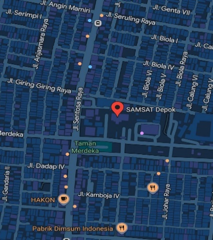

Gambar 3.1 
Lokasi Samsat Depok 1 
Sumber: Google Maps (2026)

Gambar 3.2 
Lokasi Samsat Depok 1 
Sumber: Penulis (2026)

### B. Tahapan Penelitian

Tahapan penelitian merupakan rangkaian proses yang dilakukan secara sistematis sejak awal hingga akhir penelitian. Pelaksanaan penelitian ini mengikuti alur yang mengacu pada panduan penulisan tugas akhir serta disesuaikan dengan kebutuhan sistem yang dikembangkan dalam penelitian, seperti tampak pada Gambar 3. 3.

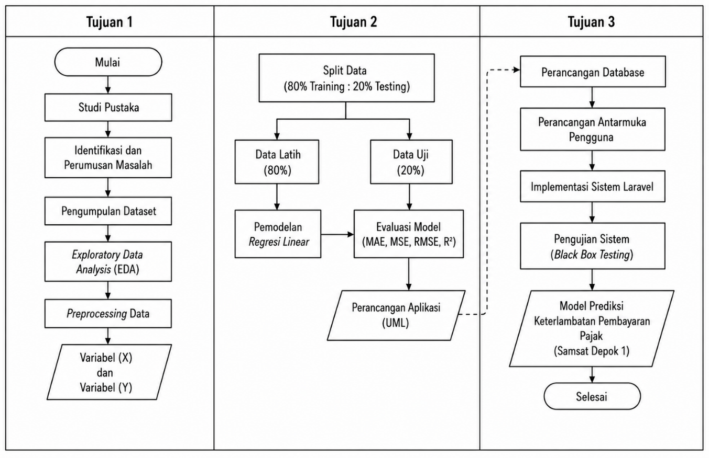

Gambar 3.3 
Tahapan Penelitian 
Sumber: Penulis (2026)

Tahapan penelitian ini dirancang secara terstruktur ke dalam serangkaian proses yang disusun secara sistematis sebagai pedoman dalam pelaksanaan penelitian agar setiap kegiatan dapat dilakukan secara terarah dan sesuai dengan tujuan yang telah ditetapkan. Pada penelitian ini, tahapan penelitian dibagi menjadi tiga tujuan utama. Tujuan pertama meliputi studi pustaka, identifikasi dan perumusan masalah, pengumpulan dataset, Exploratory Data Analysis (EDA), preprocessing data, serta penentuan variabel independen (X) dan variabel dependen (Y). Tujuan kedua mencakup pembagian dataset menjadi data latih dan data uji dengan rasio 80:20, pemodelan menggunakan metode regresi linear, evaluasi model menggunakan metrik Mean Absolute Error (MAE), Mean Squared Error (MSE), Root Mean Squared Error (RMSE), dan koefisien determinasi (R²), serta perancangan aplikasi menggunakan Unified Modeling Language (UML). Selanjutnya, tujuan ketiga meliputi perancangan basis data, perancangan antarmuka pengguna, implementasi sistem menggunakan framework Laravel, pengujian sistem dengan metode Black Box Testing, hingga menghasilkan model prediksi keterlambatan pembayaran pajak pada Samsat Depok 1.

#### 1. Pengumpulan Dataset

Tahap pengumpulan dataset, tahapan awal yang dilakukan dalam penelitian untuk memperoleh data yang akan digunakan sebagai dasar dalam pembangunan model prediksi keterlambatan pembayaran pajak kendaraan bermotor dan/atau bermobil di Samsat Depok 1. Data yang digunakan dalam penelitian dikumpulkan melalui metode wawancara dan dokumentasi. Wawancara dilakukan dengan pegawai Samsat Depok 1 untuk memperoleh informasi mengenai kondisi keterlambatan pembayaran pajak oleh WP (wajib pajak), faktor-faktor yang memengaruhi keterlambatan, serta prosedur penanganan yang diterapkan oleh instansi. Selain itu, dokumentasi dilakukan dengan mengumpulkan data historis pembayaran pajak kendaraan bermotor dan/atau bermobil jurnal ilmiah, buku, serta berbagai referensi yang berkaitan dengan metode Regresi Linear, pengolahan data, dan pengembangan sistem. Data yang diperoleh pada tahap ini menjadi dasar dalam proses analisis, pembangunan model prediksi, serta implementasi sistem.

#### 2. Import Dataset ke Database

Pada tahap ini, penulis meng-import dataset yang telah diperoleh ke dalam basis data MySQL melalui phpMyAdmin. Proses ini bertujuan agar data tersimpan secara terstruktur sehingga memudahkan pengelolaan data, proses analisis, serta integrasi dengan sistem yang dibangun menggunakan Laravel.

#### 3. Preprocessing Data

Tahap preprocessing data ini dalam pengolahan data yang dilakukan oleh penulis untuk membersihkan, memperbaiki, dan mempersiapkan data sebelum dianalisis atau digunakan dalam proses penelitian, data mining, machine learning, maupun metode statistik seperti regresi linear. Tahap ini bertujuan untuk menghasilkan data yang berkualitas sehingga proses analisis dapat memberikan hasil yang lebih akurat, valid, dan dapat dipercaya.

Tahap preprocessing sangat penting bagi penulis karena kualitas hasil analisis sangat dipengaruhi oleh kualitas data yang digunakan. Data yang belum diproses biasanya masih memiliki data kosong, duplikasi, kesalahan penulisan, atau format yang tidak sesuai. Apabila permasalahan tersebut tidak ditangani, maka dapat memengaruhi hasil pemodelan dan menurunkan tingkat akurasi prediksi.

Dalam penelitian ini, penulis melakukan tahap preprocessing terdiri dari beberapa proses utama, yaitu Exploratory Data Analysis (EDA), pembersihan data (data cleaning), dan transformasi data (data transformation). Tahap EDA dilakukan untuk memahami karakteristik data melalui proses eksplorasi, seperti melihat jumlah data, jenis atribut, distribusi data, hubungan antarvariabel, serta mengidentifikasi adanya nilai yang hilang (missing value), data duplikat, maupun nilai pencilan (outlier). Hasil dari EDA menjadi dasar dalam menentukan teknik preprocessing yang akan diterapkan.

Setelah proses EDA, penulis melakukan pembersihan data (data cleaning) untuk meningkatkan kualitas data. Tahap ini meliputi penghapusan data duplikat, penanganan nilai kosong, perbaikan kesalahan penulisan atau inkonsistensi data, serta penghapusan data yang tidak relevan dengan tujuan penelitian. Dengan proses pembersihan data, dataset menjadi lebih bersih dan siap digunakan dalam tahap analisis.

Selanjutnya, penulis melakukan transformasi data (data transformation), dengan proses ini mengubah bentuk atau struktur data agar sesuai dengan kebutuhan algoritma yang digunakan. Transformasi dapat berupa perubahan format data, konversi tipe data, normalisasi atau standarisasi nilai numerik apabila diperlukan, pengkodean data kategorikal menjadi numerik (encoding), serta pemilihan atribut (feature selection) yang relevan dengan variabel penelitian. Melalui tahap transformasi, data menjadi lebih terstruktur dan sesuai untuk digunakan dalam pembangunan model regresi linear sehingga dapat menghasilkan model prediksi yang lebih optimal.

#### 4. Pembagian Data (Training dan Testing)

Pada tahap ini, penulis membagi dataset menjadi dua bagian, yaitu data training dan data testing. Pembagian data bertujuan agar model dapat dilatih sekaligus dievaluasi menggunakan data yang berbeda. Dalam penelitian ini digunakan rasio 80% data training dan 20% data testing. Data training digunakan untuk membangun model regresi linear, sedangkan data testing digunakan untuk menguji kemampuan model dalam melakukan prediksi terhadap data yang belum pernah dipelajari sebelumnya.

#### 5. Menentukan Variabel X (Independen) dan Y (Dependen)

Pada tahap ini, penulis menentukan variabel independen (X) dan variabel dependen (Y) yang akan digunakan dalam proses pemodelan regresi linear. Variabel independen merupakan faktor-faktor yang memengaruhi keterlambatan pembayaran pajak, sedangkan variabel dependen merupakan nilai yang akan diprediksi oleh model. Penentuan variabel dilakukan agar model mampu mempelajari hubungan antarvariabel secara optimal.

#### 6. Data Siap Digunakan

Setelah seluruh proses preprocessing, pembagian data, serta penentuan variabel selesai dilakukan oleh penulis, dataset dinyatakan siap digunakan dalam proses pembangunan model regresi linear. Dataset yang telah dipersiapkan memiliki kualitas yang lebih baik sehingga mampu menghasilkan model prediksi yang lebih optimal.

#### 7. Model Regresi Linear

Pada tahap model regresi linear, setelah proses pembagian data selesai yang dilakukan oleh penulis, data training digunakan untuk membangun model regresi linear. Pada tahap ini, model mempelajari hubungan antara variabel independen (X) dengan variabel dependen (Y) berdasarkan data pelatihan yang telah disiapkan. Hasil proses pelatihan berupa koefisien regresi yang digunakan untuk membentuk persamaan regresi, sehingga model dapat melakukan prediksi terhadap nilai variabel dependen.

Sistem ini dirancang untuk mengelola data keterlambatan pembayaran pajak di Samsat Depok 1. Selain itu, antarmuka pengguna (user interface) juga dirancang agar sistem mudah digunakan oleh pengguna dalam melakukan proses keterlambatan pembayaran pajak bermotor & bermobil.

#### 8. Prediksi Data Testing

Setelah tahap model regresi linear berhasil, penulis membangun menggunakan data training, langkah selanjutnya penulis dapat melakukan prediksi terhadap data testing. Data testing data yang tidak digunakan pada proses pelatihan model sehingga dapat digunakan untuk mengukur kemampuan model dalam memprediksi data baru.

Pada tahap ini, penulis menghasilkan model nilai prediksi berdasarkan hubungan antara variabel independen dan variabel dependen yang telah dipelajari dari data training. Hasil prediksi kemudian dibandingkan dengan nilai aktual pada data testing untuk mengetahui tingkat ketepatan model. Selanjutnya, hasil tersebut digunakan sebagai dasar dalam proses evaluasi kinerja model menggunakan metrik evaluasi yang telah ditentukan.

#### 9. Implementasi Model ke dalam Sistem Laravel

Setelah model regresi linear memperoleh hasil evaluasi yang baik, penulis mengimplementasikan model tersebut ke dalam sistem berbasis Laravel. Implementasi dilakukan agar model prediksi dapat digunakan secara langsung melalui aplikasi dalam melakukan prediksi keterlambatan pembayaran pajak.

#### 10. Perancangan Database dan Antarmuka

Pada tahap ini penulis merancang struktur basis data menggunakan MySQL serta merancang antarmuka pengguna (user interface) menggunakan framework Laravel. Perancangan dilakukan agar pengguna dapat mengelola data WP (wajib pajak), menjalankan proses prediksi, serta melihat hasil prediksi dengan mudah.

#### 11. Pengujian Sistem (Black Box Testing)

Setelah implementasi selesai, penulis melakukan pengujian sistem menggunakan metode Black Box Testing. Pengujian dilakukan untuk memastikan seluruh fungsi sistem berjalan sesuai dengan kebutuhan pengguna, mulai dari proses input data hingga menampilkan hasil prediksi.

#### 12. Data Baru melalui Sistem

Pada tahap ini, pengguna memasukkan data WP (wajib pajak) melalui antarmuka sistem yang telah dibangun oleh penulis menggunakan Laravel. Data yang diinput akan diproses oleh model regresi linear untuk menghasilkan prediksi.

#### 13. Proses Prediksi

Setelah data berhasil dimasukkan oleh penulis, sistem menjalankan proses prediksi menggunakan model regresi linear yang telah diimplementasikan. Sistem menghitung nilai prediksi berdasarkan hubungan antara variabel independen dan variabel dependen yang telah dipelajari sebelumnya.

#### 14. Hasil Prediksi

Tahap ini penulis menghasilkan informasi mengenai prediksi keterlambatan pembayaran pajak berdasarkan data yang telah dimasukkan oleh pengguna. Hasil prediksi ditampilkan pada sistem sehingga dapat digunakan sebagai bahan pertimbangan dalam mendukung pengambilan keputusan di Samsat Depok 1.

### C. Algoritma

Metode yang digunakan dalam penelitian ini adalah metode regresi linear yang bertujuan untuk memprediksi tingkat keterlambatan pembayaran pajak kendaraan bermotor & bermobil pada Samsat Depok 1 berdasarkan data historis WP (wajib pajak). Regresi Linear digunakan untuk mengetahui hubungan antara variabel independen dengan variabel dependen sehingga dapat menghasilkan prediksi keterlambatan pembayaran pajak (Rusdy et al., 2022).

Pada penelitian ini, variabel independen (X) yang digunakan antara lain lama keterlambatan pembayaran pada periode sebelumnya (hari). Sedangkan variabel dependen (Y) adalah lama keterlambatan pembayaran pada periode berikutnya (hari). Tahapan dari Algoritma Regresi Linear terlihat pada Gambar 3. 4.

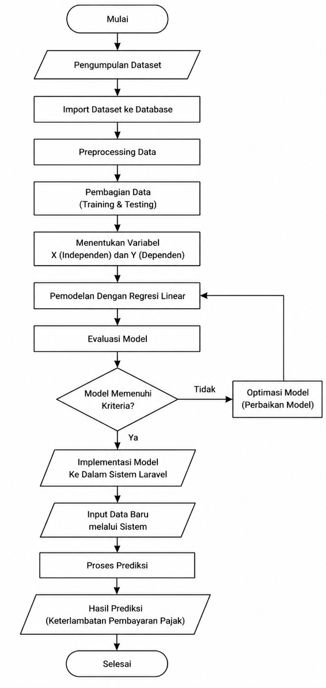

Gambar 3.4 
Sumber: Penulis (2026)

Alur pada Gambar 3. 4 menjadi dasar untuk menjelaskan langkah-langkah penerapan algoritma Regresi Linear penelitian diawali dengan pengumpulan dataset dari Samsat Depok 1 yang kemudian diimpor ke dalam database. Selanjutnya dilakukan preprocessing data, pembagian data menjadi 80% data latih (training) dan 20% data uji (testing), serta penentuan variabel independen (X) dan dependen (Y). Data latih digunakan untuk membangun model regresi linear, sedangkan data uji digunakan untuk mengevaluasi model menggunakan metrik MAE (Mean Absolute Error), MSE (Mean Squared Error), RMSE (Root Mean Squared Error), dan koefisien determinasi (R²). Apabila model belum memenuhi kriteria, dilakukan optimasi hingga diperoleh performa yang lebih baik. Model yang memenuhi kriteria kemudian diimplementasikan ke dalam sistem Laravel untuk memproses data baru dan menghasilkan prediksi keterlambatan pembayaran pajak sebagai pendukung pengambilan keputusan.

#### 1. Langkah – Langkah dari Algoritma Metode Regresi Linear

##### a. Pengumpulan Dataset

Pada tahap pengumpulan dataset, penulis memasukkan WP (wajib pajak) kendaraan bermotor & bermobil, seperti nomor, nama, nomor polisi, jenis kendaraan, nomor mesin, tanggal bayar, tanggal jatuh tempo, prediksi keterlambatan (hari), status keterlambatan/pajak hidup. Persiapan data dilakukan agar seluruh data yang digunakan sesuai dengan kebutuhan sistem/aplikasi.

Pada tahap preprocessing data yang telah dikumpulkan oleh penulis dapat dilakukan untuk dibersihkan dari data kosong (missing value), data ganda (duplicate), dan data yang tidak valid agar proses analisis menjadi lebih akurat. Jika terdapat data yang belum lengkap atau tidak relevan, data tersebut diperbaiki atau dihapus. Tahap ini penting agar proses menggunakan algoritma Regresi Linear dapat berjalan lebih akurat.

Pada tahap pembagian data, penulis membagi dataset menjadi data training dan data testing. Data training digunakan untuk membangun model Regresi Linear, sedangkan data testing digunakan untuk mengevaluasi kemampuan model dalam memprediksi keterlambatan pembayaran pajak pada data yang belum pernah dipelajari sebelumnya. Pada penelitian ini digunakan pembagian data sebesar 80% sebagai data training dan 20% sebagai data testing.

##### b. Menentukan Variabel Penelitian

Pada tahap selanjutnya, penulis menentukan variabel independen (X) dan variabel dependen (Y). Contoh X yaitu nomor, tanggal bayar, nama, nomor polisi, jenis kendaraan, nomor mesin, tanggal jatuh tempo, dan Y yaitu status keterlambatan pembayaran pajak/pajak hidup.

##### c. Pemodelan Dengan Regresi Linear

Pemodelan regresi linear, penulis membentuk berdasarkan hasil perhitungan koefisien regresi untuk menghasilkan model prediksi keterlambatan pajak. Data dibagi menjadi data pelatihan (training data) dan data pengujian (testing data) untuk membangun serta menguji model regresi linear.

##### d. Evaluasi Model

Mengukur tingkat akurasi model penulis menggunakan metode evaluasi seperti: Mean Absolute Error (MAE), Mean Squared Error (MSE), Root Mean Squared Error (RMSE), dan Coefficient of Determination (R²). Rumus masing-masing metrik evaluasi disajikan sebagai berikut:

Koefisien Determinasi (R²) :

$$
R^{2}=1-\frac{\sum_{i=1}^{n}{y_{i}-\bar{y_{i}}}^{2}}{\sum_{i=1}^{n}{y_{i}-\bar{y}}^{2}} 1
$$

Mean Squared Error (MSE) :

$$
MSE=\frac{1}{n}\sum_{i=1}^{n}{y_{i}-\bar{y_{i}}}^{2} 2
$$

Mean Absolute Error (MAE) :

$$
MAE=\frac{1}{n}\sum_{i=1}^{n}y_{i}-\bar{y_{i}} 3
$$

Root Mean Squared Error (RMSE) :

$$
RMSE=\sqrt{\frac{1}{n}\sum_{i=1}^{n}{y_{i}-\bar{y_{i}}}^{2}} 4
$$

##### e. Model Memenuhi Kriteria?

Jika tidak / model belum baik, maka penulis melakukan “Perbaiki Model”, dan jika ya / model sudah baik, penulis lanjut ke hasil prediksi.

##### f. Implementasi Model Ke Dalam Sistem Laravel

Pada tahap ini, penulis mengimplementasikan model regresi linear ke dalam sistem Laravel sehingga pengguna dapat melakukan prediksi keterlambatan pembayaran pajak melalui aplikasi yang telah dibangun.

##### g. Data Baru

Data baru digunakan oleh penulis untuk memasukkan data WP (wajib pajak) yang akan diprediksi.

##### h. Melakukan Proses Prediksi

Memasukkan data baru WP (wajib pajak) ke dalam model regresi linear oleh penulis untuk menghasilkan prediksi keterlambatan pembayaran pajak.

##### i. Hasil Prediksi

Tahap hasil prediksi penulis menampilkan sistem / aplikasi hasil prediksi keterlambatan pembayaran pajak kendaraan bermotor & bermobil.

##### j. Selesai

Proses algoritma regresi linear selesai yang telah dilakukan oleh penulis. Dengan adanya sistem/aplikasi kerja algoritma ini yang dibangun dapat melakukan proses secara sistematis, terstruktur, dan sesuai dengan proses yang memberikan hasil yang sesuai.

## BAB IV HASIL DAN PEMBAHASAN

### A. Definisi Masalah

Hasil observasi dan wawancara menunjukkan bahwa petugas Samsat Depok 1 masih melakukan identifikasi Wajib Pajak (WP) yang berpotensi mengalami keterlambatan pembayaran secara manual. Petugas memeriksa riwayat pembayaran WP untuk mengetahui pembayaran yang melewati tanggal jatuh tempo.

Proses pemeriksaan manual membutuhkan waktu ketika jumlah data WP meningkat. Proses tersebut juga bergantung pada ketelitian petugas dalam memeriksa riwayat pembayaran. Kondisi tersebut menyulitkan petugas dalam menentukan WP yang berpotensi mengalami keterlambatan pembayaran.

Data pembayaran WP belum dimanfaatkan secara optimal untuk menghasilkan prediksi keterlambatan pembayaran. Data pembayaran menghasilkan nilai lama keterlambatan berdasarkan selisih antara tanggal pembayaran dan tanggal jatuh tempo. Nilai tersebut dapat digunakan sebagai dasar dalam pembentukan model prediksi.

Penelitian ini menggunakan lama keterlambatan pembayaran pada periode sebelumnya sebagai variabel independen (X). Penelitian ini menggunakan lama keterlambatan pembayaran pada periode berikutnya sebagai variabel dependen (Y). Data nama WP, nomor polisi, jenis kendaraan, dan nomor mesin digunakan sebagai atribut pendukung untuk menghubungkan hasil prediksi dengan data WP.

Model regresi linear menghasilkan nilai prediksi lama keterlambatan pembayaran pada periode berikutnya. Nilai prediksi lebih dari 0 hari menunjukkan potensi keterlambatan pembayaran. Nilai prediksi 0 hari atau kurang menunjukkan tidak adanya perkiraan keterlambatan pembayaran.

Dataset penelitian terdiri atas 1.000 data pembayaran WP pada Samsat Depok 1. Dataset tersebut terdiri atas 800 data latih dan 200 data uji. Data latih digunakan untuk membentuk model regresi linear, sedangkan data uji digunakan untuk mengukur kemampuan model dalam menghasilkan prediksi.

Hasil implementasi menunjukkan bahwa sistem dapat mengolah data pembayaran secara terkomputerisasi. Sistem menampilkan hasil prediksi, hasil evaluasi model, dan riwayat prediksi. Informasi tersebut dapat digunakan sebagai bahan pertimbangan petugas dalam mengidentifikasi WP yang berpotensi mengalami keterlambatan pembayaran.

Hasil prediksi tidak digunakan sebagai dasar pemberian sanksi atau tindakan penagihan secara otomatis. Keputusan mengenai tindakan terhadap WP tetap berada pada pihak Samsat Depok 1.

### B. Pembahasan Algoritma

Penerapan regresi linear menghasilkan model prediksi lama keterlambatan pembayaran pajak pada Samsat Depok 1. Model menggunakan lama keterlambatan pembayaran pada periode sebelumnya sebagai variabel independen (X) dan lama keterlambatan pembayaran pada periode berikutnya sebagai variabel dependen (Y).

Dataset penelitian terdiri atas 1.000 data pembayaran WP. Data tersebut terdiri atas 800 data latih dan 200 data uji. Data latih digunakan untuk membentuk persamaan regresi linear, sedangkan data uji digunakan untuk mengukur kemampuan model dalam menghasilkan prediksi.

Hasil perhitungan data latih menghasilkan koefisien regresi dan konstanta yang membentuk persamaan regresi. Persamaan tersebut digunakan untuk menghitung perkiraan lama keterlambatan pembayaran pada periode berikutnya berdasarkan nilai keterlambatan pada periode sebelumnya.

Contoh penerapan model dilakukan dengan menggunakan nilai X sebesar 5 hari. Sistem memasukkan nilai tersebut ke dalam persamaan regresi dan menghasilkan perkiraan keterlambatan pada periode berikutnya. Hasil prediksi tersebut menunjukkan bahwa nilai keterlambatan pada periode sebelumnya dapat digunakan untuk memperkirakan nilai keterlambatan pada periode berikutnya.

Hasil pengujian terhadap 200 data uji menghasilkan nilai MAE sebesar 33,46 hari. Nilai tersebut menunjukkan rata-rata selisih absolut antara hasil prediksi dan nilai aktual sebesar 33,46 hari, Nilai MSE yang diperoleh sebesar 5.380,32 hari². Nilai tersebut menunjukkan rata-rata kuadrat kesalahan antara hasil prediksi dan nilai aktual pada data uji, Nilai RMSE yang diperoleh sebesar 73,35 hari. Nilai tersebut menunjukkan besarnya kesalahan prediksi dalam satuan hari dengan memberikan pengaruh lebih besar terhadap kesalahan yang bernilai tinggi, Nilai R² yang diperoleh sebesar 81,50%. Nilai tersebut menunjukkan bahwa model mampu menjelaskan 81,50% variasi lama keterlambatan pembayaran pada data pengujian.

Hasil evaluasi menunjukkan bahwa model regresi linear dapat digunakan untuk memperkirakan lama keterlambatan pembayaran berdasarkan data historis yang digunakan dalam penelitian. Hasil prediksi berfungsi sebagai informasi pendukung bagi petugas dalam mengidentifikasi WP yang berpotensi mengalami keterlambatan pembayaran.

#### 1. Algoritma Regresi Linear

Implementasi algoritma Regresi Linear pada aplikasi menempatkan proses prediksi sebagai tahapan untuk memperkirakan keterlambatan pembayaran Wajib Pajak (WP). Admin/petugas memilih data WP yang akan diproses pada halaman model & prediksi, kemudian sistem mengambil data keterlambatan pembayaran yang tersimpan pada basis data. Sistem menggunakan data keterlambatan pembayaran pada periode sebelumnya sebagai variabel X dan perkiraan keterlambatan pembayaran pada periode berikutnya sebagai variabel Y. Sistem menghasilkan nilai prediksi berdasarkan hubungan linear antara kedua variabel tersebut. Hasil prediksi digunakan sebagai informasi untuk mengidentifikasi WP yang berpotensi mengalami keterlambatan pembayaran pajak.

Proses prediksi dimulai ketika Admin/petugas membuka halaman model & prediksi dan memilih data WP yang akan diprediksi. Aplikasi memeriksa ketersediaan data keterlambatan pembayaran sebelum menjalankan proses prediksi. Data yang tersedia kemudian diproses menggunakan algoritma regresi linear untuk membentuk hubungan antara variabel X dan variabel Y. Sistem menggunakan data training untuk membentuk model dan data testing untuk menguji hasil prediksi. Pembagian dataset dilakukan dengan perbandingan 80% data training dan 20% data testing.

Proses pembentukan model menggunakan data training untuk memperoleh persamaan regresi linear. Algoritma menghitung hubungan antara variabel X dan variabel Y berdasarkan data yang tersedia. Model yang terbentuk digunakan untuk menghasilkan nilai prediksi pada data testing. Sistem membandingkan nilai prediksi dengan nilai aktual untuk mengetahui tingkat kesalahan prediksi. Sistem menyimpan hasil prediksi dan nilai evaluasi model sebagai informasi pada aplikasi. Algoritma regresi linear pada aplikasi terdiri atas beberapa langkah yang berjalan secara berurutan. Secara umum, algoritma Regresi Linear terdiri atas beberapa langkah yang saling berurutan, yaitu:

1. Pengguna membuka halaman model & prediksi pada aplikasi.
1. Admin/petugas memilih data WP yang akan diproses untuk melakukan prediksi.
1. Sistem mengambil data keterlambatan pembayaran dari basis data dan melakukan pemeriksaan terhadap ketersediaan data.
1. Sistem membagi dataset menjadi 80% data training dan 20% data testing.
1. Algoritma regresi linear membentuk model berdasarkan hubungan antara data keterlambatan pembayaran periode sebelumnya sebagai variabel X dan data keterlambatan pembayaran periode berikutnya sebagai variabel Y.
1. Sistem menggunakan model yang terbentuk untuk menghasilkan nilai prediksi keterlambatan pembayaran pada data testing.
1. Sistem menghitung nilai MAE, MSE, RMSE, dan R² untuk mengevaluasi hasil prediksi serta menampilkan hasil prediksi pada halaman model & prediksi.

Implementasi algoritma regresi linear tersebut memberikan informasi prediksi keterlambatan pembayaran kepada Admin/petugas. Sistem menggunakan hasil prediksi untuk mengidentifikasi WP yang berpotensi mengalami keterlambatan pembayaran. Nilai prediksi yang lebih besar dari 0 menunjukkan adanya potensi keterlambatan pembayaran pada periode berikutnya. Hasil prediksi dan evaluasi model dapat digunakan Admin/petugas sebagai informasi pendukung dalam melakukan pemantauan terhadap pembayaran pajak WP.

#### 2. Algoritma Prediksi Keterlambatan Pembayaran Pajak dengan Regresi Linear

Regresi Linear merupakan algoritma utama yang digunakan untuk memperkirakan lama keterlambatan pembayaran pajak kendaraan bermotor dan bermobil pada Samsat Depok 1. Algoritma ini digunakan untuk memodelkan hubungan antara variabel independen (X) dan variabel dependen (Y) dalam bentuk persamaan garis lurus, sehingga nilai Y pada data baru dapat diperkirakan berdasarkan nilai X yang dimiliki.

Variabel independen (X) yang digunakan adalah lama keterlambatan pembayaran WP pada periode sebelumnya (dalam satuan hari), yang dihitung dari selisih antara tanggal bayar dan tanggal jatuh tempo. Variabel dependen (Y) adalah perkiraan lama keterlambatan pembayaran pada periode berikutnya. Data identitas WP, yaitu nomor, nama, nomor polisi, jenis kendaraan, dan nomor mesin, digunakan sebagai atribut penyerta agar hasil prediksi tetap dapat ditelusuri kembali ke WP dan kendaraan yang bersangkutan.

Tahapan algoritma Regresi Linear pada penelitian ini meliputi pengumpulan dan preprocessing data, penentuan variabel X dan Y, pembagian dataset, pembentukan persamaan regresi, evaluasi model, serta implementasi ke dalam sistem. Setiap tahapan tersebut dijelaskan sebagai berikut.

##### a. Pengumpulan dan Preprocessing Data

Data pembayaran WP yang telah tersimpan pada basis data MySQL diperiksa untuk menemukan data kosong, data ganda, maupun data yang tidak valid. Data tanggal bayar dan tanggal jatuh tempo diolah untuk menghasilkan nilai numerik lama keterlambatan (dalam satuan hari) pada setiap periode pembayaran. Nilai negatif atau nol menunjukkan bahwa pembayaran dilakukan tepat waktu atau lebih awal, sedangkan nilai positif menunjukkan lama keterlambatan dalam hari.

##### b. Penentuan Variabel X dan Y

Setiap WP yang memiliki riwayat pembayaran lebih dari satu periode dipasangkan menjadi satu baris data, dengan X berupa lama keterlambatan pada periode sebelumnya dan Y berupa lama keterlambatan pada periode berikutnya.

##### c. Pembagian Dataset

Dataset dibagi dengan perbandingan 80% data latih dan 20% data uji. Data latih digunakan untuk membentuk persamaan regresi, sedangkan data uji digunakan untuk mengukur kemampuan model dalam memperkirakan lama keterlambatan pada data yang tidak digunakan pada proses pelatihan.

##### d. Pembentukan Persamaan Regresi Linear

Persamaan Regresi Linear sederhana dibentuk dalam bentuk $Y = a + bX$, dengan $a$ merupakan konstanta (intercept) dan $b$ merupakan koefisien kemiringan garis (slope). Nilai $a$ dan $b$ diperoleh melalui metode kuadrat terkecil (least square) menggunakan persamaan berikut.

$$
b = \sum (Xi - \bar{X})(Yi - \bar{Y}) / \sum (Xi - \bar{X})^2 a = \bar{Y} - b\cdot \bar{X} (1)
$$

##### e. Evaluasi Model

Tingkat akurasi model diukur menggunakan metrik Mean Absolute Error (MAE), Mean Squared Error (MSE), Root Mean Squared Error (RMSE), dan Coefficient of Determination (R²) sebagaimana rumus yang telah diuraikan pada Bab III.

##### f. Implementasi ke dalam Sistem Laravel

Persamaan regresi yang telah terbentuk pada tahap pelatihan disimpan dan digunakan oleh controller prediksi pada Laravel. Ketika Admin/petugas memasukkan atau memilih data WP baru, sistem menghitung nilai X, menerapkan persamaan regresi untuk memperoleh nilai Y, kemudian menampilkan hasil prediksi berupa perkiraan lama keterlambatan (dalam hari) beserta status "berpotensi tepat waktu" atau "berpotensi terlambat". Hasil prediksi selanjutnya disimpan sebagai riwayat pada basis data.

#### 3. Contoh Perhitungan Manual

Berikut disajikan contoh perhitungan manual untuk memperlihatkan cara kerja algoritma regresi linear pada penelitian ini. Data yang digunakan merupakan contoh ilustrasi dengan 6 pasang data lama keterlambatan pembayaran (X = periode sebelumnya, Y = periode berikutnya) dalam satuan hari. Data Perhitungan Manual ditampilkan pada Tabel 4. 1 bertujuan menjelaskan mekanisme rumus regresi, sedangkan hasil akhir model yang sesungguhnya harus dihitung menggunakan seluruh dataset Samsat Depok 1 yang digunakan penulis.

Tabel 4.1 
Data Perhitungan Manual Regresi Linear

| No | X (hari) | Y (hari) | Xi − X̄ | Yi − Ȳ | (Xi−X̄)(Yi−Ȳ) | (Xi−X̄)² |
| --- | --- | --- | --- | --- | --- | --- |
| 1 | 2 | 3 | -2 | -2.5 | 5 | 4 |
| 2 | 3 | 4 | -1 | -1.5 | 1.5 | 1 |
| 3 | 4 | 5 | 0 | -0.5 | 0 | 0 |
| 4 | 5 | 6 | 1 | 0.5 | 0.5 | 1 |
| 5 | 6 | 8 | 2 | 2.5 | 5 | 4 |
| 6 | 4 | 7 | 0 | 1.5 | 0 | 0 |
| Σ | 24 | 33 | 0 | 0 | 12 | 10 |

Sumber: Penulis (2026)

Berdasarkan data pada Tabel 4.1, $\bar{X} = 24/6 = 4, dan \bar{Y} = 33/6 = 5,5$. Nilai koefisien b dan konstanta a dihitung sebagai berikut.

$$
b = 12 / 10 = 1,2 (1)
$$

$$
a = 5,5 - (1,2 \times 4) = 5,5 - 4,8 = 0,7 (2)
$$

Sehingga persamaan regresi $Y = 0,7 + 1,2X$. Apabila terdapat WP (wajib pajak) baru dengan lama keterlambatan pada periode sebelumnya (X) selama 5 hari, maka perkiraan lama keterlambatan pada periode berikutnya (Y) dihitung sebagai berikut.

$Y = 0,7 + (1,2 \times 5) = 0,7 + 6 = 6,7 ≈ 7 hari$ (3)

Nilai tersebut menunjukkan bahwa WP dengan riwayat keterlambatan 5 hari pada periode sebelumnya diperkirakan akan mengalami keterlambatan sekitar 7 hari pada periode pembayaran berikutnya, sehingga dapat dikategorikan berpotensi terlambat dan perlu diberikan pengingat oleh Samsat Depok 1. Perhitungan MAE, MSE, RMSE, dan R² dilakukan dengan cara yang sama, yaitu membandingkan nilai Y hasil prediksi dengan nilai Y aktual pada data uji, kemudian dimasukkan ke dalam masing-masing rumus evaluasi yang telah diuraikan pada Bab III. Hasil evaluasi menggunakan dataset Samsat Depok 1 yang sesungguhnya disajikan pada Sub-bab 4. 1.

### C. Pemodelan Perangkat Lunak

#### 1. Unified Modeling Language (UML)

Pemodelan perangkat lunak merupakan tahapan yang dilakukan untuk menggambarkan rancangan dan perilaku sistem sebelum dan selama proses implementasi ke dalam program. Pada penelitian ini, pemodelan perangkat lunak menggunakan UML (Unified Modeling Language) sebagai bahasa pemodelan standar untuk merepresentasikan kebutuhan fungsional, alur aktivitas, komunikasi antarkomponen, dan struktur data pada sistem prediksi keterlambatan pembayaran pajak.

Pada penelitian ini, pemodelan perangkat lunak terdiri atas empat jenis diagram UML yang saling melengkapi, yaitu Use Case Diagram, Activity Diagram, Sequence Diagram, dan Class Diagram.

##### a. Use Case Diagram

Use Case Diagram sistem prediksi keterlambatan pembayaran pajak menunjukkan interaksi antara Admin / Petugas dan User / Wajib Pajak dengan sistem berdasarkan hak akses masing-masing. Admin/Petugas mengakses fitur login, dashboard, data pajak, model dan prediksi / cetak laporan, import data, pengguna, serta pengaturan untuk mengelola data dan proses prediksi. Admin/Petugas mengelola data pajak, melakukan import data, melatih model regresi linear, menjalankan prediksi, melihat hasil prediksi, dan mencetak laporan. Sistem memproses data pembayaran pajak dan menghasilkan nilai prediksi keterlambatan pembayaran. User / Wajib Pajak mengakses fitur login, dashboard, data pajak, model dan prediksi, serta pengaturan sesuai dengan hak akses yang diberikan. User / Wajib Pajak melihat informasi data pajak dan hasil prediksi yang berkaitan dengan datanya. Sistem menyimpan hasil prediksi dan menampilkan informasi sesuai dengan hak akses pengguna. Hubungan antara Admin / Petugas, User / Wajib Pajak, dan seluruh fungsi sistem ditampilkan pada Gambar 4. 1.

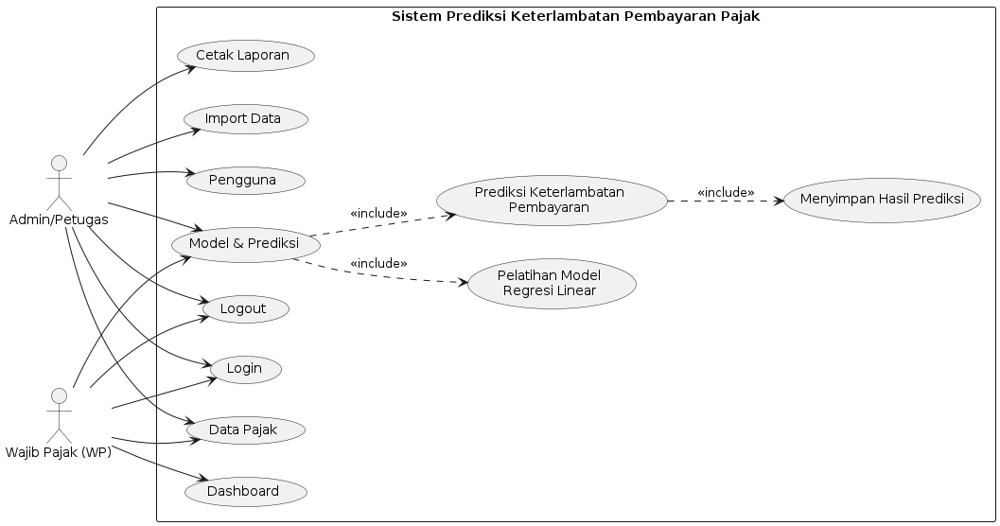

Gambar 4.1 
Use Case Diagram 
Sumber: Penulis (2026)

##### 1. Skenario Use Case Admin / Petugas

Sembilan tabel skenario menjelaskan fungsi utama yang diakses Admin / Petugas. Tabel skenario admin 4. 2 sampai 4. 10 memuat use case, aktor, tujuan, prakondisi, pemicu, alur, dan pascakondisi.

Tabel 4.2 
Skenario Use Case Login Admin/Petugas 

| Elemen | Deskripsi |
| --- | --- |
| Nama use case | Login |
| Aktor | Admin/Petugas |
| Tujuan | Admin/Petugas mengakses fungsi utama aplikasi melalui sesi yang valid. |
| Prakondisi | Admin/Petugas memiliki akun aktif dan halaman login ditampilkan. |
| Pemicu | Admin/Petugas memilih tombol Login setelah mengisi username/email dan password. |
| Alur utama | 1. Admin/Petugas memasukkan username/email dan password.  2. Sistem melakukan validasi terhadap data login.  3. Sistem memeriksa kredensial pengguna.  4. Sistem membentuk sesi pengguna yang valid.  5. Sistem mengarahkan Admin/Petugas ke dashboard sesuai dengan hak akses. |
| Alur alternatif | 1. Sistem menampilkan pesan kesalahan ketika username/email atau password kosong.  2. Sistem menampilkan pemberitahuan ketika kredensial tidak valid atau akun tidak aktif.  3. Sistem tidak memberikan akses ke dashboard ketika proses autentikasi gagal. |
| Pascakondisi | Sistem memberikan akses kepada Admin/Petugas yang berhasil melakukan autentikasi dan menampilkan dashboard. |

Sumber: Penulis (2026)

Tabel 4.3 
Skenario Use Case Dashboard Admin/Petugas
Sumber: Penulis (2026)

| Elemen | Deskripsi |
| --- | --- |
| Nama use case | Dashboard |
| Aktor | Admin/Petugas |
| Tujuan | Admin/Petugas memantau kondisi data pajak dan hasil prediksi secara ringkas. |
| Prakondisi | Admin/Petugas memiliki sesi yang valid. |
| Pemicu | Admin/Petugas membuka halaman Dashboard setelah berhasil login atau melalui navigasi aplikasi. |
| Alur utama | 1. Admin/Petugas membuka halaman Dashboard.  2. Sistem mengambil ringkasan data pajak dan hasil prediksi.  3. Sistem menampilkan jumlah data pajak, pembayaran, keterlambatan, dan hasil prediksi.  4. Sistem menampilkan grafik pembayaran untuk membantu pemantauan kondisi data. |
| Alur alternatif | 1. Sistem mengarahkan pengguna ke halaman login ketika sesi tidak valid.  2. Sistem menampilkan informasi yang tersedia apabila sebagian data ringkasan belum tersedia. |
| Pascakondisi | Dashboard menampilkan informasi terbaru sesuai dengan data yang tersedia pada sistem. |

Sumber: Penulis (2026)

Tabel 4.4 
Skenario Use Case Data Pajak Admin/Petugas

| Elemen | Deskripsi |
| --- | --- |
| Nama use case | Data Pajak |
| Aktor | Admin/Petugas |
| Tujuan | Admin/Petugas mengelola data kendaraan dan pembayaran pajak yang digunakan sebagai dataset penelitian. |
| Prakondisi | Admin/Petugas memiliki sesi yang valid. |
| Pemicu | Admin/Petugas membuka halaman Data Pajak. |
| Alur utama | 1. Admin/Petugas membuka halaman Data Pajak.  2. Sistem menampilkan data kendaraan dan pembayaran pajak dalam bentuk tabel.  3. Admin/Petugas dapat mencari dan menyaring data sesuai kebutuhan.  4. Admin/Petugas dapat menambahkan data pajak baru.  5. Admin/Petugas dapat mengubah data pajak yang tersedia.  6. Admin/Petugas dapat menghapus data pajak yang dipilih.  7. Sistem menyimpan perubahan data ke dalam basis data MySQL. |
| Alur alternatif | 1. Sistem menampilkan pesan kesalahan ketika data yang dimasukkan tidak lengkap atau tidak sesuai.  2. Sistem tidak menyimpan perubahan ketika proses validasi data gagal. |
| Pascakondisi | Data pajak tersimpan atau diperbarui sesuai tindakan yang dilakukan Admin/Petugas. |

Sumber: Penulis (2026)

Tabel 4.5 
Skenario Use Case Model dan Prediksi Admin/Petugas

| Elemen | Deskripsi |
| --- | --- |
| Nama use case | Model dan Prediksi |
| Aktor | Admin/Petugas |
| Tujuan | Admin/Petugas menghasilkan model Regresi Linear dan memperoleh hasil prediksi keterlambatan pembayaran pajak. |
| Prakondisi | Admin/Petugas memiliki sesi yang valid dan data pembayaran pajak tersedia. |
| Pemicu | Admin/Petugas membuka menu Model & Prediksi dan menjalankan proses prediksi. |
| Alur utama | 1. Admin/Petugas memilih menu Model & Prediksi.  2. Sistem mengambil dan melakukan pre-processing data pembayaran pajak.  3. Sistem membagi data menjadi 80% data training dan 20% data testing.  4. Sistem membentuk dan menguji model Regresi Linear.  5. Sistem menghitung nilai MAE, MSE, RMSE, dan R² untuk mengevaluasi model.  6. Admin/Petugas memilih data WP yang akan digunakan dalam proses prediksi.  7. Sistem menghasilkan perkiraan lama keterlambatan pembayaran pajak.  8. Sistem menampilkan dan menyimpan hasil prediksi sebagai riwayat prediksi. |
| Alur alternatif | 1. Sistem menampilkan pesan kesalahan ketika data yang diperlukan belum tersedia atau tidak valid.  2. Sistem tidak menghasilkan prediksi apabila proses pembentukan model gagal.  3. Sistem tidak menyimpan riwayat ketika proses prediksi tidak berhasil. |
| Pascakondisi | Sistem menghasilkan model, nilai evaluasi, dan hasil prediksi keterlambatan pembayaran pajak yang dapat digunakan sebagai informasi pendukung. |

Sumber: Penulis (2026)

Tabel 4.6 
Skenario Use Case Cetak Laporan

| Elemen | Deskripsi |
| --- | --- |
| Nama use case | Cetak Laporan |
| Aktor | Admin/Petugas |
| Tujuan | Admin/Petugas memperoleh laporan data pembayaran pajak dan hasil prediksi sesuai jenis serta periode yang dipilih. |
| Prakondisi | Admin/Petugas memiliki sesi yang valid dan data laporan tersedia. |
| Pemicu | Admin/Petugas membuka halaman Cetak Laporan dan memilih jenis serta periode laporan. |
| Alur utama | 1. Admin/Petugas membuka halaman Cetak Laporan.  2. Admin/Petugas memilih jenis laporan dan periode data.  3. Sistem mengambil data sesuai pilihan yang diberikan.  4. Sistem menampilkan data pembayaran pajak dan hasil prediksi secara terstruktur.  5. Admin/Petugas memeriksa informasi laporan.  6. Admin/Petugas memilih fungsi cetak untuk menghasilkan laporan. |
| Alur alternatif | 1. Sistem menampilkan pesan ketika data sesuai jenis atau periode laporan tidak tersedia.  2. Sistem tidak menghasilkan laporan apabila parameter laporan tidak sesuai. |
| Pascakondisi | Laporan data pajak dan hasil prediksi tersedia dan dapat dicetak sebagai dokumentasi serta bahan evaluasi. |

Sumber: Penulis (2026)

Tabel 4.7 
Skenario Use Case Laporan

| Elemen | Deskripsi |
| --- | --- |
| Nama use case | Laporan |
| Aktor | Admin/Petugas |
| Tujuan | Admin/Petugas memperoleh salinan laporan data pembayaran pajak dan hasil prediksi miliknya. |
| Prakondisi | Admin/Petugas memiliki sesi yang valid dan data laporan tersedia. |
| Pemicu | Admin/Petugas membuka halaman Laporan dan memilih periode data yang diinginkan. |
| Alur utama | 1. Admin/Petugas membuka halaman Laporan. 2. Admin/Petugas memilih periode data yang akan ditampilkan. 3. Sistem mengambil data sesuai periode yang dipilih. 4. Sistem menampilkan data pembayaran pajak dan hasil prediksi secara terstruktur. 5. Admin/Petugas memilih fungsi cetak atau unduh untuk menyimpan laporan. |
| Alur alternatif | 1. Sistem menampilkan pesan ketika data sesuai periode yang dipilih tidak tersedia. 2. Sistem tidak menghasilkan laporan apabila proses pengambilan data gagal. |
| Pascakondisi | Laporan data pajak dan hasil prediksi tersedia serta dapat dicetak atau diunduh oleh Admin/Petugas. |

Sumber: Penulis (2026)

Tabel 4.8 
Skenario Use Case Import Data

| Elemen | Deskripsi |
| --- | --- |
| Nama use case | Import Data |
| Aktor | Admin/Petugas |
| Tujuan | Admin/Petugas memasukkan dataset pajak dalam jumlah besar melalui file Excel atau CSV. |
| Prakondisi | Admin/Petugas memiliki sesi yang valid dan file dataset tersedia. |
| Pemicu | Admin/Petugas memilih menu Import Data dan memilih file Excel atau CSV. |
| Alur utama | 1. Admin/Petugas memilih file dataset yang akan diunggah.  2. Sistem menerima file Excel atau CSV.  3. Sistem memeriksa format dan memvalidasi isi data.  4. Sistem menampilkan pratinjau serta informasi jumlah data.  5. Sistem menyimpan data yang valid ke dalam basis data.  6. Sistem menampilkan pemberitahuan mengenai data yang berhasil dimasukkan. |
| Alur alternatif | 1. Sistem menampilkan pesan kesalahan ketika format file tidak sesuai.  2. Sistem menampilkan informasi pada data yang tidak valid.  3. Sistem tidak menyimpan data yang gagal melewati proses validasi. |
| Pascakondisi | Dataset yang valid berhasil dimasukkan ke dalam sistem dan dapat digunakan pada proses pengolahan berikutnya. |

Sumber: Penulis (2026)

Tabel 4.9 
Skenario Use Case Pengguna

| Elemen | Deskripsi |
| --- | --- |
| Nama use case | Pengguna |
| Aktor | Admin/Petugas |
| Tujuan | Admin/Petugas mengelola akun dan hak akses pengguna sistem. |
| Prakondisi | Admin/Petugas memiliki sesi yang valid. |
| Pemicu | Admin/Petugas membuka halaman Pengguna. |
| Alur utama | 1. Admin/Petugas membuka halaman Pengguna.  2. Sistem menampilkan daftar akun beserta informasi nama, username, role, dan status akun.  3. Admin/Petugas dapat menambahkan pengguna baru.  4. Admin/Petugas dapat mengubah data pengguna sesuai hak akses.  5. Admin/Petugas dapat menghapus pengguna yang dipilih.  6. Sistem menyimpan perubahan data pengguna ke dalam basis data. |
| Alur alternatif | 1. Sistem menampilkan pesan kesalahan ketika data pengguna tidak lengkap atau tidak valid.  2. Sistem tidak menyimpan perubahan ketika proses validasi gagal. |
| Pascakondisi | Data pengguna tersimpan dan daftar pengguna menampilkan informasi terbaru sesuai perubahan yang berhasil dilakukan. |

Sumber: Penulis (2026)

Tabel 4.10 
Skenario Use Case Pengaturan

| Elemen | Deskripsi |
| --- | --- |
| Nama use case | Pengaturan |
| Aktor | Admin/Petugas |
| Elemen | Deskripsi |
| Tujuan | Admin/Petugas mengelola informasi profil dan password untuk menjaga keamanan akun. |
| Prakondisi | Admin/Petugas memiliki sesi yang valid. |
| Pemicu | Admin/Petugas membuka halaman Pengaturan. |
| Alur utama | 1. Admin/Petugas membuka halaman Pengaturan.  2. Sistem menampilkan informasi profil dan pengaturan akun.  3. Admin/Petugas dapat memperbarui informasi profil.  4. Admin/Petugas dapat mengganti password akun.  5. Sistem memvalidasi perubahan yang dimasukkan.  6. Sistem menyimpan perubahan pengaturan ke dalam basis data. |
| Alur alternatif | 1. Sistem menampilkan pesan kesalahan ketika data pengaturan tidak sesuai.  2. Sistem tidak menyimpan perubahan apabila validasi gagal. |
| Pascakondisi | Informasi profil dan pengaturan akun tersimpan sesuai perubahan yang berhasil dilakukan. |

Sumber: Penulis (2026)

##### 2. Skenario Use Case User

lima tabel skenario menjelaskan fungsi utama yang diakses user. Tabel 4. 11 Sampai 4. 15 memuat use case, aktor, tujuan, prakondisi, pemicu, alur, dan pascakondisi.

Tabel 4.11 
Skenario Use Case Login User

| Elemen | Deskripsi |
| --- | --- |
| Nama use case | Login |
| Aktor | User |
| Tujuan | User mengakses fungsi aplikasi melalui sesi yang valid sesuai hak akses yang dimiliki. |
| Prakondisi | User memiliki akun aktif dan halaman login ditampilkan. |
| Pemicu | User memilih tombol Login setelah mengisi username/email dan password. |
| Alur utama | 1. User memasukkan username/email dan password. 2. Sistem melakukan validasi terhadap data login. 3. Sistem memeriksa kredensial pengguna. 4. Sistem membentuk sesi pengguna yang valid. 5. Sistem mengarahkan User ke halaman utama sesuai dengan hak akses. |
| Alur alternatif | 1. Sistem menampilkan pesan kesalahan etika username/email atau password kosong. 2. Sistem menampilkan pemberitahuan ketika kredensial tidak valid atau akun tidak aktif. 3. Sistem tidak memberikan akses ke halaman utama ketika proses autentikasi gagal. |
| Pascakondisi | Sistem memberikan akses kepada User yang berhasil melakukan autentikasi dan menampilkan halaman utama. |

Sumber: Penulis (2026)

Tabel 4.12 
Skenario Use Case Dashboard User

| Elemen | Deskripsi |
| --- | --- |
| Nama use case | Melihat Dashboard |
| Aktor | User |
| Tujuan | User memantau ringkasan data pajak dan informasi terkait akun miliknya. |
| Prakondisi | User memiliki sesi yang valid. |
| Pemicu | User membuka halaman Dashboard setelah berhasil login atau melalui navigasi aplikasi. |
| Alur utama | 1. User membuka halaman Dashboard. 2. Sistem mengambil data pajak yang berkaitan dengan User. 3. Sistem menampilkan ringkasan data pembayaran dan status pajak. 4. Sistem menampilkan grafik atau informasi pendukung untuk membantu pemantauan. |
| Alur alternatif | 1. Sistem mengarahkan User ke halaman login ketika sesi tidak valid. 2. Sistem menampilkan informasi yang tersedia apabila sebagian data belum tersedia. |
| Pascakondisi | Dashboard menampilkan informasi terbaru sesuai dengan data yang tersedia pada sistem. |

Sumber: Penulis (2026)

Tabel 4.13 
Skenario Use Case Data Pajak User

| Elemen | Deskripsi |
| --- | --- |
| Nama use case | Data Pajak |
| Aktor | User |
| Tujuan | User melihat data kendaraan dan riwayat pembayaran pajak miliknya. |
| Prakondisi | User memiliki sesi yang valid dan data pajak terdaftar pada sistem. |
| Pemicu | User membuka halaman Data Pajak. |
| Alur utama | 1. User membuka halaman Data Pajak. 2. Sistem mengambil data kendaraan dan pembayaran pajak yang berkaitan dengan User. 3. Sistem menampilkan data pajak dalam bentuk tabel. 4. User dapat mencari dan menyaring data sesuai kebutuhan. |
| Alur alternatif | 1. Sistem menampilkan pesan ketika data pajak belum tersedia untuk User terkait. 2. Sistem mengarahkan User ke halaman login ketika sesi tidak valid. |
| Pascakondisi | User memperoleh informasi data pajak sesuai dengan data yang tersedia pada sistem. |

Sumber: Penulis (2026)

Tabel 4.14 
Skenario Use Case Model & Prediksi User

| Elemen | Deskripsi |
| --- | --- |
| Nama use case | Model dan Prediksi |
| Aktor | User |
| Tujuan | User memperoleh hasil prediksi keterlambatan pembayaran pajak untuk data miliknya. |
| Prakondisi | User memiliki sesi yang valid dan data pembayaran pajak tersedia. |
| Pemicu | User membuka menu Model & Prediksi dan memilih data yang akan diprediksi. |
| Elemen | Deskripsi |
| Alur utama | 1. User membuka menu Model & Prediksi. 2. User memilih data pajak yang akan digunakan dalam proses prediksi. 3. Sistem mengambil model Regresi Linear yang telah dibentuk oleh Admin/Petugas. 4. Sistem menghasilkan perkiraan lama keterlambatan pembayaran pajak. 5. Sistem menampilkan hasil prediksi kepada User. |
| Alur alternatif | 1. Sistem menampilkan pesan kesalahan ketika data yang diperlukan belum tersedia atau tidak valid. 2. Sistem tidak menghasilkan prediksi apabila proses pengambilan model gagal. |
| Pascakondisi | User memperoleh hasil prediksi keterlambatan pembayaran pajak yang dapat dijadikan bahan pertimbangan. |

Sumber: Penulis (2026)

Tabel 4.15 
Skenario Use Case Pengaturan

| Elemen | Deskripsi |
| --- | --- |
| Nama use case | Pengaturan |
| Aktor | User |
| Tujuan | User mengelola informasi profil dan password untuk menjaga keamanan akun. |
| Prakondisi | User memiliki sesi yang valid. |
| Pemicu | User membuka halaman Pengaturan. |
| Alur utama | 1. User membuka halaman Pengaturan. 2. Sistem menampilkan informasi profil dan pengaturan akun. 3. User dapat memperbarui informasi profil. 4. User dapat mengganti password akun. 5. Sistem memvalidasi perubahan yang dimasukkan. 6. Sistem menyimpan perubahan pengaturan ke dalam basis data. |
| Alur alternatif | 1. Sistem menampilkan pesan kesalahan ketika data pengaturan tidak sesuai. 2. Sistem tidak menyimpan perubahan apabila validasi gagal. |
| Pascakondisi | Informasi profil dan pengaturan akun tersimpan sesuai perubahan yang berhasil dilakukan. |

Sumber: Penulis (2026)

##### b. Activity Diagram

Activity Diagram sistem prediksi keterlambatan pembayaran pajak menunjukkan urutan aktivitas, proses, dan percabangan keputusan pada setiap fungsi sistem. Penelitian ini menyusun empat belas Activity Diagram, yaitu sembilan diagram untuk Admin/Petugas (Login, Dashboard, Data Pajak, Model & Prediksi, Import Data, Cetak Laporan, Laporan, Pengguna, dan Pengaturan) serta lima diagram untuk User (Login, Dashboard, Data Pajak, Model & Prediksi, dan Pengaturan).

Seluruh diagram tersedia dalam satu file sumber yang dapat diedit: [activity-diagrams.drawio](activity-diagrams.drawio).

##### 1) Activity Diagram Login Admin / Petugas

Activity Diagram Login Admin / Petugas menunjukan ketika Admin / Petugas masuk ke dalam sistem. Pengguna memasukkan nama pengguna / alamat surel dan kata sandi. Sistem melakukan validasi terhadap data pengguna. Apabila data benar, sistem membuat sesi pengguna dan mengarahkan pengguna ke dashboard sesuai dengan hak aksesnya. Apabila data salah, sistem menampilkan pesan kegagalan login dan pengguna dapat mengulangi proses login. Alur proses Login Admin / Petugas ditampilkan pada Gambar 4. 2.

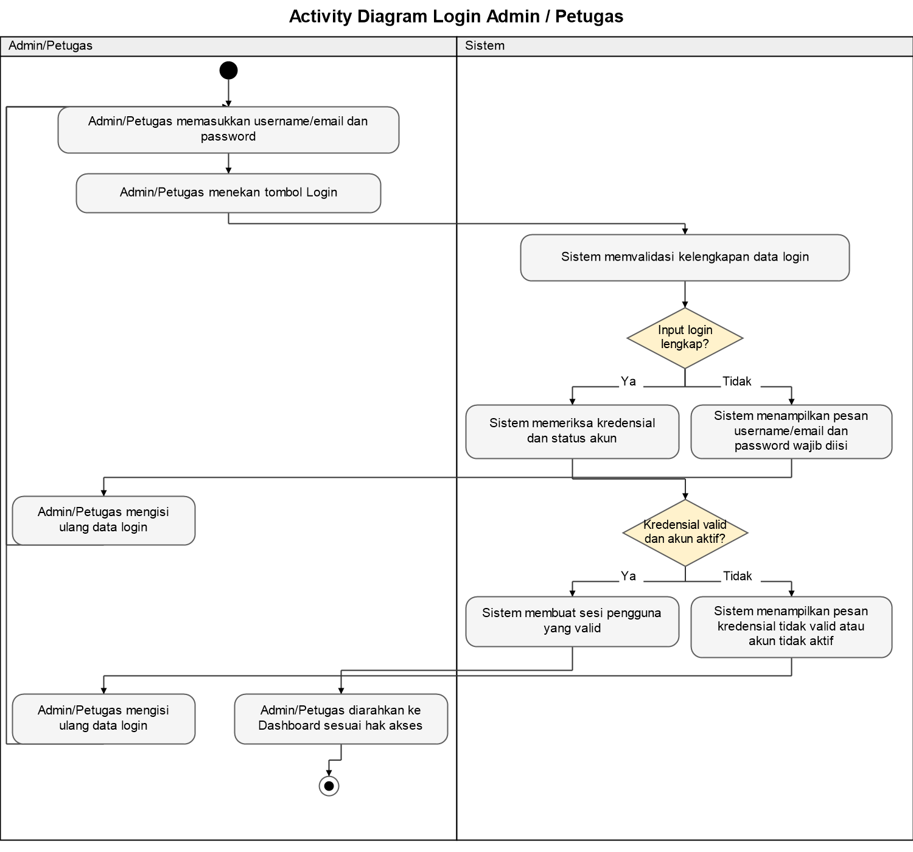

Gambar 4.2 
Activity Diagram Login Admin / Petugas 
Sumber: Penulis (2026)

##### 2) Activity Diagram Dashboard Admin / Petugas

Activity Diagram Dashboard Admin / Petugas menunjukkan proses Admin / Petugas dalam mengakses informasi utama pada sistem. Admin / Petugas melakukan login terlebih dahulu untuk masuk ke dalam sistem. Sistem melakukan validasi data pengguna dan memberikan akses apabila data login sesuai dengan hak akses yang dimiliki. Admin / Petugas membuka menu Dashboard untuk melihat ringkasan informasi sistem. Sistem menerima permintaan Admin / Petugas dan mengambil data ringkasan dari basis data. Sistem mengolah data yang diperoleh dan menampilkan informasi jumlah data pajak, jumlah pembayaran, hasil prediksi keterlambatan, serta informasi sistem lainnya. Admin / Petugas dapat melihat informasi tersebut sebagai gambaran kondisi data yang tersedia pada sistem. Alur proses Dashboard Admin / Petugas ditampilkan pada Gambar 4. 3.

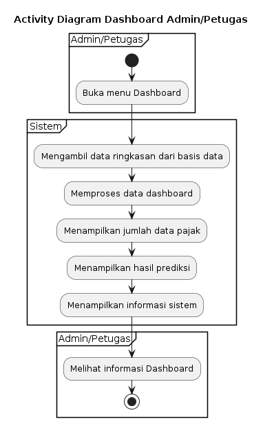

Gambar 4.3 
Activity Diagram Dashboard Admin / Petugas 
Sumber: Penulis (2026)

##### 3) Activity Diagram Data Pajak Admin / Petugas

Activity Diagram Kelola Data Pajak Admin / Petugas menunjukkan aktivitas Admin / Petugas dalam mengelola data wajib pajak. Admin / Petugas melihat, menambahkan, mengubah, dan menghapus data pajak sesuai dengan kebutuhan pengelolaan data. Sistem menyimpan data yang telah diproses ke dalam basis data MySQL. Alur proses Data Pajak Admin / Petugas ditampilkan pada Gambar 4. 4.

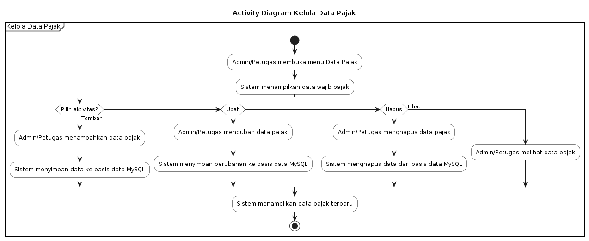

Gambar 4.4 
Activity Diagram Kelola Data Pajak Admin / Petugas 
Sumber: Penulis (2026)

##### 4) Activity Diagram Model & Prediksi Admin / Petugas

Activity Diagram Model & Prediksi Admin / Petugas menunjukkan proses penerapan regresi linear dalam memprediksi keterlambatan pajak. Admin / Petugas memilih menu Model & Prediksi, kemudian sistem mengambil dan melakukan pre-processing data pajak. Sistem membagi data menjadi 80% data training dan 20% data testing, kemudian membentuk dan menguji model regresi linear. Sistem menghitung nilai MAE, MSE, RMSE, dan R² untuk mengevaluasi model. Sistem menghasilkan, menampilkan, dan menyimpan hasil prediksi sebagai riwayat prediksi. Alur proses Model & Prediksi Admin / Petugas ditampilkan pada Gambar 4. 5.

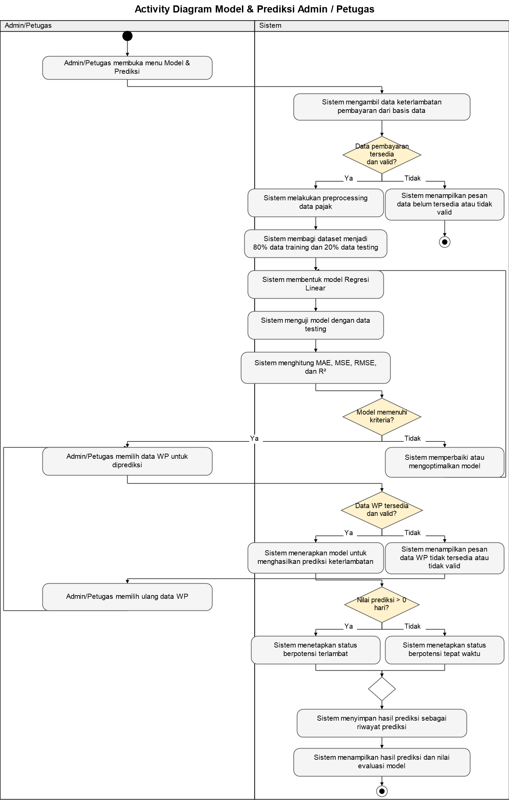

Gambar 4.5 
Activity Diagram Model & Prediksi Admin / Petugas 
Sumber: Penulis (2026)

##### 5) Activity Diagram Import Pajak

Activity Diagram Import Data menunjukkan proses Admin / Petugas memasukkan data pajak melalui file Excel atau CSV. Admin / Petugas mengunggah file data pajak ke dalam sistem. Sistem memeriksa format dan memvalidasi isi data. Sistem menyimpan data yang valid ke dalam basis data dan menampilkan informasi kesalahan pada data yang tidak valid. Alur proses Import Data Admin / Petugas ditampilkan pada Gambar 4. 6.

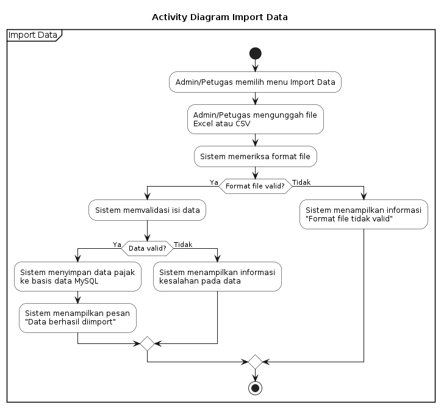

Gambar 4.6 
Activity Diagram Import Data

Sumber: Penulis (2026)

##### 6) Activity Diagram Cetak Laporan

Activity Diagram Cetak Laporan menggambarkan proses Admin / Petugas menghasilkan laporan berdasarkan data pajak dan hasil prediksi yang tersimpan dalam sistem. Admin / Petugas memilih jenis laporan, menentukan periode atau data yang diperlukan, kemudian sistem mengambil data dari database dan menghasilkan laporan yang dapat dicetak atau disimpan. Alur proses Cetak Laporan ditampilkan pada Gambar 4. 7.

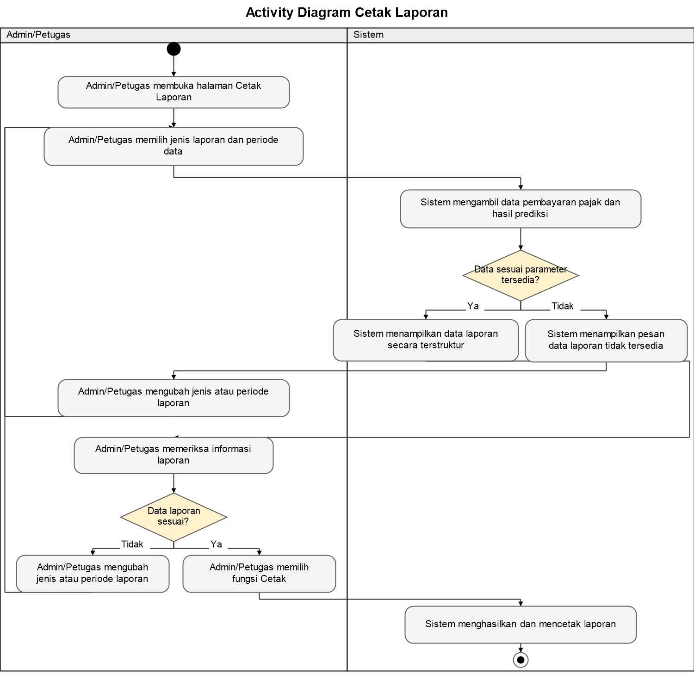

Gambar 4.7 
Activity Diagram Cetak Laporan 
Sumber: Penulis (2026)

##### 7) Activity Diagram Laporan

Activity Diagram Laporan menunjukkan proses Admin / Petugas dalam membuat dan mencetak laporan data pajak serta hasil prediksi. Alur proses Laporan ditampilkan pada Gambar 4. 8.

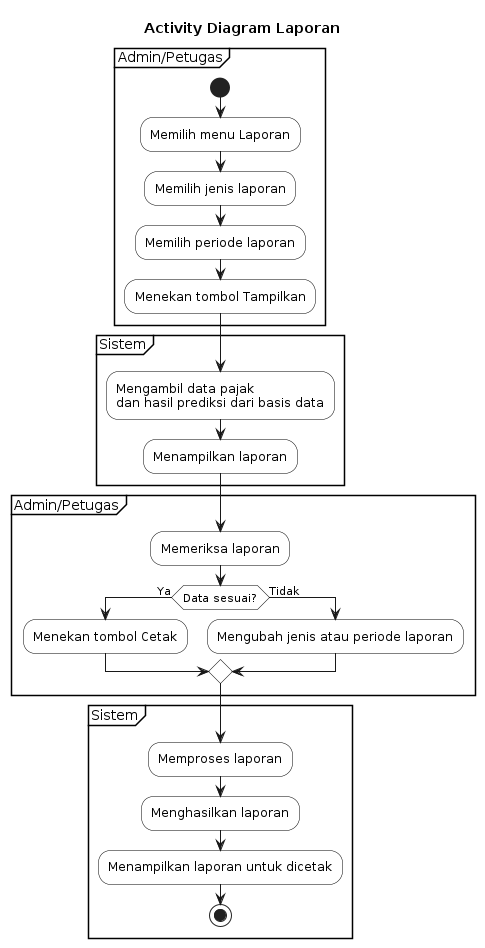

Gambar 4.8 
Activity Diagram Laporan 
Sumber: Penulis (2026)

##### 8) Activity Diagram Pengguna

Activity Diagram Pengguna menunjukkan proses Admin / Petugas mengelola data pengguna dalam sistem. Admin / Petugas membuka menu Pengguna dan melihat data pengguna. Admin / Petugas menambah, mengubah, atau menghapus data pengguna sesuai kebutuhan. Sistem memvalidasi dan menyimpan perubahan data pengguna ke dalam basis data. Alur proses Pengguna ditampilkan pada Gambar 4. 9.

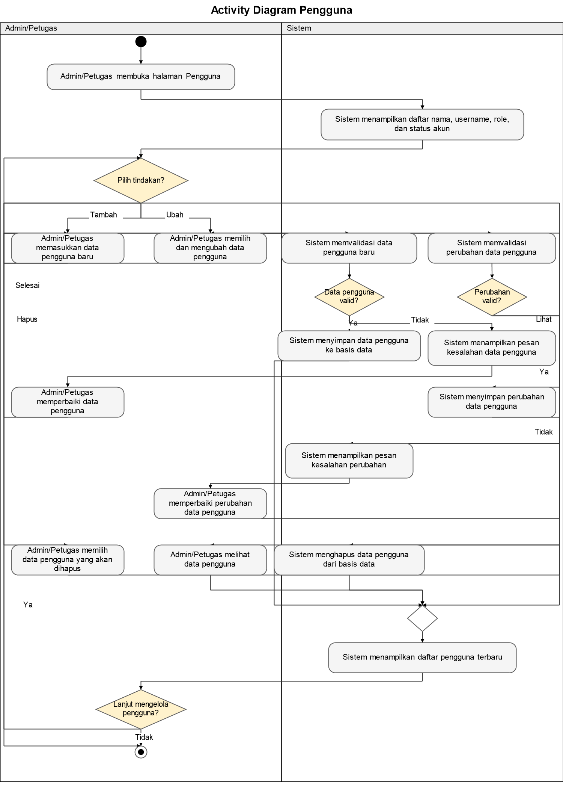

Gambar 4.9 
Activity Diagram Pengguna 
Sumber: Penulis (2026)

##### 9) Activity Diagram Pengaturan Admin / Petugas

Activity Diagram Pengaturan menunjukkan proses Admin / Petugas dalam mengelola informasi pengaturan akun pada sistem. Admin / Petugas membuka menu Pengaturan dan sistem menampilkan informasi akun yang tersimpan. Admin / Petugas melihat informasi profil dan mengubah data pengaturan sesuai dengan kebutuhan. Admin / Petugas mengubah informasi seperti nama, alamat email, atau kata sandi pada kolom yang tersedia. Sistem menerima perubahan data dan melakukan validasi terhadap data yang dimasukkan. Sistem menyimpan data yang telah memenuhi proses validasi ke dalam basis data. Sistem menampilkan notifikasi apabila perubahan pengaturan berhasil disimpan. Alur proses Pengaturan ditampilkan pada Gambar 4. 10.

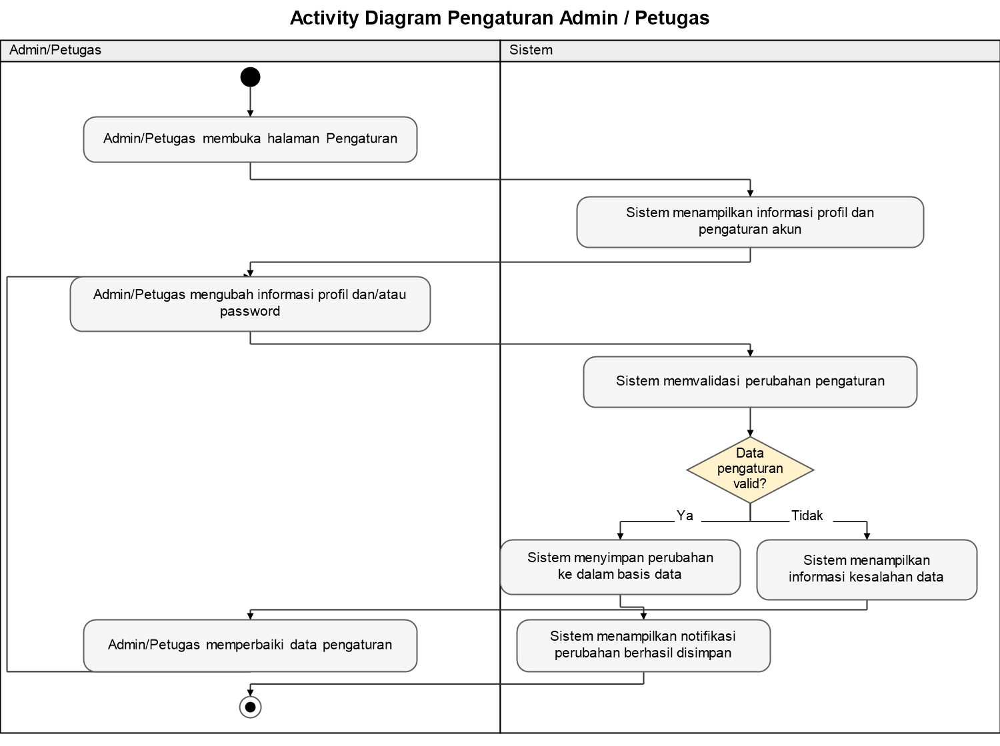

Gambar 4.10 
Activity Diagram Pengaturan Admin / Petugas 
Sumber: Penulis (2026)

##### 10) Activity Diagram Login User

Activity Diagram Login User menunjukkan aktivitas User dalam melakukan login ke dalam sistem. User memasukkan username/email dan kata sandi, sistem memvalidasi data pengguna, kemudian sistem mengarahkan User ke dashboard sesuai dengan hak akses. Alur proses Login User ditampilkan pada Gambar 4. 11.

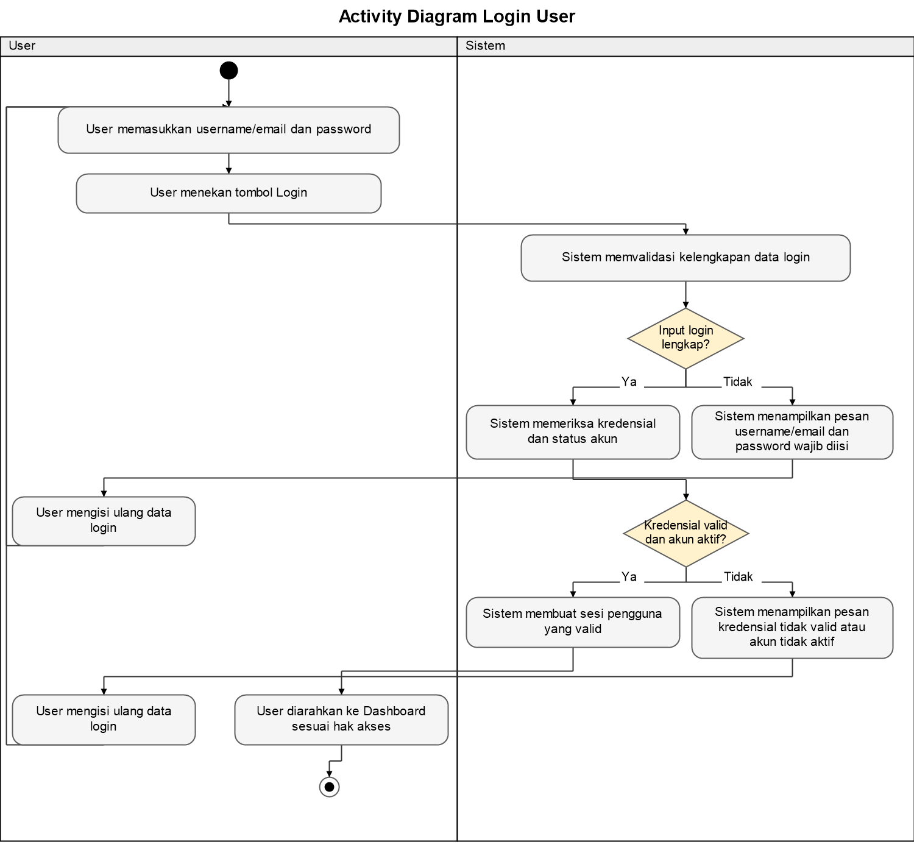

Gambar 4.11 
Activity Diagram Login User 
Sumber: Penulis (2026)

##### 11) Activity Diagram Dashboard User

Activity Diagram Dashboard User menunjukkan aktivitas User dalam mengakses informasi utama pada sistem. User membuka menu Dashboard, sistem mengambil data ringkasan dari basis data, kemudian sistem menampilkan informasi dashboard sesuai dengan hak akses User. Alur proses Dashboard User ditampilkan pada Gambar 4. 12.

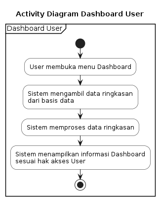

Gambar 4.12 
Activity Diagram Dashboard User 
Sumber: Penulis (2026)

##### 12) Activity Diagram Data Pajak User

Activity Diagram Data Pajak User menunjukkan proses User dalam mengakses dan melihat informasi wajib pajak serta data pembayaran pajak. User membuka menu Data Pajak pada sistem, kemudian sistem memproses permintaan dan mengambil data dari basis data. Sistem memeriksa hak akses User sebelum menampilkan data. Sistem menampilkan informasi data pajak yang sesuai dengan hak akses User. User dapat melihat informasi pembayaran pajak yang tersimpan pada sistem. Alur proses Data Pajak User ditampilkan pada Gambar 4. 13.

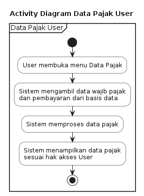

Gambar 4.13 
Activity Diagram Data Pajak User 
Sumber: Penulis (2026)

##### 13) Activity Diagram Model & Prediksi User

Activity Diagram Model & Prediksi User menunjukkan proses yang dilakukan User dalam melihat hasil prediksi dan evaluasi model. Proses dimulai ketika User mengakses menu Model & Prediksi pada sistem. Selanjutnya, sistem akan menampilkan halaman Model & Prediksi yang berisi informasi mengenai hasil prediksi keterlambatan pembayaran pajak serta informasi evaluasi model yang telah dilakukan. Pada halaman tersebut, User dapat melihat hasil prediksi yang telah dihasilkan oleh model berdasarkan data yang telah diproses sebelumnya. Selain itu, User juga dapat melihat informasi mengenai hasil evaluasi model yang digunakan untuk mengetahui tingkat kemampuan model dalam menghasilkan prediksi. Sistem menampilkan informasi tersebut sesuai dengan hak akses User, sehingga setiap pengguna hanya dapat mengakses informasi dan fitur yang telah ditentukan berdasarkan kewenangannya. Dengan adanya proses ini, User dapat memperoleh informasi mengenai hasil prediksi keterlambatan pembayaran pajak dengan lebih mudah dan terstruktur. Alur proses Model & Prediksi User ditampilkan pada Gambar 4. 14.

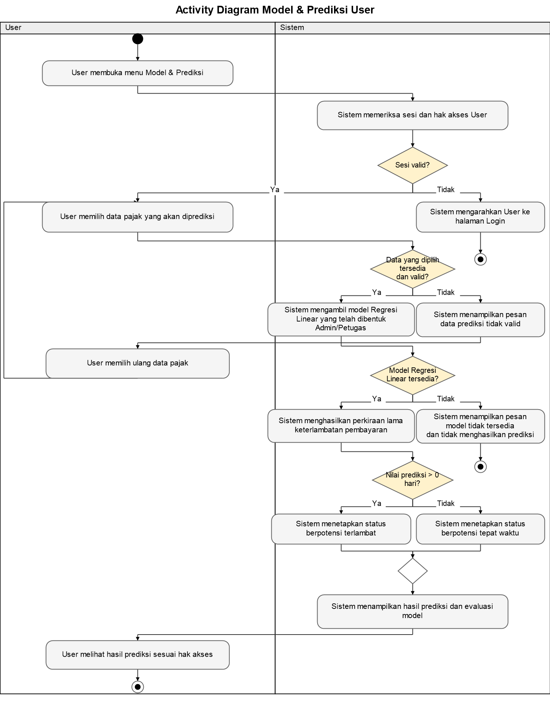

Gambar 4.14 
Activity Diagram Model & Prediksi User 
Sumber: Penulis (2026)

##### 14) Activity Diagram Pengaturan User

Activity Diagram Pengaturan User menunjukkan aktivitas User dalam mengelola pengaturan akun. User membuka menu Pengaturan, sistem menampilkan informasi pengaturan, User mengubah data pengaturan, kemudian sistem memvalidasi dan menyimpan perubahan ke dalam basis data. Alur proses Pengaturan User ditampilkan pada Gambar 4. 15.

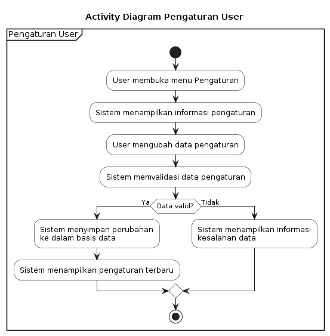

Gambar 4.15 
Activity Diagram Pengaturan User 
Sumber: Penulis (2026)

##### c. Sequence Diagram

Sequence Diagram menunjukkan urutan interaksi antarobjek dalam proses prediksi keterlambatan pembayaran pajak. Admin / Petugas memilih data WP, sistem mengambil data pembayaran, model regresi linear menghasilkan prediksi keterlambatan, dan sistem menyimpan serta menampilkan hasil prediksi.

##### 1) Sequence Diagram Login Admin / Petugas

Sequence Diagram Login Admin/Petugas menunjukkan urutan interaksi pengguna dengan sistem dalam proses login. Pengguna memasukkan username/email dan kata sandi, sistem memvalidasi data pengguna, dan sistem mengarahkan pengguna ke dashboard sesuai hak akses. Alur proses Login Admin / Petugas ditampilkan pada Gambar 4. 16.

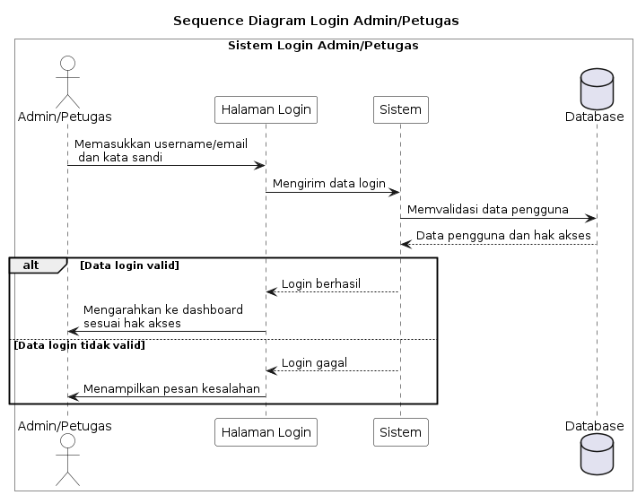

Gambar 4.16 
Sequence Diagram Login Admin / Petugas 
Sumber: Penulis (2026)

##### 2) Sequence Diagram Dashboard Admin / Petugas

Sequence Diagram Dashboard Admin / Petugas menunjukkan urutan interaksi Admin / Petugas dengan sistem dalam mengakses dashboard. Admin / Petugas membuka dashboard, sistem mengambil data ringkasan dari basis data, dan sistem menampilkan informasi dashboard. Alur proses Dashboard Admin / Petugas ditampilkan pada Gambar 4. 17.

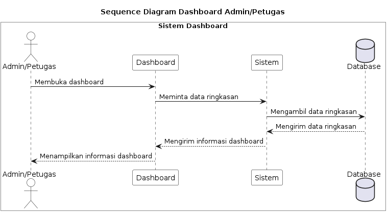

Gambar 4.17 
Sequence Diagram Dashboard Admin / Petugas 
Sumber: Penulis (2026)

##### 3) Sequence Diagram Data Pajak Admin / Petugas

Sequence Diagram Data Pajak Admin / Petugas menunjukkan urutan interaksi Admin / Petugas dengan sistem dalam mengelola data pajak. Admin / Petugas memilih data pajak, sistem menampilkan data, dan Admin / Petugas menambah, mengubah, atau menghapus data. Sistem menyimpan perubahan data ke dalam basis data MySQL. Alur proses Data Pajak Admin / Petugas ditampilkan pada Gambar 4. 18.

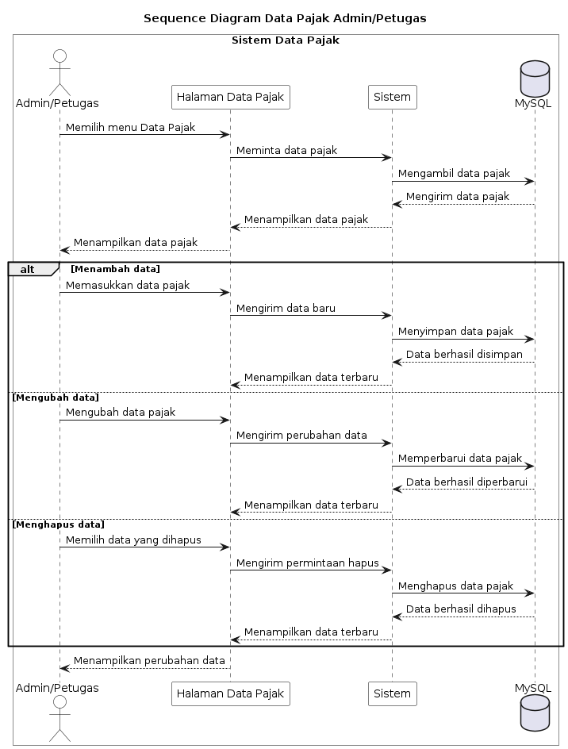

Gambar 4.18 
Sequence Diagram Data Pajak Admin / Petugas 
Sumber: Penulis (2026)

##### 4) Sequence Diagram Model & Prediksi Admin / Petugas

Sequence Diagram Model & Prediksi Admin / Petugas menunjukkan urutan interaksi Admin/Petugas dengan sistem dalam proses prediksi keterlambatan pembayaran pajak. Admin / Petugas memilih data WP, sistem mengambil data pembayaran, model regresi linear menghasilkan prediksi, dan sistem menyimpan serta menampilkan hasil prediksi. Alur proses Model & Prediksi Admin / Petugas ditampilkan pada Gambar 4. 19.

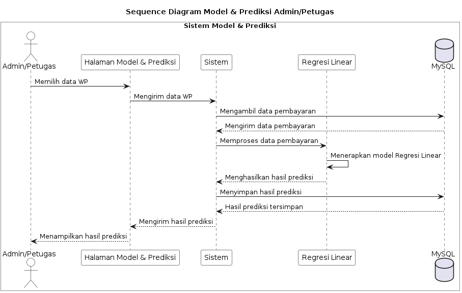

Gambar 4.19 
Sequence Diagram Prediksi Model & Prediksi Admin / Petugas 
Sumber: Penulis (2026)

##### 5) Sequence Diagram Cetak Laporan

Sequence Diagram Cetak Laporan menunjukkan urutan interaksi Admin / Petugas dengan sistem dalam menghasilkan laporan. Admin / Petugas memilih jenis dan periode laporan, sistem mengambil data dari basis data, dan sistem menghasilkan laporan untuk dicetak. Alur proses Cetak Laporan ditampilkan pada Gambar 4. 20.

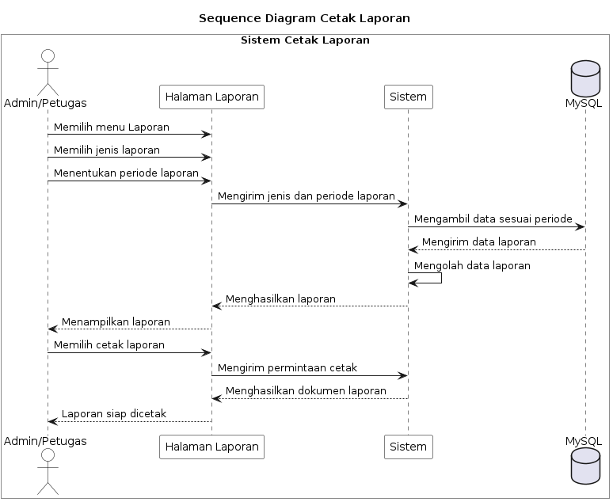

Gambar 4.20 
Sequence Diagram Cetak Laporan 
Sumber: Penulis (2026)

##### 6) Sequence Diagram Laporan

Sequence Diagram Laporan menunjukkan interaksi antara Admin / Petugas, halaman laporan, sistem, dan basis data dalam proses pengelolaan serta penyajian laporan. Proses diawali ketika Admin / Petugas mengakses halaman laporan melalui sistem. Selanjutnya, sistem akan menerima permintaan tersebut dan melakukan proses pengambilan data laporan yang diperlukan dari basis data. Data yang diperoleh kemudian diproses oleh sistem untuk ditampilkan pada halaman laporan sesuai dengan periode atau informasi yang dipilih oleh Admin / Petugas. Selain menampilkan data laporan, sistem juga menyediakan proses untuk mencetak laporan. Ketika Admin / Petugas memilih fitur cetak, sistem akan memproses data laporan yang telah ditampilkan dan menghasilkan laporan dalam format yang dapat dicetak. Dengan demikian, Admin / Petugas dapat melihat informasi laporan secara lebih terstruktur serta mencetak laporan sebagai dokumentasi dan bahan evaluasi. Seluruh proses tersebut melibatkan komunikasi antara halaman laporan, sistem, dan basis data sehingga informasi yang ditampilkan dapat sesuai dengan data yang tersimpan di dalam sistem. Alur proses Laporan ditampilkan pada Gambar 4. 21.

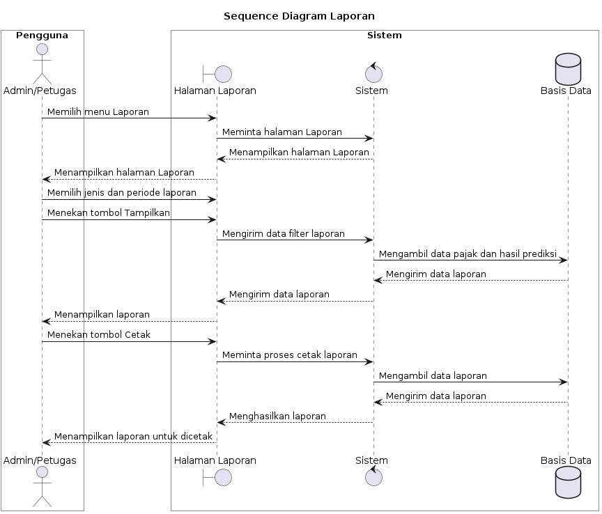

Gambar 4.21 
Sequence Diagram Laporan 
Sumber: Penulis (2026)

##### 7) Sequence Diagram Import Data

Sequence Diagram Import Data menunjukkan urutan interaksi Admin / Petugas dengan sistem dalam proses memasukkan data pajak melalui file. Admin/Petugas membuka menu Import Data dan memilih file Excel atau CSV yang akan diunggah. Sistem menerima file dan melakukan validasi terhadap format serta kelengkapan data. Sistem menampilkan pesan apabila data tidak sesuai. Sistem menyimpan data yang telah memenuhi validasi ke dalam basis data. Sistem menampilkan informasi bahwa proses import data telah berhasil. Alur proses Import Data ditampilkan pada Gambar 4. 22.

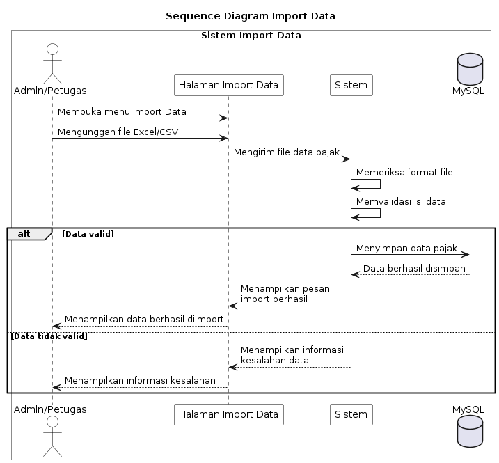

Gambar 4.22 
Sequence Diagram Import Data 
Sumber: Penulis (2026)

##### 8) Sequence Diagram Pengguna

Sequence Diagram Pengguna menunjukkan urutan interaksi Admin / Petugas dengan sistem dalam mengelola data pengguna. Admin / Petugas melihat, menambah, mengubah, atau menghapus data pengguna, dan sistem menyimpan perubahan data ke dalam basis data. Alur proses Pengguna ditampilkan pada Gambar 4. 23.

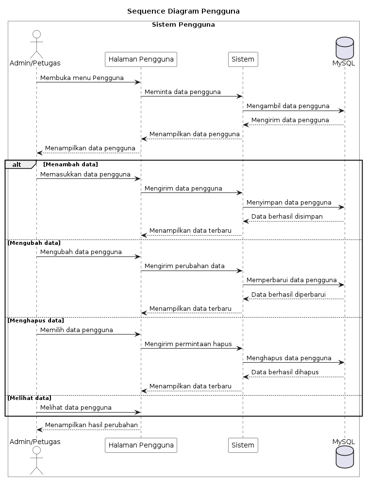

Gambar 4.23 
Sequence Diagram Pengguna 
Sumber: Penulis (2026)

##### 9) Sequence Diagram Pengaturan

Sequence Diagram Pengaturan menunjukkan urutan interaksi Admin / Petugas dengan sistem dalam mengelola pengaturan sistem. Admin / Petugas membuka menu pengaturan dan mengubah informasi pengaturan, sistem memvalidasi data, dan sistem menyimpan perubahan ke dalam basis data. Alur proses Pengaturan ditampilkan pada Gambar 4. 24.

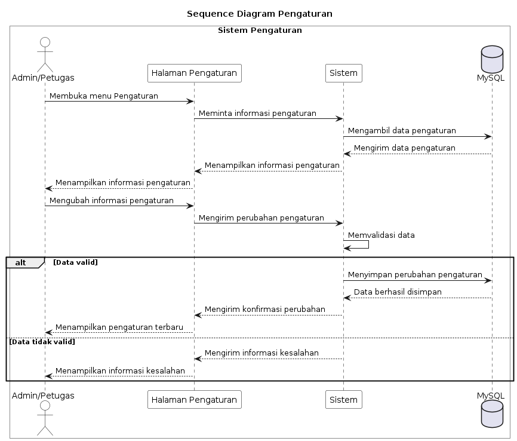

Gambar 4.24 
Sequence Diagram Pengaturan 
Sumber: Penulis (2026)

##### 9) Sequence Diagram Login User

Sequence Diagram Login User menunjukkan urutan interaksi User dengan sistem dalam proses login. User memasukkan username/email dan kata sandi, sistem memvalidasi data pengguna melalui basis data, dan sistem mengarahkan User ke dashboard sesuai hak akses. Alur proses Login User ditampilkan pada Gambar 4. 25.

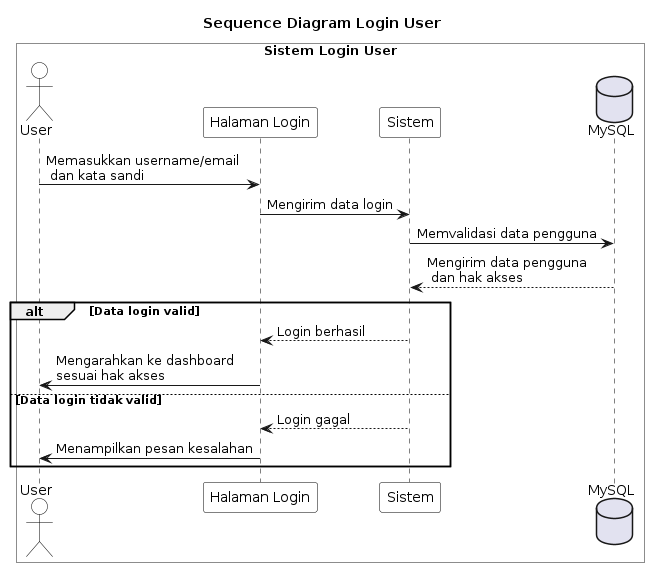

Gambar 4.25 
Sequence Diagram Login User 
Sumber: Penulis (2026)

##### 10) Sequence Diagram Dashboard User

Sequence Diagram Dashboard User menunjukkan urutan interaksi User dengan sistem dalam mengakses dashboard. User membuka dashboard, sistem mengambil data ringkasan dari basis data, kemudian sistem menampilkan informasi dashboard sesuai dengan hak akses User. Alur proses Dashboard User ditampilkan pada Gambar 4. 26.

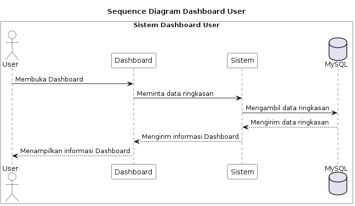

Gambar 4.26 
Sequence Diagram Dashboard User 
Sumber: Penulis (2026)

##### 11) Sequence Diagram Data Pajak User

Sequence Diagram Data Pajak User menunjukkan urutan interaksi User dengan sistem dalam melihat informasi data wajib pajak dan pembayaran pajak. User memilih menu Data Pajak pada halaman sistem. Sistem menerima permintaan User dan mengambil data wajib pajak serta data pembayaran dari basis data. Sistem memeriksa hak akses User terhadap data yang akan ditampilkan. Sistem mengirimkan data yang sesuai kepada halaman Data Pajak. Sistem menampilkan informasi data wajib pajak dan pembayaran pajak kepada User sesuai dengan hak akses yang diberikan. Alur proses Data Pajak User ditampilkan pada Gambar 4. 27.

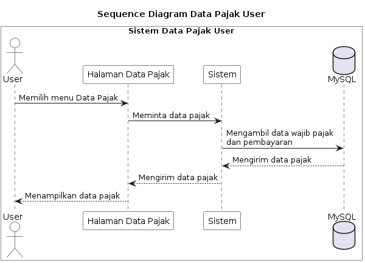

Gambar 4.27 
Sequence Diagram Pajak User 
Sumber: Penulis (2026)

##### 12) Sequence Diagram Model & Prediksi User

Sequence Diagram Model & Prediksi User menunjukkan urutan interaksi User dengan sistem dalam melihat informasi model, hasil prediksi keterlambatan pembayaran pajak, dan evaluasi model. User memilih menu Model & Prediksi pada halaman sistem. Sistem menerima permintaan User dan mengambil data model, hasil prediksi, serta informasi evaluasi dari basis data. Sistem memproses data yang diperoleh dan menyesuaikan informasi berdasarkan hak akses User. Sistem mengirimkan data yang sesuai kepada halaman Model & Prediksi. Sistem menampilkan informasi model, hasil prediksi keterlambatan pembayaran pajak, dan nilai evaluasi kepada User. Alur proses Model & Prediksi User ditampilkan pada Gambar 4. 28.

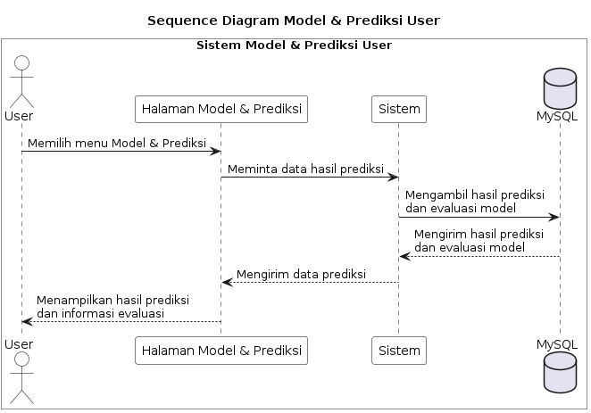

Gambar 4.28 
Sequence Diagram Model & Prediksi User 
Sumber: Penulis (2026)

##### 13) Sequence Diagram Pengaturan

Sequence Diagram Pengaturan menunjukkan urutan interaksi User dengan sistem dalam mengelola informasi akun. User memilih menu Pengaturan pada halaman sistem. Sistem menampilkan informasi pengaturan akun yang tersimpan pada basis data. User mengubah informasi akun sesuai kebutuhan dan mengirimkan perubahan kepada sistem. Sistem menerima data perubahan dan melakukan validasi terhadap data yang dimasukkan. Sistem menyimpan data yang valid ke dalam basis data. Sistem menampilkan notifikasi bahwa perubahan pengaturan akun telah berhasil disimpan. Alur proses Pengaturan ditampilkan pada Gambar 4. 29.

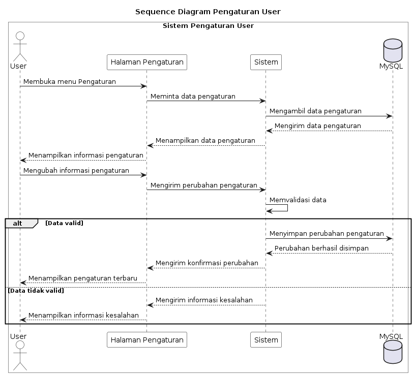

Gambar 4.29 
Sequence Diagram Pengaturan 
Sumber: Penulis (2026)

##### d. Class Diagram

Class Diagram menunjukkan struktur kelas, atribut, operasi, dan hubungan antar kelas dalam sistem. Sistem memiliki kelas User, Wajib Pajak, Model Prediksi, Laporan, dan Data Import. Kelas User menyimpan data akun, identitas pengguna, dan hak akses berdasarkan peran Admin atau User. Kelas Wajib Pajak menyimpan data identitas wajib pajak dan kendaraan. Kelas Model Prediksi menyimpan data model regresi linear, proses prediksi, dan hasil evaluasi model. Kelas Laporan mengelola data laporan pajak dan hasil prediksi yang dapat dicetak oleh Admin. Kelas Data Import mengelola proses pemasukan data pajak dari berkas ke dalam sistem. Admin mengakses fitur Dashboard, Data Pajak, Model & Prediksi, Laporan, Import Data, Pengguna, dan Pengaturan, sedangkan User mengakses fitur Dashboard, Data Pajak, Model & Prediksi, dan Pengaturan. Hubungan antarkelas ditunjukkan pada Gambar 4. 30.

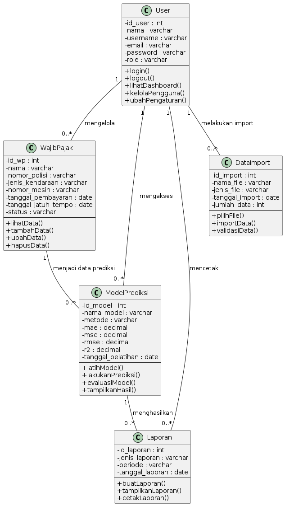

Gambar 4.30 
Class Diagram 
Sumber: Penulis (2026)

#### 2. Rancangan Layar

Rancangan layar disusun sebagai acuan awal tampilan aplikasi sebelum diimplementasikan. Rancangan layar pada penelitian ini terdiri atas:

##### a. Rancangan Layar Login Admin / Petugas

Rancangan layar login admin / petugas menampilkan halaman awal yang digunakan Admin atau Petugas untuk mengakses sistem. Halaman ini berfungsi sebagai mekanisme autentikasi dengan menyediakan input username/email, password, serta tombol login. Sistem memvalidasi data yang dimasukkan. Jika benar, pengguna diarahkan ke dashboard, sedangkan jika salah, sistem menampilkan pemberitahuan. Rancangan ini bertujuan menjaga keamanan dan membatasi akses berdasarkan akun pengguna. Rancangan layar Login Admin / Petugas ditampilkan pada Gambar 4. 31.

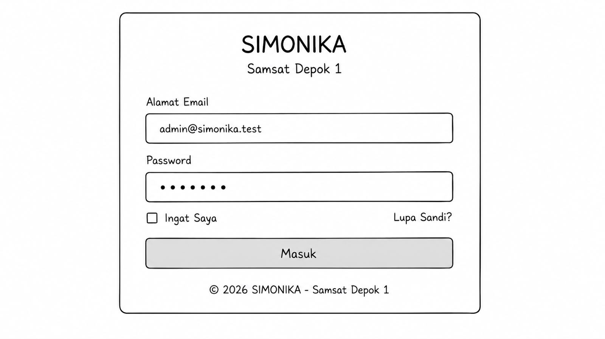

Gambar 4.31 
Rancangan Layar Login Admin / Petugas 
Sumber: Penulis (2026)

##### b. Rancangan Layar Dashboard Admin / Petugas

Halaman Dashboard menggambarkan halaman utama setelah pengguna berhasil login yang menampilkan ringkasan data pajak dan hasil prediksi. Informasi yang ditampilkan meliputi total data pajak, jumlah pembayaran, keterlambatan, hasil prediksi, serta grafik pembayaran. Tujuannya memberikan informasi kondisi data pajak secara cepat dan mudah kepada Admin/Petugas. Rancangan layar Dashboard Admin / Petugas ditampilkan pada Gambar 4. 32.

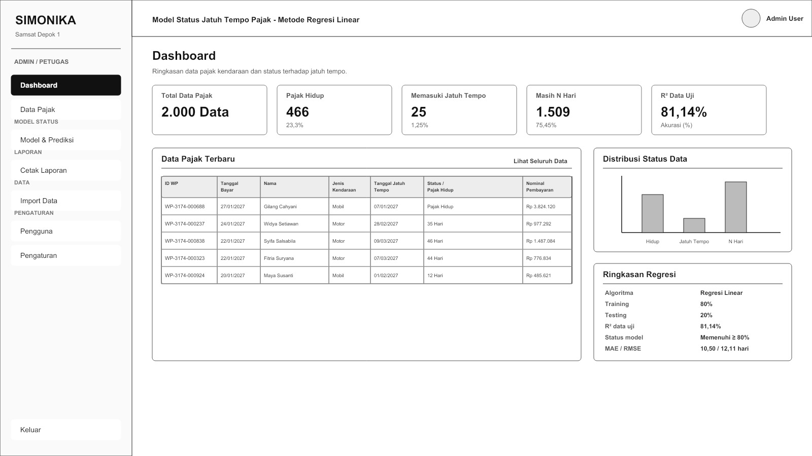

Gambar 4.32 
Rancangan Layar Dashboard Admin / Petugas 
Sumber: Penulis (2026)

##### c. Rancangan Layar Data Pajak Admin / Petugas

Halaman Rancangan layar Data Pajak Admin / Petugas digunakan untuk menampilkan dan mengelola data kendaraan serta pembayaran pajak sebagai dataset penelitian. Data yang ditampilkan meliputi nomor, nama, nomor polisi, jenis kendaraan, nomor mesin, tanggal bayar, jatuh tempo, status, dan prediksi keterlambatan. Halaman ini dilengkapi fitur pencarian, filter, tambah, edit, hapus, dan detail data. Tujuannya untuk memudahkan pengelolaan dan pemantauan data pembayaran pajak. Rancangan layar Data Pajak Admin / Petugas ditampilkan pada Gambar 4. 33.

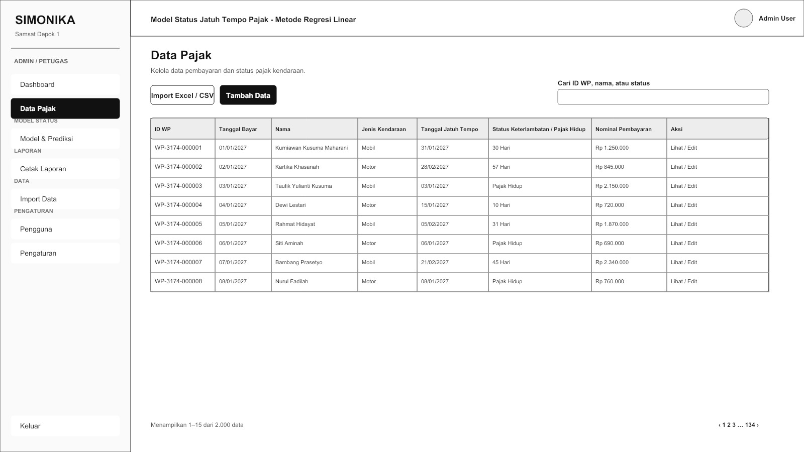

Gambar 4.33 
Rancangan Layar Data Pajak Admin / Petugas 
Sumber: Penulis (2026)

##### d. Rancangan Layar Model & Prediksi Admin / Petugas

Halaman Layar Model & Prediksi Admin / Petugas menampilkan proses pelatihan model Regresi Linear dan hasil prediksi keterlambatan pembayaran pajak. Admin / Petugas memilih data WP (wajib pajak) yang akan digunakan dalam proses prediksi. Sistem memproses data yang dipilih menggunakan model Regresi Linear yang telah dilatih. Sistem menampilkan hasil prediksi berupa perkiraan keterlambatan pembayaran pajak pada periode berikutnya. Sistem juga menampilkan nilai evaluasi model yang meliputi MAE, MSE, RMSE, dan R² untuk mengetahui tingkat kinerja model. Admin / Petugas dapat menggunakan hasil prediksi tersebut sebagai informasi dalam mengidentifikasi WP yang berpotensi mengalami keterlambatan pembayaran pajak. Rancangan layar Model & Prediksi Admin / Petugas ditampilkan pada Gambar 4. 34.

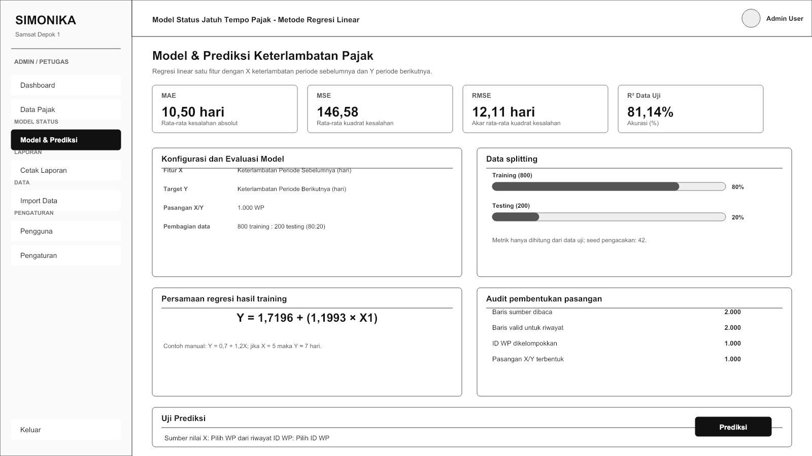

Gambar 4.34 
Rancangan Layar Model & Prediksi Admin / Petugas 
Sumber: Penulis (2026)

##### e. Rancangan Layar Cetak Laporan

Halaman Layar Laporan menampilkan data pembayaran pajak dan hasil prediksi keterlambatan dalam bentuk laporan. Admin / Petugas memilih jenis laporan dan menentukan periode data yang akan ditampilkan. Sistem memproses data sesuai dengan jenis dan periode laporan yang dipilih. Sistem menampilkan data pajak dan hasil prediksi secara terstruktur pada halaman laporan. Admin / Petugas dapat memeriksa informasi laporan sebelum melakukan pencetakan. Sistem menyediakan fitur cetak untuk menghasilkan laporan yang dapat digunakan sebagai dokumentasi dan bahan evaluasi. Rancangan layar Cetak Laporan ditampilkan pada Gambar 4. 35.

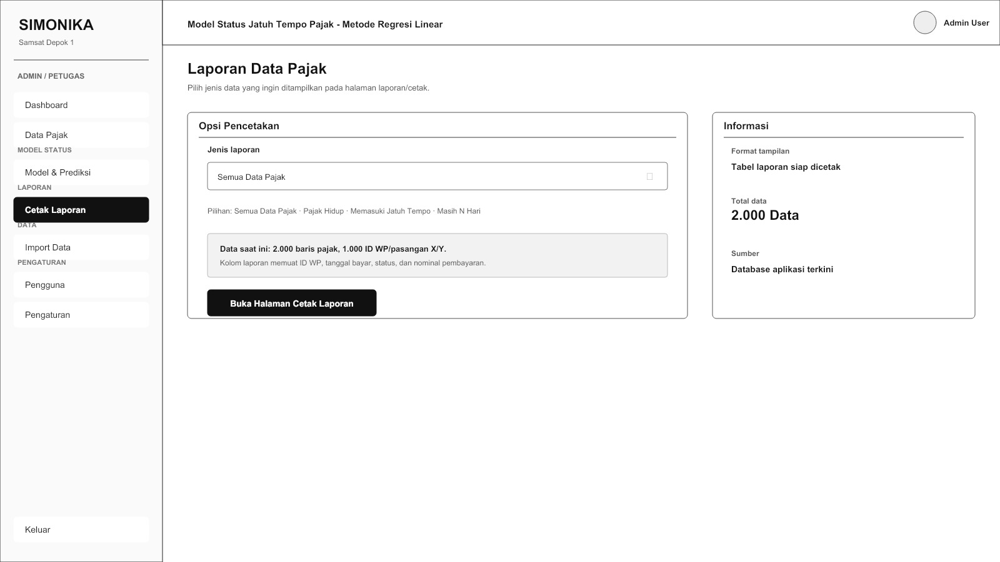

Gambar 4.35 
Rancangan Layar Cetak Laporan 
Sumber: Penulis (2026)

##### f. Rancangan Layar Laporan

Rancangan Layar Laporan menampilkan rancangan halaman untuk melihat hasil prediksi keterlambatan pembayaran pajak. User dapat melihat data hasil prediksi berdasarkan periode yang dipilih. Sistem menampilkan laporan yang dapat dicetak atau disimpan sesuai kebutuhan. Rancangan layar Laporan ditampilkan pada Gambar 4. 36.

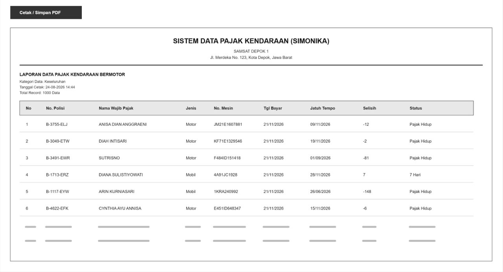

Gambar 4.36 
Rancangan Layar Laporan 
Sumber: Penulis (2026)

##### g. Rancangan Layar Import Data

Halaman Import Data digunakan untuk memasukkan dataset pajak dalam jumlah besar melalui file Excel (.xlsx) atau CSV (.csv). Halaman ini menyediakan fitur pilih file, preview data, tombol Import, serta informasi jumlah data dan pemberitahuan jika terdapat data tidak valid. Tujuannya mempermudah Admin / Petugas dalam memasukkan dataset ke dalam sistem. Rancangan layar Import Data ditampilkan pada Gambar 4. 37.

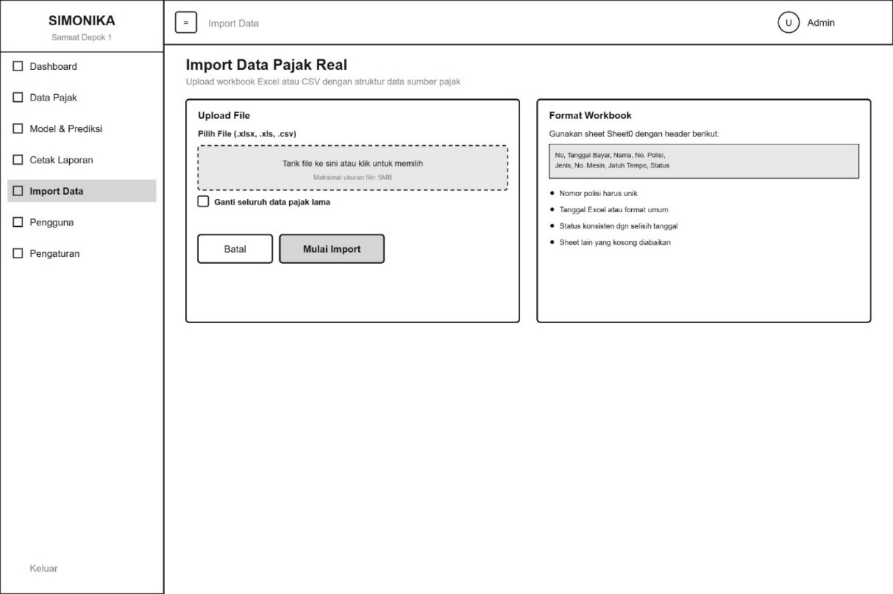

Gambar 4.37 
Rancangan Layar Import Data 
Sumber: Penulis (2026)

##### h. Rancangan Layar Pengguna

Rancangan layar Pengguna menampilkan untuk mengelola akun dan hak akses pengguna sistem. Halaman ini memuat nama, username, role, status akun, serta fitur tambah, edit, dan hapus pengguna. Role dibedakan menjadi Admin dan Petugas sesuai kewenangan masing-masing. Tujuannya agar pengelolaan pengguna lebih terstruktur dan keamanan sistem tetap terjaga. Rancangan layar Pengguna ditampilkan pada Gambar 4. 38.

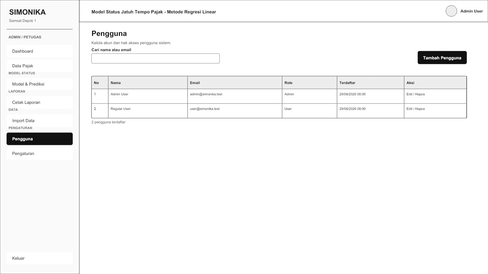

Gambar 4.38 
Rancangan Layar Pengguna 
Sumber: Penulis (2026)

##### i. Rancangan Layar Pengaturan

Rancangan layar Pengaturan menampilkan untuk mengelola konfigurasi akun dan aplikasi sesuai kebutuhan pengguna. Halaman ini mencakup pengaturan profil dan perubahan password. Pengguna dapat memperbarui informasi akun serta mengganti password untuk menjaga keamanan akses sistem. Tujuannya memudahkan Admin / Petugas dalam mengelola pengaturan akun dan sistem. Rancangan layar Pengaturan ditampilkan pada Gambar 4. 39.

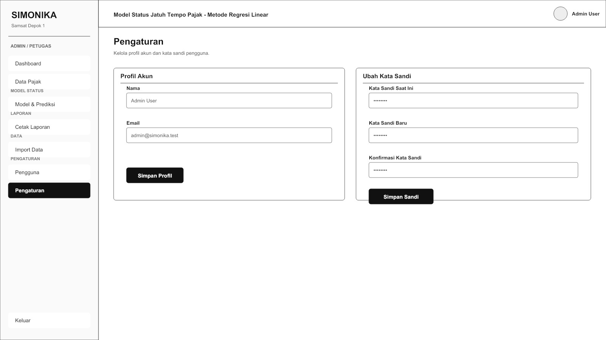

Gambar 4.39 
Rancangan Pengaturan 
Sumber: Penulis (2026)

##### j. Rancangan Layar Login User

Rancangan Layar Login User menampilkan halaman masuk yang digunakan User untuk mengakses sistem. User memasukkan username/email dan kata sandi pada kolom yang tersedia. Sistem memvalidasi data yang dimasukkan dengan data pengguna yang tersimpan pada basis data. Sistem memberikan akses kepada User apabila data dinyatakan benar dan mengarahkan User ke halaman dashboard. Sistem menampilkan pesan kesalahan apabila data yang dimasukkan tidak sesuai. Rancangan Layar Login User ditampilkan pada Gambar 4. 40.

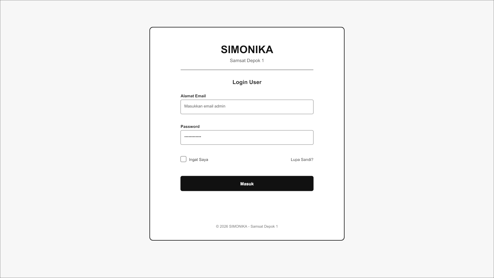

Gambar 4.40 
Rancangan Login User 
Sumber: Penulis (2026)

##### k. Rancangan Layar Dashboard User

Rancangan Layar Dashboard User menampilkan halaman utama yang berisi informasi ringkasan sistem. User dapat melihat informasi jumlah data pajak, data pembayaran pajak, hasil prediksi keterlambatan pembayaran, dan informasi sistem lainnya sesuai dengan hak akses yang diberikan. Sistem mengambil data dari basis data dan menampilkan informasi dalam bentuk ringkasan pada halaman dashboard. Sistem menampilkan informasi tersebut untuk membantu User memperoleh gambaran mengenai data pajak dan hasil prediksi yang tersedia. User dapat menggunakan informasi pada dashboard sebagai akses awal untuk melihat kondisi data sebelum membuka menu lainnya. Sistem membatasi informasi yang ditampilkan berdasarkan hak akses User. Rancangan Layar Dashboard User ditampilkan pada Gambar 4. 41.

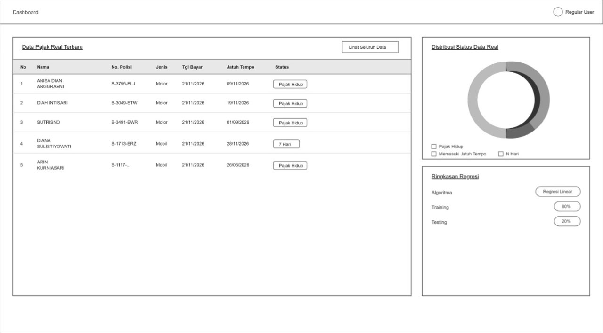

Gambar 4.41 
Rancangan Dashboard User 
Sumber: Penulis (2026)

##### l. Rancangan Layar Data Pajak User

Rancangan Layar Data Pajak User menampilkan halaman yang digunakan User untuk melihat informasi wajib pajak dan data pembayaran pajak. Sistem menampilkan data seperti identitas wajib pajak, informasi kendaraan, tanggal pembayaran, tanggal jatuh tempo, dan status pembayaran. User dapat melihat data pajak yang tersedia sesuai dengan hak akses yang diberikan oleh sistem. Sistem mengambil data dari basis data dan menampilkan informasi pada halaman Data Pajak. Rancangan Layar Data Pajak User membantu User memperoleh informasi pembayaran pajak secara terstruktur. Rancangan Layar Data Pajak User ditampilkan pada Gambar 4. 42.

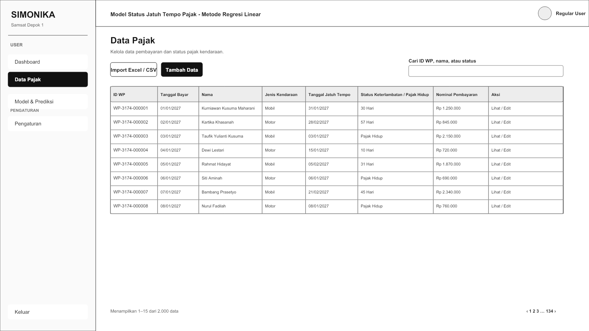

Gambar 4.42 
Rancangan Data Pajak User 
Sumber: Penulis (2026)

##### m. Rancangan Layar Model & Prediksi User

Rancangan Layar Model & Prediksi User menampilkan halaman yang digunakan User untuk melihat informasi model dan hasil prediksi keterlambatan pembayaran pajak. Sistem menampilkan data wajib pajak, hasil prediksi, dan informasi evaluasi model pada halaman tersebut. User dapat melihat informasi prediksi berdasarkan data yang tersedia sesuai dengan hak akses yang diberikan oleh sistem. Sistem mengambil data model, hasil prediksi, dan evaluasi dari basis data untuk ditampilkan kepada User. Rancangan Layar Model & Prediksi User membantu User memperoleh informasi mengenai hasil prediksi keterlambatan pembayaran pajak. Rancangan Layar Model & Prediksi User ditampilkan pada Gambar 4. 43.

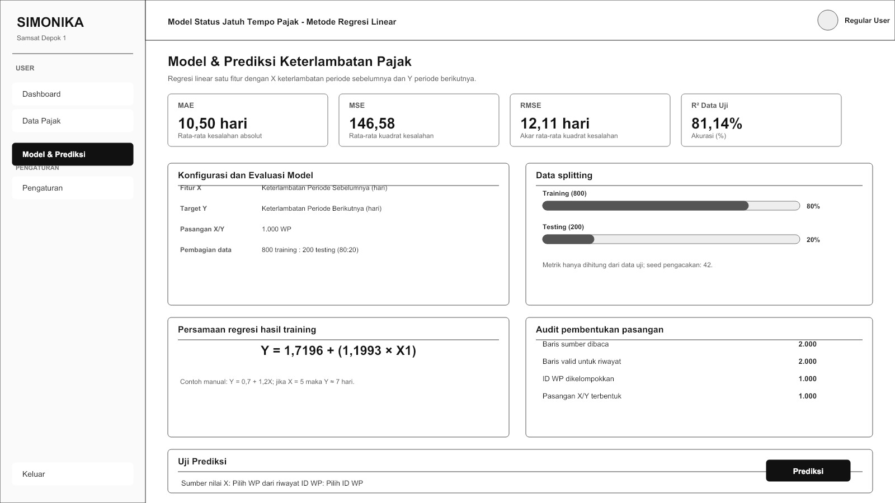

Gambar 4.43 
Rancangan Model & Prediksi User 
Sumber: Penulis (2026)

##### n. Rancangan Layar Pengaturan

Rancangan Layar Pengaturan menampilkan halaman yang digunakan pengguna untuk mengelola informasi akun pada sistem. Pengguna dapat melihat informasi akun yang tersimpan pada sistem, seperti nama dan alamat email. Pengguna dapat mengubah informasi akun sesuai dengan kebutuhan melalui kolom yang tersedia pada halaman Pengaturan. Pengguna juga dapat memasukkan kata sandi lama dan kata sandi baru untuk memperbarui keamanan akun. Sistem memeriksa kesesuaian kata sandi lama dan melakukan validasi terhadap data yang dimasukkan oleh pengguna. Sistem menyimpan perubahan data yang telah memenuhi proses validasi ke dalam basis data. Sistem menampilkan informasi akun yang telah diperbarui setelah proses penyimpanan berhasil. Sistem menampilkan notifikasi sebagai tanda bahwa perubahan data pengaturan berhasil disimpan. Rancangan Layar Pengaturan digunakan untuk membantu pengguna mengelola dan memperbarui informasi akun secara mandiri. Rancangan Layar Pengaturan ditampilkan pada Gambar 4. 44.

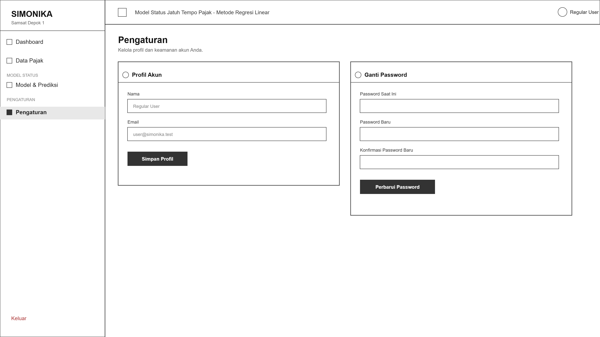

Gambar 4.44 
Rancangan Pengaturan 
Sumber: Penulis (2026)

#### 3. Tampilan Layar

Tampilan layar menampilkan hasil implementasi rancangan layar ke dalam aplikasi yang telah dibangun menggunakan framework Laravel. Tampilan layar pada penelitian ini terdiri atas:

##### a. Tampilan Layar Login Admin / Petugas

Tampilan layar Login Admin / Petugas menampilkan hasil implementasi halaman login yang digunakan Admin / Petugas untuk mengakses sistem. Pada halaman ini pengguna memasukkan username dan password. Sistem melakukan validasi terhadap data login sebelum memberikan akses ke halaman utama. Apabila login berhasil, pengguna diarahkan menuju dashboard. Apabila gagal, sistem menampilkan pesan kesalahan. Hasil implementasi halaman login Admin / Petugas disajikan pada Gambar 4. 45.

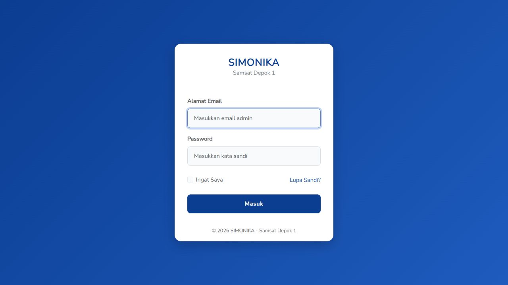

Gambar 4.45 
Tampilan Layar Login Admin / Petugas 
Sumber: Penulis (2026)

##### b. Tampilan Layar Dashboard Admin / Petugas

Tampilan Dashboard merupakan halaman utama yang pertama kali ditampilkan setelah Admin / Petugas berhasil melakukan login. Halaman ini menampilkan ringkasan informasi sistem yang membantu Admin / Petugas mengetahui kondisi data secara keseluruhan. Informasi yang ditampilkan meliputi jumlah data pajak, jumlah pembayaran tepat waktu, jumlah pembayaran yang mengalami keterlambatan, serta jumlah hasil prediksi keterlambatan pembayaran pajak. Sistem mengambil data tersebut dari basis data dan menampilkannya dalam bentuk ringkasan pada halaman Dashboard. Halaman Dashboard juga menampilkan grafik untuk memberikan gambaran visual mengenai kondisi data pajak dan hasil prediksi. Admin / Petugas dapat menggunakan informasi tersebut sebagai gambaran awal sebelum mengakses menu Data Pajak, Model & Prediksi, Laporan, dan menu lainnya. Tampilan Dashboard disesuaikan dengan hak akses Admin / Petugas sehingga informasi dan fitur yang tersedia dapat digunakan untuk mendukung proses pengelolaan data dan prediksi. Hasil implementasi halaman Dashboard Admin / Petugas disajikan pada Gambar 4. 46.

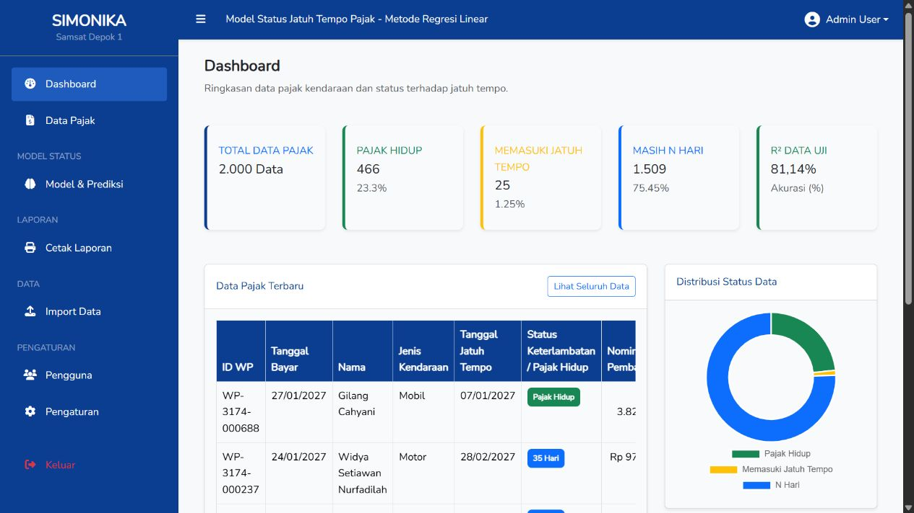

Gambar 4.46 
Tampilan Layar Dashboard Admin / Petugas 
Sumber: Penulis (2026)

##### c. Tampilan Layar Data Pajak Admin / Petugas

Tampilan Data Pajak Admin / Petugas menampilkan seluruh data kendaraan dan pembayaran pajak yang telah tersimpan dalam sistem. Data ditampilkan dalam bentuk tabel yang memuat nomor, nama, nomor polisi, jenis/kendaraan, nomor mesin, tanggal bayar, tanggal jatuh tempo, selisih (hari), dan status. Pengguna dapat melakukan pencarian, penyaringan, penambahan, perubahan, dan penghapusan data sesuai hak aksesnya. Hasil implementasi halaman Data Pajak Admin / Petugas disajikan pada Gambar 4. 47.

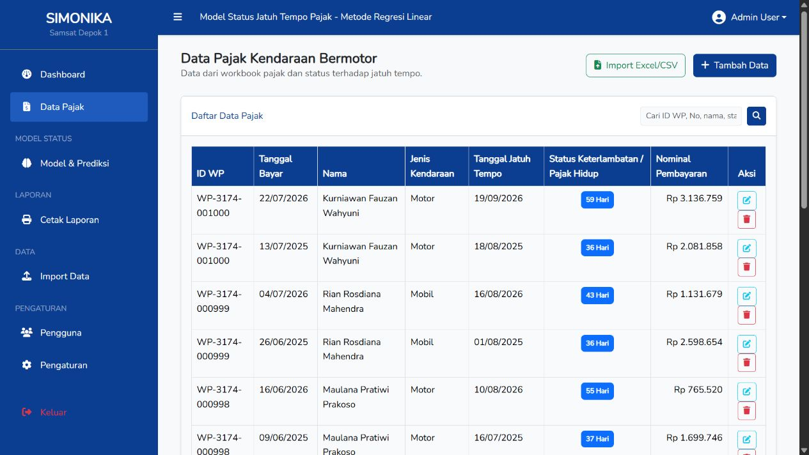

Gambar 4.47 
Tampilan Layar Data Pajak Admin / Petugas 
Sumber: Penulis (2026)

##### d. Tampilan Layar Model & Prediksi Admin / Petugas

Tampilan Layar Model & Prediksi Admin / Petugas menampilkan proses pelatihan model regresi linear dan hasil prediksi keterlambatan pembayaran pajak. Admin / Petugas memilih data WP yang akan digunakan dalam proses pelatihan dan prediksi melalui halaman Model & Prediksi. Sistem memproses data pembayaran pajak yang dipilih dan menjalankan model regresi linear untuk menghasilkan nilai prediksi keterlambatan pembayaran. Sistem menampilkan hasil prediksi berdasarkan data WP yang telah diproses. Halaman ini juga menampilkan nilai evaluasi model, seperti MAE, MSE, RMSE, dan R² untuk memberikan informasi mengenai kinerja model yang digunakan. Admin / Petugas dapat melihat hasil prediksi dan nilai evaluasi sebagai bahan pendukung dalam mengidentifikasi WP yang berpotensi mengalami keterlambatan pembayaran. Sistem menyimpan hasil proses prediksi agar data dapat digunakan kembali dalam pengelolaan dan pembuatan laporan. Hasil implementasi halaman Model & Prediksi Admin / Petugas disajikan pada Gambar 4. 48.

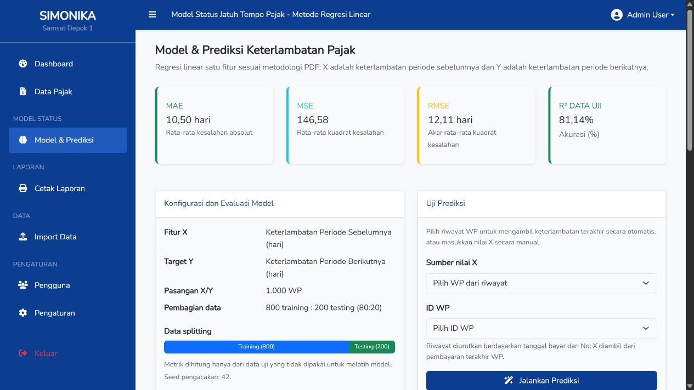

Gambar 4.48 
Tampilan Layar Model & Prediksi Admin / Petugas 
Sumber: Penulis (2026)

##### e. Tampilan Layar Cetak Laporan

Tampilan Layar Cetak Laporan menampilkan halaman yang digunakan Admin / Petugas untuk membuat dan mencetak laporan data pajak serta hasil prediksi keterlambatan pembayaran. Admin / Petugas memilih jenis laporan sesuai dengan informasi yang ingin ditampilkan. Admin / Petugas menentukan periode data yang digunakan sebagai dasar laporan. Sistem menerima pilihan tersebut dan mengambil data yang sesuai dari basis data. Sistem menampilkan data laporan berdasarkan jenis dan periode yang telah dipilih. Admin / Petugas memeriksa informasi yang ditampilkan sebelum melakukan proses pencetakan. Sistem menyediakan tombol cetak untuk menghasilkan laporan dalam bentuk yang dapat dicetak. Hasil implementasi halaman Cetak Laporan disajikan pada Gambar 4. 49.

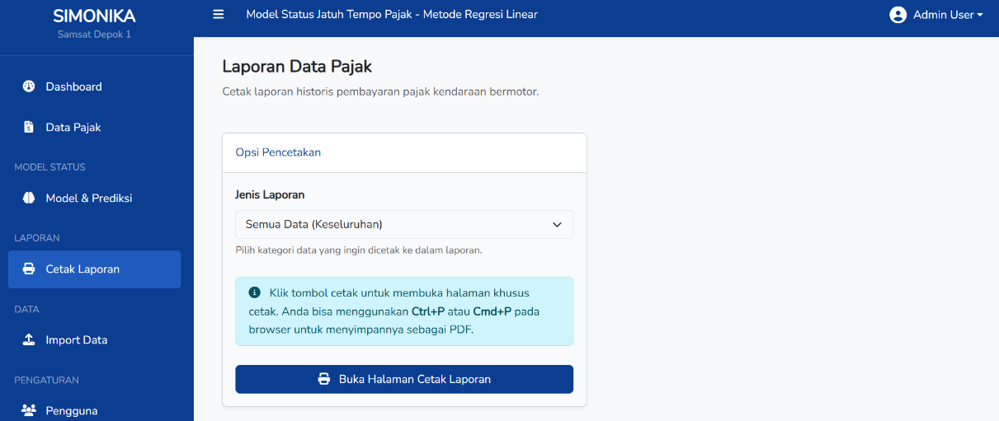

Gambar 4.49 
Tampilan Layar Cetak Laporan 
Sumber: Penulis (2026)

##### f. Tampilan Layar Laporan

Tampilan Layar Laporan menampilkan informasi data pajak dan hasil prediksi keterlambatan pembayaran pajak dalam bentuk laporan. Admin / Petugas memilih jenis laporan dan menentukan periode data yang diperlukan. Sistem menerima pilihan Admin / Petugas dan mengambil data yang sesuai dari basis data. Sistem mengolah data tersebut dan menampilkan hasil prediksi keterlambatan pembayaran dalam bentuk laporan yang terstruktur. Admin / Petugas memeriksa data dan hasil prediksi yang ditampilkan sebelum melakukan tindakan selanjutnya. Admin / Petugas dapat mencetak atau menyimpan laporan sesuai dengan kebutuhan pengelolaan data. Hasil implementasi halaman Laporan disajikan pada Gambar 4. 50.

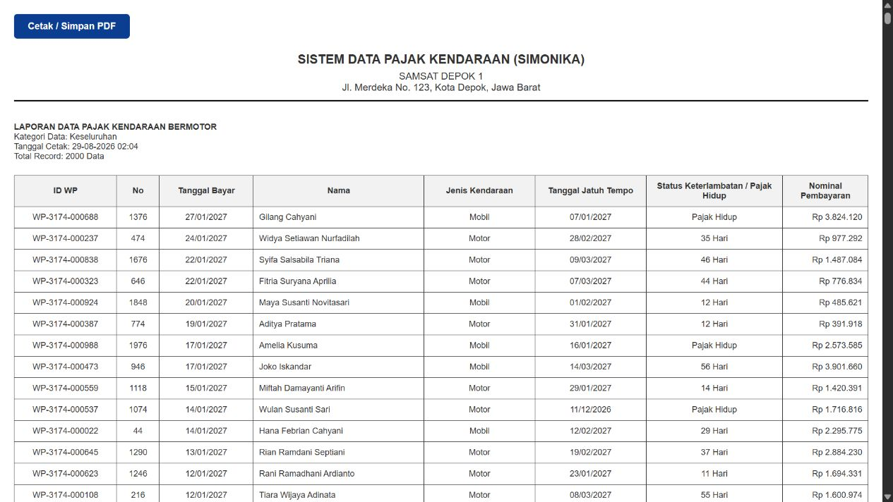

Gambar 4.50 
Tampilan Layar Laporan 
Sumber: Penulis (2026)

##### g. Tampilan Layar Import Data

Tampilan Import Data menyediakan fasilitas bagi Admin / Petugas untuk memasukkan dataset ke dalam sistem melalui file Excel atau CSV. Admin/Petugas memilih file dataset yang akan digunakan dan mengunggah file melalui halaman Import Data. Sistem menerima file dan melakukan pemeriksaan terhadap format serta kesesuaian data sebelum proses import dilakukan. Sistem memasukkan data yang sesuai ke dalam basis data setelah proses validasi selesai. Sistem menampilkan informasi mengenai jumlah data yang berhasil dimasukkan ke dalam sistem. Sistem juga menampilkan notifikasi apabila terdapat data yang tidak sesuai atau tidak dapat diproses. Admin / Petugas dapat melakukan pemeriksaan dan memperbaiki data sebelum melakukan proses import kembali. Hasil implementasi halaman Import Data disajikan pada Gambar 4. 51.

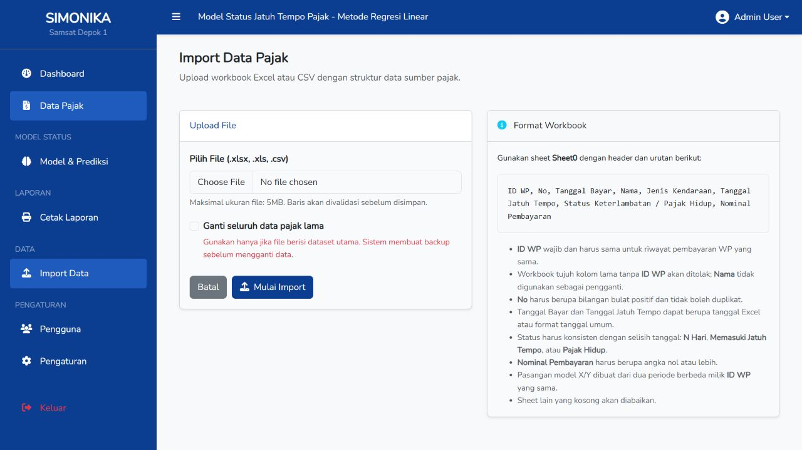

Gambar 4.51 
Tampilan Import Data 
Sumber: Penulis (2026)

##### h. Tampilan Layar Pengguna

Tampilan Pengguna digunakan Admin / Petugas untuk menampilkan dan mengelola daftar akun yang memiliki akses terhadap sistem. Halaman ini menampilkan informasi pengguna seperti nama, username, role, dan status akun. Admin / Petugas dapat melihat data pengguna yang telah tersimpan dalam sistem. Admin / Petugas dapat menambahkan akun pengguna baru sesuai dengan kebutuhan sistem. Admin / Petugas juga dapat mengubah informasi akun dan menyesuaikan hak akses pengguna. Admin / Petugas dapat menghapus akun yang sudah tidak digunakan dalam sistem. Sistem menyimpan setiap perubahan data pengguna ke dalam basis data dan menampilkan informasi terbaru pada halaman Pengguna. Hasil implementasi halaman Pengguna disajikan pada Gambar 4. 52.

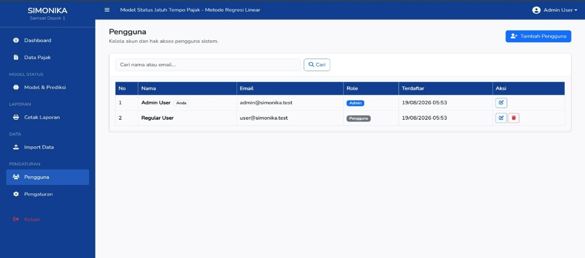

Gambar 4.52 
Tampilan Layar Pengguna 
Sumber: Penulis (2026)

##### i. Tampilan Layar Pengaturan

Tampilan Pengaturan digunakan pengguna untuk mengelola informasi akun dan konfigurasi yang tersedia pada sistem. Pengguna dapat melihat informasi profil yang tersimpan pada sistem, seperti nama dan alamat email. Pengguna dapat mengubah informasi profil sesuai dengan kebutuhan. Pengguna juga dapat memperbarui password melalui kolom yang tersedia pada halaman Pengaturan. Sistem melakukan validasi terhadap data yang dimasukkan sebelum menyimpan perubahan. Sistem menyimpan data yang valid ke dalam basis data dan menampilkan notifikasi setelah proses pembaruan berhasil. Hasil implementasi halaman Pengaturan disajikan pada Gambar 4. 53.

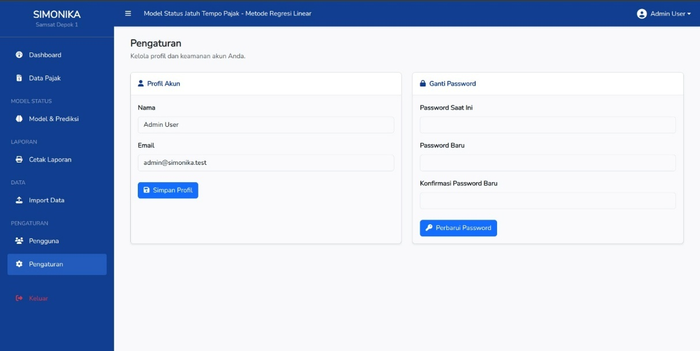

Gambar 4.53 
Tampilan Layar Pengaturan 
Sumber: Penulis (2026)

##### j. Tampilan Layar Login User

Tampilan Layar Login User menampilkan formulir untuk masuk ke dalam sistem. User memasukkan username atau email dan kata sandi. Sistem memvalidasi data login dan mengarahkan user ke dashboard sesuai hak akses. Hasil implementasi halaman Login User disajikan pada Gambar 4. 54.

Gambar 4.54 
Tampilan Layar Login User 
Sumber: Penulis (2026)

##### k. Tampilan Layar Dashboard User

Tampilan Layar Dashboard User menampilkan informasi utama sistem kepada user. User dapat melihat ringkasan data dan informasi yang tersedia sesuai dengan hak akses. Sistem mengambil data dari basis data dan menampilkan informasi pada halaman dashboard. Hasil implementasi halaman Dashboard User disajikan pada Gambar 4. 55.

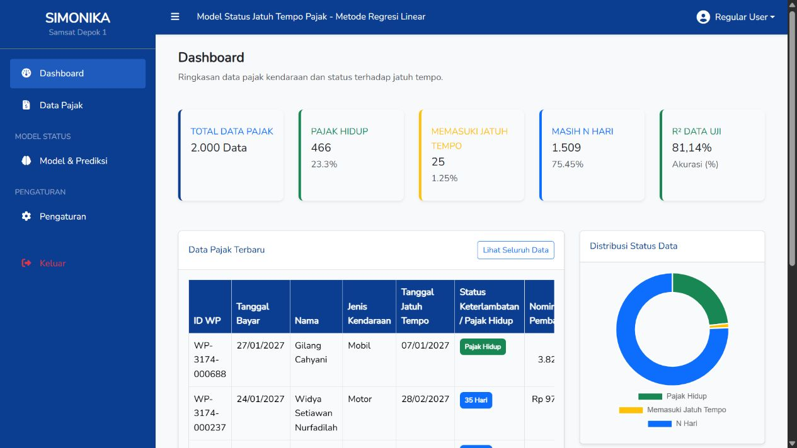

Gambar 4.55 
Tampilan Layar Dashboard User 
Sumber: Penulis (2026)

##### l. Tampilan Layar Data Pajak User

Tampilan Layar Data Pajak User menampilkan informasi wajib pajak dan data pembayaran pajak yang tersimpan dalam sistem. User dapat melihat informasi seperti identitas wajib pajak, data kendaraan, tanggal jatuh tempo, dan status keterlambatan (hari). Sistem mengambil data dari basis data dan menampilkan informasi sesuai dengan hak akses yang diberikan kepada User. User dapat menggunakan halaman Data Pajak untuk melihat informasi pembayaran pajak yang tersedia tanpa mengubah data tersebut. Hasil implementasi halaman Data Pajak User disajikan pada Gambar 4. 56.

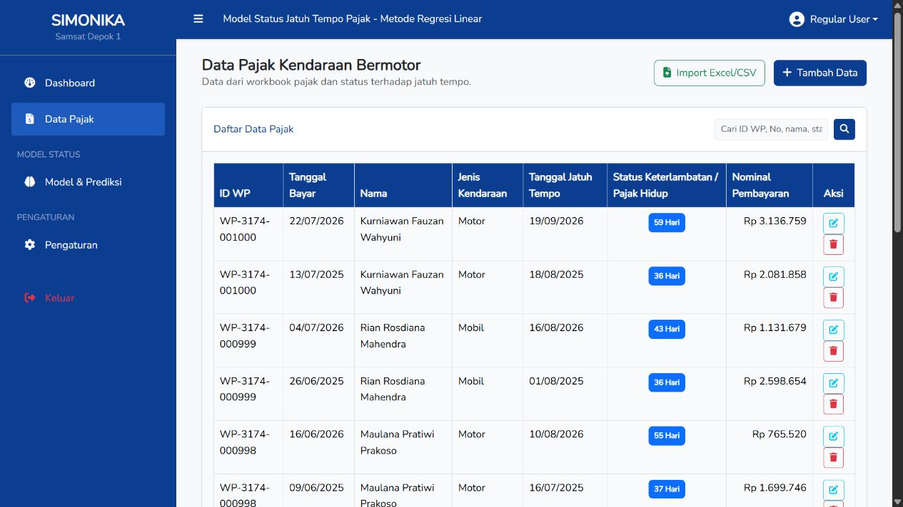

Gambar 4.56 
Tampilan Layar Data Pajak User 
Sumber: Penulis (2026)

##### m. Tampilan Layar Model & Prediksi User

Tampilan Layar Model & Prediksi User menampilkan hasil prediksi keterlambatan pembayaran pajak berdasarkan model regresi linear. User dapat melihat data wajib pajak, hasil prediksi, dan informasi evaluasi model sesuai dengan hak akses. Hasil implementasi halaman Model & Prediksi User disajikan pada Gambar 4. 57.

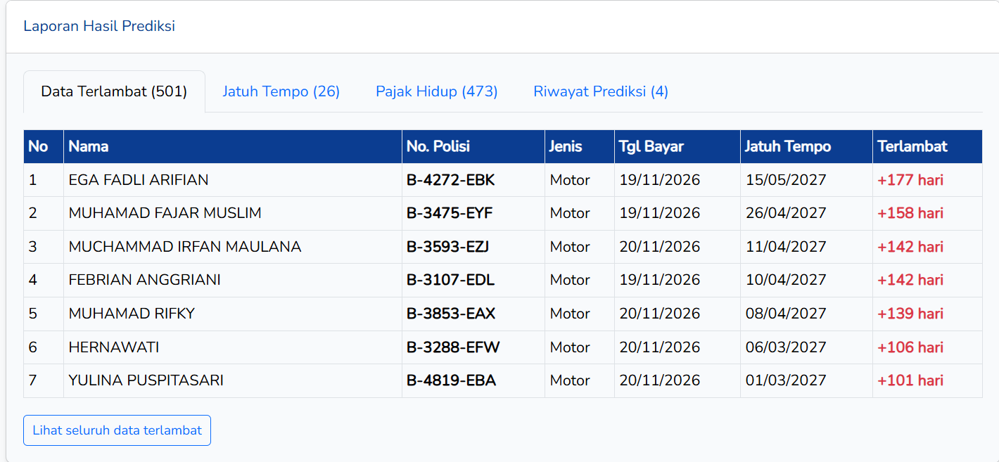

Gambar 4.57 
Tampilan Layar Model & Prediksi User 
Sumber: Penulis (2026)

##### n. Tampilan Layar Pengaturan

Tampilan Layar Pengaturan menampilkan informasi pengaturan sistem yang dapat dikelola oleh Admin / Petugas. Admin / Petugas dapat mengubah data pengaturan sesuai kebutuhan sistem. Sistem menyimpan perubahan pengaturan ke dalam basis data. Hasil implementasi halaman Pengaturan disajikan pada Gambar 4. 58.

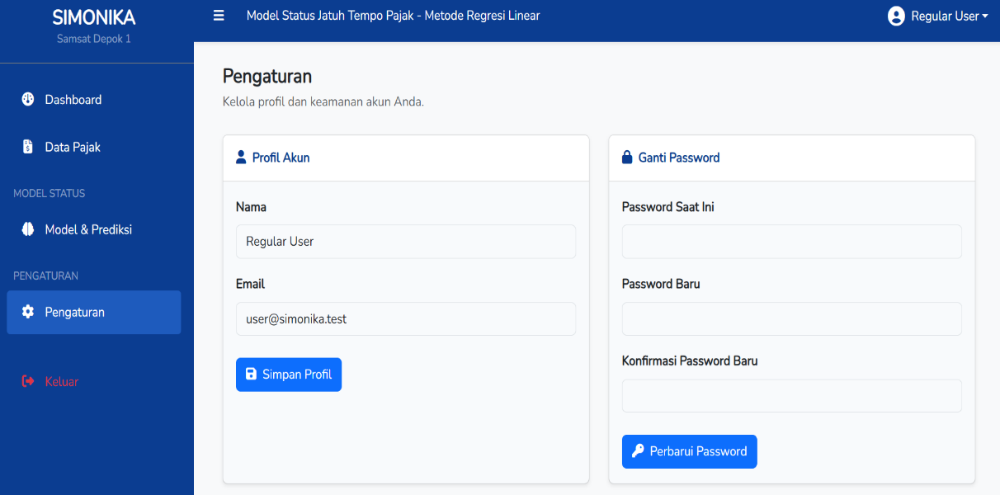

Gambar 4.58 
Tampilan Layar Pengaturan 
Sumber: Penulis (2026)

### D. Kelebihan dan Kekurangan Sistem

Secara keseluruhan dalam penelitian ini yaitu kelebihan utama sistem terletak pada kemampuannya membantu pengelolaan data pajak dan memberikan estimasi keterlambatan pembayaran menggunakan regresi linear secara lebih cepat dan terstruktur. Sementara itu, kekurangan utama sistem adalah hasil prediksi sangat bergantung pada kualitas dataset dan kemampuan metode regresi linear dalam menggambarkan pola data yang digunakan. Dengan demikian, sistem lebih tepat digunakan sebagai alat bantu informasi dan pendukung pengambilan keputusan, bukan sebagai satu-satunya dasar dalam menentukan tindakan terhadap WP (wajib pajak).

### a. Kelebihan Sistem

1. Penelitian ini dilakukan melalui tahapan yang sistematis, mulai dari pengumpulan data, preprocessing, penentuan variabel, pembagian data latih dan data uji, pembentukan model, evaluasi, hingga implementasi ke dalam sistem Laravel. Tahapan tersebut dilakukan secara terstruktur agar penelitian dapat dipertanggungjawabkan dan direplikasi.
1. Regresi Linear dipilih karena sesuai dengan karakteristik permasalahan, yaitu memperkirakan nilai numerik berupa lama keterlambatan dalam hari. Selain itu, metode ini menghasilkan persamaan yang mudah diinterpretasikan oleh pihak Samsat Depok 1.
1. Model dievaluasi menggunakan empat metrik, yaitu MAE, MSE, RMSE, dan R². Penggunaan metrik tersebut memungkinkan kualitas model dinilai berdasarkan tingkat kesalahan prediksi dan kemampuan model dalam menjelaskan variasi data.
1. Model memperoleh nilai R² sebesar 81,50%. Nilai tersebut menunjukkan bahwa model mampu menjelaskan 81,50% variasi lama keterlambatan pembayaran pada data pengujian.

### b. Kekurangan Sistem

1. Keterbatasan Implementasi Sistem yang dibangun masih berfokus pada prediksi berdasarkan data historis yang telah tersimpan pada basis data dan belum terintegrasi secara langsung (real-time) dengan sistem pembayaran pajak kendaraan bermotor dan bermobil pusat, sehingga pembaruan data masih memerlukan proses input/import secara berkala.
1. Dataset penelitian hanya berasal dari Samsat Depok 1. Kondisi tersebut menyebabkan model belum dapat diterapkan secara langsung pada wilayah Samsat lain tanpa menggunakan data dan pelatihan yang sesuai.
1. Asumsi Hubungan Regresi Linear mengasumsikan bahwa hubungan antara variabel X dan Y bersifat linear. Pada praktiknya, keterlambatan pembayaran pajak dapat dipengaruhi oleh faktor lain yang bersifat non-linear, seperti kondisi ekonomi WP (wajib pajak), hari libur, atau kebijakan pemutihan pajak, sehingga tingkat akurasi model dapat menurun apabila pola keterlambatan tidak sepenuhnya mengikuti hubungan linear.

## BAB V PENUTUP

### A. Simpulan

Penelitian ini menghasilkan simpulan yang menjawab tiga tujuan penelitian. Simpulan tersebut diuraikan sebagai berikut:

1. Penelitian ini berhasil mengidentifikasi fitur yang relevan untuk digunakan dalam memprediksi keterlambatan pembayaran pajak kendaraan bermotor dan bermobil pada Samsat Depok 1. Fitur yang digunakan berasal dari data historis pembayaran pajak dan menjadi dasar dalam proses pembentukan model prediksi keterlambatan pembayaran pajak.
1. Penelitian ini berhasil membangun model prediksi keterlambatan pembayaran pajak menggunakan metode regresi linear berdasarkan data historis yang tersedia. Model dibangun melalui tahapan pengolahan data, pembagian data training dan testing, pembentukan model, serta evaluasi menggunakan MAE, MSE, RMSE, dan R². Model yang dihasilkan dapat digunakan untuk memberikan estimasi keterlambatan pembayaran pajak berdasarkan data yang digunakan dalam penelitian.
1. Penelitian ini berhasil merancang dan mengimplementasikan aplikasi prediksi keterlambatan pembayaran pajak berbasis regresi linear. Aplikasi dapat mengelola data pajak, melakukan proses prediksi, serta menampilkan hasil prediksi dan nilai evaluasi model. Aplikasi tersebut dapat digunakan sebagai alat bantu informasi bagi petugas dalam mengidentifikasi wajib pajak yang berpotensi mengalami keterlambatan pembayaran serta mendukung proses pengambilan keputusan di Samsat Depok 1.

### B. Saran

Berdasarkan hasil dan keterbatasan penelitian, Samsat Depok 1 disarankan untuk menggunakan hasil prediksi keterlambatan pembayaran pajak kendaraan bermotor dan bermobil sebagai informasi pendukung dalam menentukan prioritas pemantauan terhadap wajib pajak yang berpotensi mengalami keterlambatan pembayaran. Hasil prediksi dapat membantu petugas dalam memperoleh informasi secara lebih cepat dan terarah. Namun, hasil prediksi sebaiknya digunakan sebagai bahan pertimbangan dan tidak menjadi satu-satunya dasar dalam menentukan tindakan terhadap wajib pajak.

Pada penelitian selanjutnya, data yang digunakan disarankan memiliki periode yang lebih panjang dan jumlah data yang lebih besar agar model dapat mengenali pola keterlambatan pembayaran secara lebih baik. Penambahan fitur yang relevan, seperti riwayat keterlambatan pembayaran, jumlah tunggakan, jenis kendaraan, dan riwayat pembayaran sebelumnya, juga dapat dipertimbangkan sesuai dengan ketersediaan dan kualitas data yang dimiliki. Hal tersebut diharapkan dapat membantu meningkatkan kemampuan model dalam menghasilkan prediksi yang lebih baik.

Penelitian selanjutnya juga disarankan untuk membandingkan metode regresi linear dengan metode prediksi lainnya untuk mengetahui metode yang memberikan hasil prediksi lebih baik. Penggunaan metode evaluasi dan validasi yang lebih beragam dapat dilakukan untuk mengetahui kinerja serta kemampuan generalisasi model secara lebih menyeluruh. Perbandingan tersebut juga dapat menjadi dasar dalam menentukan metode yang paling sesuai dengan karakteristik data keterlambatan pembayaran pajak pada Samsat Depok 1.

Dari sisi aplikasi, sistem dapat dikembangkan dengan menambahkan fitur dashboard, pencarian dan penyaringan data, notifikasi potensi keterlambatan, pengaturan hak akses pengguna, serta pencadangan data. Pengembangan tersebut diharapkan dapat meningkatkan efektivitas, keamanan, dan kemudahan penggunaan aplikasi dalam membantu petugas melakukan pemantauan keterlambatan pembayaran pajak serta mendukung proses pengambilan keputusan di Samsat Depok 1. Pengembangan ini juga tetap perlu memperhatikan keterbatasan sistem karena hasil prediksi bergantung pada kualitas data dan kemampuan regresi linear dalam menggambarkan pola data yang digunakan.

## DAFTAR PUSTAKA

Akuntansi, K. I. (2025). Manajemen & bisnis. XVIII(1). https://ejournal.sainttheresa.ac.id/index.php/jmb/article/view/147

Alwi Prayoga, A., Hasanuddin, M., Khodijah, S., & Atika Rizki, C. (2025). Analisis Penerapan Machine Learning dalam Sistem Prediksi dan Pengambilan Keputusan. Journal of Electrical Engineering Research, 1(3), 84–90. https://doi.org/10.64803/joeer.v1i3.19

Andi Sahrul Jahrir, M. Q. H. (2025). Jurnal dunia pendidikan. Jurnal Dunia Pendidikan, 3(November), 67–78. https://repositori.uma.ac.id/handle/123456789/27493

Andika, D. K. R., & Wulandari, I. R. (2024). Implementasi Metode Forward Chaining dan Certainty Factor Pada Sistem Pakar Penyakit Ikan Cupang. Journal Of Information System Management (JOISM), 5(2), 156–164.

Arif. (2024). Dan R & D. In M. S. Dr. Bambang Ismaya, S.Ag., M.Pd., & L. Desain, Setting, G. 1. Anis Anggraini, S.Pd., S. P. 2. M. Raditya S.P, & S. A. 3. Utamirohmahsari (Eds.), CV Saba Jaya Publishr. CV Saba Jaya Publisher. https://www.researchgate.net/profile/Hery-Purnomo/publication/377469385.

Azkiya, A. I. A., & Santoso, B. (2023). Indonesian Journal of Computer Science. Indonesian Journal of Computer Science, 13(1), 1227–1240. http://ijcs.stmikindonesia.ac.id/ijcs/index.php/ijcs/article/view/3135

Bastian, A. A., Handayani, H. H., Wahiddin, D., & Rohana, T. (2020). Implementasi Algoritma Support Vector Regression dan Linear Regression Untuk Prediksi Harga Rumah. Progresif: Jurnal Ilmiah Komputer, 20(2), 961. https://doi.org/10.35889/progresif.v20i2.2191

Bisnis, J. (2023). JURNAL PKB Cantika dan Hadi SOSIALISASI PAJAK (tidak berpengaruh). 3(1), 419–438. https://doi.org/10.33197/bes.vol3.iss1.2023.1966

Christefa, D., Mawengkang, H., & Zarlis, M. (2022). Data-Driven Decision Making In Large Scale Production Planning. SinkrOn, 7(3), 2068–2071. https://doi.org/10.33395/sinkron.v7i3.11600

Christi, M., Putra, W. H. N., & Hanggara, B. T. (2023). Rancang Bangun Sistem Informasi dan Pelayanan E-Ticket (Booking Online) pada Wisata Pendakian Gunung Budheg Tulungagung menggunakan Website dengan Framework Laravel. Jptiik, 7(1), 83–91. https://j-ptiik.ub.ac.id/index.php/j-ptiik/article/view/12105

Debby Islami, L. R. (2020). betty,+5+jurnal+DEBBY+FIX+(169-179). 4(2), 169–179. https://doi.org/10.15642/oje.2020.4.2.169-179

Erwansyah, D. M. (2024). Prediksi Harga Emas Menggunakan Algoritma Regresi Linear. Computing Insight : Journal of Computer Science, 5(1), 8–13. https://doi.org/10.30651/comp\_insight.v5i1.21764

Fana Wiza, & Kuning, L. (2016). Pemodelan Pola Hubungan Kemampuan Lulusan. Teknologi Informasi Dan Komunikasi Digital Zone, 7, 2–7. https://doi.org/10.31849/digitalzone.v7i1.518

Gulo, E. S., -, C., Gulo, Y. R., & Marbun, S. F. (2022). Perbandingan Efektifitas Algoritma Decission Tree, Naïve Bayes, K-Nearest Neighbor Dan Support Vector Machine Dalam Melakukan Klasifikasi. Jurnal Teknologi Dan Ilmu Komputer Prima (Jutikomp), 5(2), 54–59. https://doi.org/10.34012/jutikomp.v5i2.2940

Halif, J., Wahiddin, D., Sanjaya, I., & Faisal, S. (2025). Model Regresi Linear Berganda untuk Prediksi Tingkat Pengangguran di Provinsi Jawa Barat. Jurnal Algoritma, 22(1), 324–335. https://doi.org/10.33364/algoritma/v.22-1.2312

Hanifah, N., Nurmilah, R., Tanjung, H., Sukabumi, U. M., Balik, B., Kendaraan, N., Permukaan, A., & Daerah, P. A. (2023). Document (3) Dp . 2, 1–13. https://doi.org/10.31253/aktek.v15i2.2247.

Haviluddin. (2011). Memahami Penggunaan UML ( Unified Modelling Language ). Memahami Penggunaan UML (Unified Modelling Language), 6(1), 1–15. https://informatikamulawarman.files.wordpress.com/2011/10/01-jurnal-informatika-mulawarman-feb-2011.pdf

Istanti, F. (2017). Dan E-Promosi Terhadap Keputusan Pembelian Belanja. Jurnal Bisnis & Teknologi Politeknik NSC Surabaya, 4(1), 14–22. https://nscpolteksby.ac.id/ebook/files/Ebook/Journal/2017/.pdf.

Juni, N., Manajemen, T., Pada, P., Sektor, P., Terdaftar, Y., Bursa, D. I., & Indonesia, E. (2024). SENTRI : Jurnal Riset Ilmiah. 3(6), 3112–3126. https://doi.org/10.55681/sentri.v3i6.3022.

Kafa, M. H. W., Hidayat, N., & Cholissodin, I. (2019). Diagnosis Penyakit Ikan Mas Koki Menggunakan Metode Naïve Bayes Classifier. Jurnal Pengembangan Teknologi Informasi Dan Ilmu Komputer, 3(1), 472–480.

Kahfi Rama Putra Lubis1, S. S. (2023). Jurnal Comasie PENERAPAN DATA MINING DENGAN METODE NAIVE BAYES. Jurnal Comasie \|, 07, 934–942. http://ejournal.upbatam.ac.id/index.php/comasiejournal

Klau, D., & Puspita, W. D. (2025). Analisis peran konsultan pajak terhadap kepatuhan wajib pajak klien UMKM. Jurnal Ilmiah Bisnis Dan Perpajakan (Bijak), 7(1), 44–53. https://doi.org/10.26905/j.bijak.v7i1.15084

Larassati, M., Latukolan, A., Arwan, A., & Ananta, M. T. (2019). Pengembangan Sistem Pemetaan Otomatis Entity Relationship Diagram Ke Dalam Database. Jurnal Ilmiah Computing Insight, 3(4), 4058–4065. http://j-ptiik.ub.ac.id

Maulidiah, S., Encep, M., Susanti, A. R., Satria, R. Y., Elgar, M., & Syagara, G. W. (2025). Rancang Bangun Basis Data Untuk Sistem Informasi Terintegrasi Tata Usaha dan Laboratorium. Jurnal Nasional Teknologi Komputer, 5(4), 1132–1140. https://doi.org/10.61306/jnastek.v5i4.325

Mustakim, M., Bella, C., & Pratama, Y. R. (2019). Prediksi Jumlah Tunggakan Pajak Kendaraan Jatuh Tempo Menggunakan Algoritma Support Vector Regression. Seminar Nasional Teknologi Informasi, Komunikasi Dan Industri (SNTIKI) 11, (November 2017), 1–11. https://ejournal.uin-suska.ac.id/index.php/SNTIKI/article/view/8005

Nurhaswinda, Ramadani, S., Wahyuni, Egistin, D. P., Rahma, Rauza, M. yahdi, Ramadhan, R., & Ramadani, S. has. (2025). Analisis Regresi Linier Sederhana dan Penerapannya. Jurnal Cahaya Nusantara, 1(2), 3093–8113. https://creativecommons.org/licenses/by/4.0/

Nurshadrina, N., & Voutama, A. (2023). Penerapan Unified Modeling Language (UML) dalam membangun sistem pengenalan UMKM (Studi Kasus: Rafa Laundry). Information Management for Educators and Professionals: Journal of Information Management, 7(1), 21–30. https://doi.org/10.51211/imbi.v7i1.1975

Permana, R., & Herdiana, F. A. (2025). Analisis Klasifikasi Dan Prediksi Pola Publikasi Berita Pemprov DKI Jakarta Menggunakan Machine Learning. Jurnal Infortech, 7(1), 50–55. https://doi.org/10.31294/infortech.v7i1.25926

Pratami Hadianto, H., Wahyu Hidayat, W., & Prawesti Ningrum, E. (2024). Pengaruh Kesadaran Wajib Pajak, Kualitas Layanan Fiskus, Dan Penerapan Sistem E-Samsat Terhadap Kepatuhan Wajib Pajak Kendaraan Bermotor Di Kota Bekasi Pada Kantor Samsat Kota Besaki. SENTRI : Jurnal Riset Ilmiah, 3(3), 1458–1468.

Prihadyanti, D., Sari, K., & Hidayat, D. (2024). Jurnal Manajemen Teknologi. Jurnal Manajemen Teknologi, 17(2), 126–150. https://media.neliti.com/media/publications/260928-none-c958cf43.pdf

Putri, A. M. (2025). Pengaruh pengetahuan wajib pajak, kesadaran wajib pajak dan modenisasi sistem administrasi perpajakan terhadap kepatuhan wajib pajak kendaraan bermotor. Penambahan Natrium Benzoat Dan Kalium Sorbat (Antiinversi) Dan Kecepatan Pengadukan Sebagai Upaya Penghambatan Reaksi Inversi Pada Nira Tebu, 2(1), 25–48. https://doi.org/10.62237/jna.v2i1.195

Rizkiani, E., & Brahma, D. (2024). Comparison of the Performance of Bagging and Boosting Method Algorithms in Predicting PM 10 Concentration in North Jakarta. 01, 74–81. https://doi.org/10.25077/TEKNOSI.v10i1.2024.72-81

Roihan, A., Sunarya, P. A., & Rafika, A. S. (2020). Pemanfaatan Machine Learning dalam Berbagai Bidang: Review paper. IJCIT (Indonesian Journal on Computer and Information Technology), 5(1), 75–82. https://doi.org/10.31294/ijcit.v5i1.7951

Rusdy, A. M. A., Purnawansyah, P., & Herman, H. (2022). Penerapan Metode Regresi Linear Pada Prediksi Penawaran dan Permintaan Obat Studi Kasus Aplikasi Point Of Sales. Buletin Sistem Informasi Dan Teknologi Islam, 3(2), 121–126. https://doi.org/10.33096/busiti.v3i2.1130

Santika, I. W. A., & Jati, I. K. (2023). Faktor-faktor yang mempengaruhi kepatuhan wajib pajak kendaraan bermotor pada Kantor Samsat Badung. MSEJ : Management Studies and Entrepreneurship Journal, 4(6), 8040–8048. https://yrpipku.com/journal/index.php/msej/article/view/3117/1925

Setiyadi, D., & Herlawati, H. (2023). Structured Query Language (SQL) Untuk Purchase Order (PO). Bina Insani ICT Journal, 6(1), 75–88. https://ejournalbinainsani.ac.id/index.php/BIICT/article/view/1102

Setya Budi, A., Annafi, A. N., Syafitra, D., Danang, D., Islam, A. W., Agustiawan, F., Balda, I., Ardiansah, R. M., Alghifary, R. B., Asmara, R., Ardiansyah, R., & Saputri, G. (2022). Pengenalan Dan Penggunaan Dbms (Database Management System) Di Smk Tunas Media Kota Depok. Abdi Jurnal Publikasi, 1(2), 52–57. https://jurnal.portalpublikasi.id/index.php/AJP/index

Sihombing, A. R. (2020). Perancangan Sistem Pakar Identifikasi Jenis Ikan Mas Koki Menggunakan Metode Forward Chaining Berbasis Android. Jurnal TeiKa, 10(2), 143–159.

Srirahayu, A., & Pribadie, L. S. (2023). Review Paper Data Mining Klasifikasi Data Mining. Jurnal Ilmiah Informatika Global, 14(1). https://doi.org/10.36982/jiig.v14i1.2981

Sumiati, M., Abdillah, R., & Cahyo, A. (2021). M. Sumiati, R. Abdillah, dan A. Cahyo, “Pemodelan UML untuk Sistem Informasi Persewaan Alat Pesta,” Jurnal FASILKOM, vol. 11, no. 2, hal. 79–86, Agustus 2021. 11(2), 79–86. https://doi.org/10.37859/jf.v11i2.2673.

Surya Ningsih, K., Jamilah Aruan, N., & Taufik Al Afkari Siahaan, A. (2022). Aplikasi Buku Tamu Menggunakan Fitur Kamera Dan Ajax Berbasis Website Pada Kantor Disporakota Medan. SITek: Jurnal Sains, Informatika, Dan Tekonologi, 1(3), 94–95.

Teddy, I. P., Wijaya, D., & Bagus, I. (2023). 102444-1840-368165-1-10-20230718. 1(2016), 917–924. https://doi.org/10.24843/JNATIA.2023.v01.i03.p18

Teknologi, F., & Dan, I. (2023). SURAT TUGAS No . 009 / ST / Dek / FTIB / X / 2022. (0274). http://eprints.akprind.ac.id/id/eprint/1592

Utomo, M. R., Witama, M. N., & Sumarni, R. A. (2020). Perancangan Sistem Informasi Pendaftaran Siswa Baru Berbasis Java Dekstop Pada Madrasah Ibtidaiyah Al-Ihsan. Jurnal Nasional Komputasi Dan Teknologi Informasi (JNKTI), 3(3), 323–329. https://doi.org/10.32672/jnkti.v3i3.2518

Valentino, C., Arida Ayu Rahning Putri, L., Studi Informatika, P., Matematika dan Ilmu Pengetahuan Alam, F., Raya Kampus Udayana, J., Jimbaran, B., & Selatan, K. (2025). Analisis Kinerja XGBoost Menggunakan Bayesian Optimization dalam Prediksi Harga Ethereum. Jurnal Nasional Teknologi Informasi Dan Aplikasinya , 3(4), 795–804. https://ejournal2.unud.ac.id/index.php/jnatia/article/view/16

Widiyatmoko, A. T., Butsianto, S., & Nugroho, A. (2025). Penerapan Machine Learning untuk Prediksi Kenaikan Harga Beras Premium Menggunakan Algoritma Regresi Linier. MALCOM: Indonesian Journal of Machine Learning and Computer Science, 5(3), 1125–1132. https://journal.irpi.or.id/index.php/malcom/article/view/2123

Wijaya, A., Harahap, S. Z., & Ah, R. M. (2025). 1,2,3, 4. Journal of Computer Science and Information System(JCoInS), 6(1), 254–265. https://doi.org/10.36987/jcoins

## DAFTAR RIWAYAT HIDUP PENULIS

Anggieta Aviliani Fadhila, lahir di Depok, 20 April 2002. Saat ini tinggal di Jalan Semar II No, 81, RT. 05/RT. 19, Kecamatan Sukmajaya, Kelurahan Mekarjaya, Kota Depok, 16411. Pendidikan dasar saya tempuh di SDN Mekarjaya 21 dari tahun 2008 s.d. 2014. Pendidikan menengah di SMP PGRI Depok 2 Tengah dari tahun 2014 s.d. 2017. Pendidikan atas saya di SMK Yapemri dari tahun 2017 s.d. 2020. Penulis memutuskan untuk menempuhkan ilmu di Universitas Indraprasta PGRI Studi Teknik Informatika yang bertujuan agar penulis dapat menambah wawasan mengenai ilmu komputer. E-mail penulis: anggitaaviliani04@gmail.com.

## LAMPIRAN

### 1. Kartu Asistensi Bimbingan Tugas Akhir (Materi)

### 2. Kartu Asistensi Bimbingan Tugas Akhir (Teknik)

### 3. Surat Permohonan Penelitian

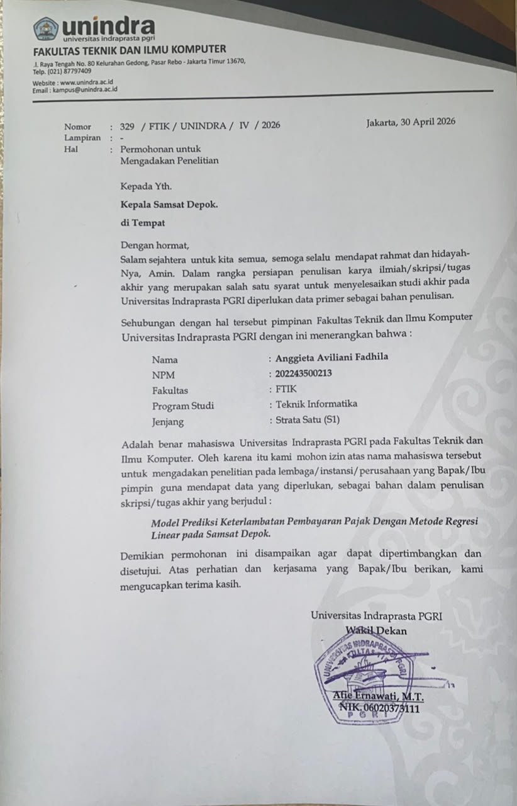

### 4. Surat Keterangan Telah Melaksanakan Penelitian di Kantor Samsat Depok 1

### 5. Listing Program
